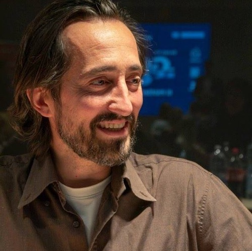

Mi chiamo Stefano Cecere e Ricerco e Sviluppo nell'intersezione tra il **Game design**, l'**EdTech**, l'**Intelligenza Artificiale** e la **XR** applicate allo sviluppo personale e sociale, open source, innovativo.
In questo periodo mi interesso di:

- Giochi, Tecnologia e Filosofia
- Playful e Game Based Learning, Games 4 Change, EdTech
- Media Education, Creatività Diffusa e Genitorialità
- AI + XR + Information Technology
- Futuro 2042, Intelligenza Collettiva e Sviluppo Sostenibile
- Trascendenza, Spazio e Nazione Umana Universale

Studio le nuove tecnologie dal 1994, con diversi master specialistici e sono attivista per un Nuovo Umanesimo dal 1996. Attualmente laureando in **Scienze dell'Educazione** e Filosofia della Scienza. Sono nato a Monza nel 1973, vivo a Firenze dal 2008 con due figli.


