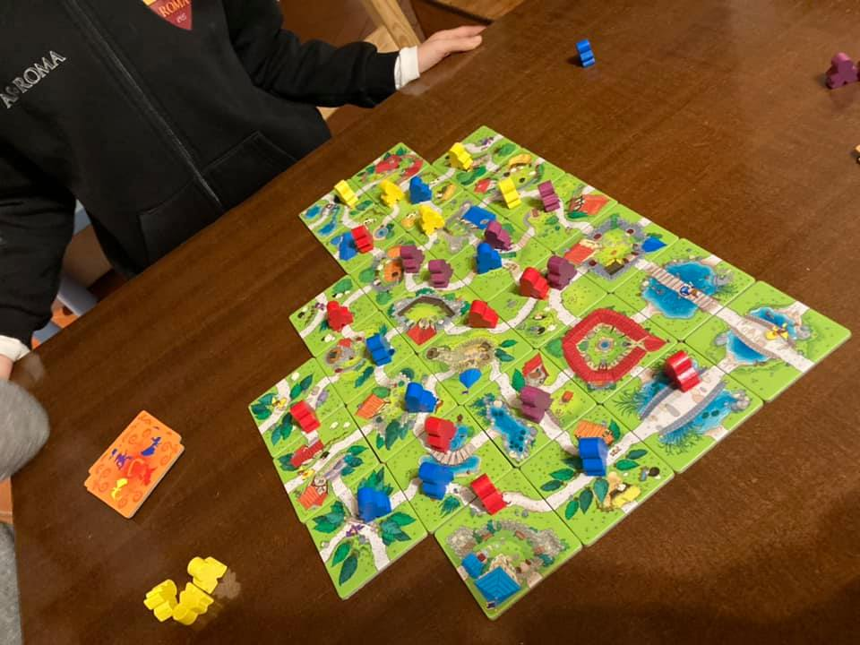

il gioco in scatola regalato per i 5 anni di Bruno è PERFETTO.
si impara in 30 secondi, si gioca in 20 minuti ed ha il giusto livello di fortuna tattica per i piccoli e di analisi e arguzia per i più grandi.
che altro dire... le tessere sono divertenti a fine partita si contano le pecore e le mucche. un ottima alternativa alla tv 🙂

