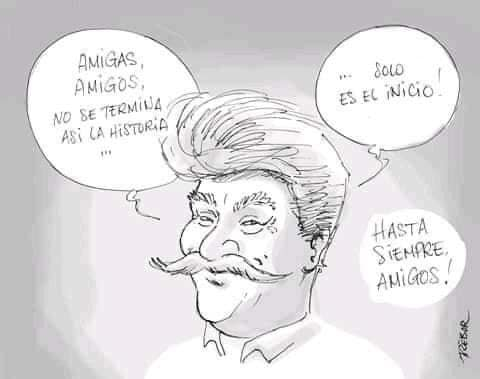
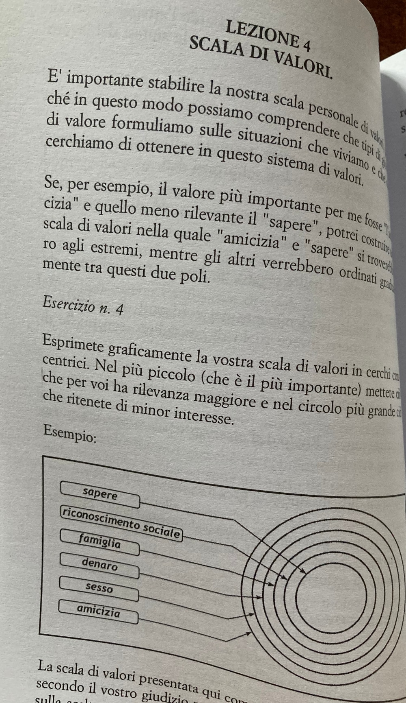
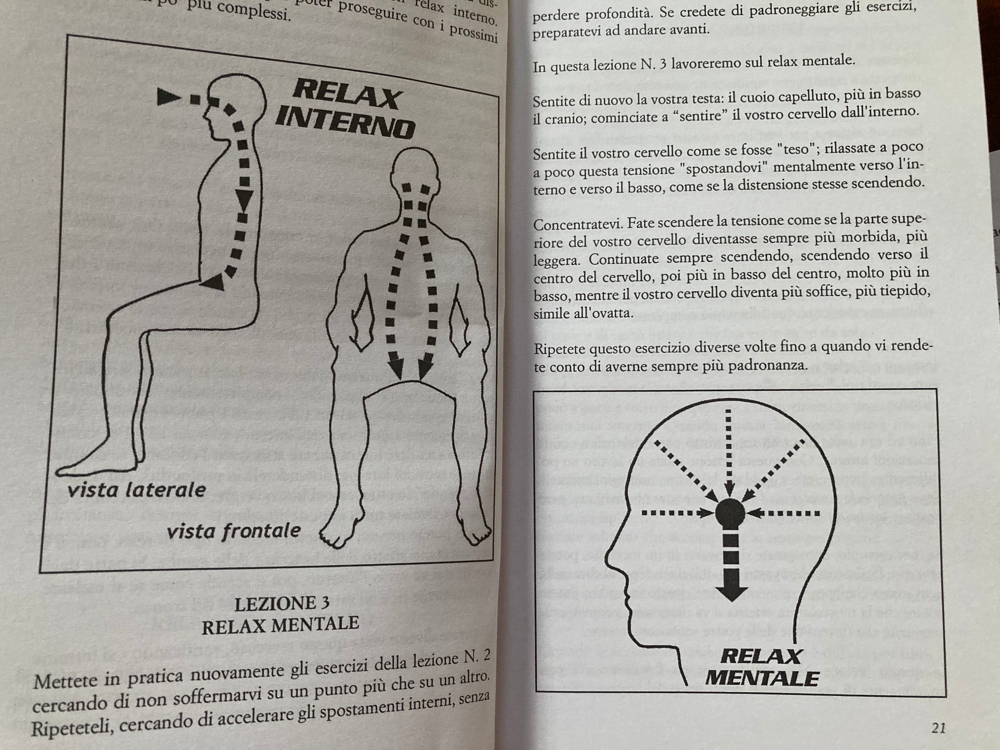

questa notte il #COVID19 ha liberato dal corpo un mio maestro, l'argentino Luis Ammann

ho detto "liberato" perché uno dei suoi più grandi contributi per la mia vita è stato il libro Autoliberazione, che ricompilò sul finire degli anni '70, come sintesi di decenni di studio, lavoro ed esperienze con molti gruppi, per dare una teoria e sopratutto strumenti di "lavoro personale" per quel nascente Movimento Umanista. 
tutto quello che in migliaia di anni è stato tramandato su come funziona l'essere umano, con migliaia di colori e parole diverse, alla fine può essere sintetizzato in modo anche semplice.  
ad esempio come funzionano i meccanismi base della coscienza (un circuito minimo di sensori -> elaborazione -> azione, a cui poi si aggiunge la memoria, la coscienza con i suoi livelli, etc).
o come si fa a rilassarsi profondamente mantenendo la lucidità.. facile dire RILASSATI! ma come farlo senza prendere psico cose?
se devo prendere una decisione come faccio? quale è la mia reale scala di valori?
posso migliorare la mia attenzione e distrarmi di meno?
etc etc
insomma per me è stata una bella bibbia laica.. 
che sopratutto sottointende un tema: la liberazione può solo essere endogena, nasce da dentro di noi per nostra volontà e nostro lavoro, non può essere imposta da fuori tramite riti più o meno fantasiosi.

e ciò è funzionale anche ad un altro tema fondamentale: non può esserci una trasformazione sociale senza uno sviluppo personale, e viceversa.
Per questo dare in mano alla gente delle idee e strumenti di "autoliberazione" è una cosa importantissima.
un'ultima cosa sull'essere "Maestro":
io considero un vero Maestro chi influisce attivamente e positivamente verso fuori, aiutando o migliorando le condizioni di vita degli altri, anche solo condividendo tutto quello che sa e soprattutto COME ci è arrivato. 
e Luis è una di quelle persone che lo ha fatto per tutta la vita.
a memoria e ringraziamento imperituri!

PS: il libro è facilmente trovabile ovunque, anche online.

