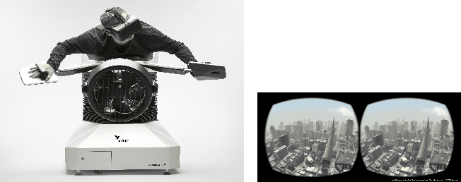
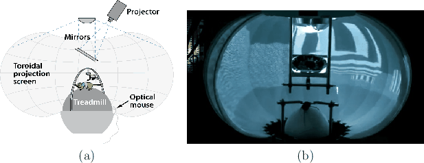
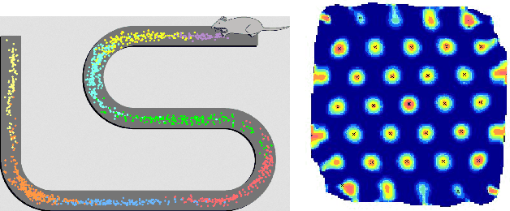
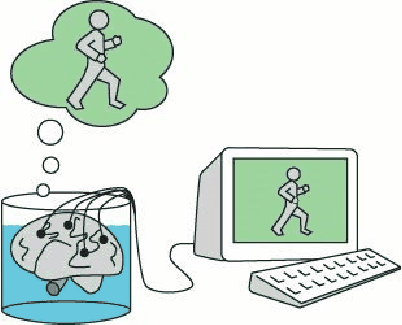
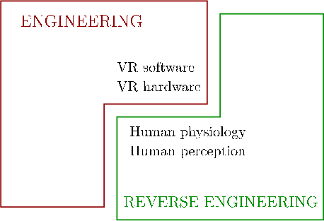

Virtual reality (VR) technology is evolving rapidly, making it undesirable to define VR in terms of specific devices that may fall out of favor in a year or two. In this book, we are concerned with fundamental principles that are less sensitive to particular technologies and therefore survive the test of time. Our first challenge is to consider what VR actually means, in a way that captures the most crucial aspects in spite of rapidly changing technology. The concept must also be general enough to encompass what VR is considered today and what we envision for its future.

**Figure 1.1:** In the Birdly experience from the Zurich University of the Arts, the user, wearing a VR headset, flaps his wings while flying over virtual San Francisco. A motion platform and fan provide additional sensory stimulation. The figure on the right shows the stimulus presented to each eye.

**Figure 1.2:** (a) An experimental setup used by neurobiologists at LMU Munich to present visual stimuli to a gerbil while it runs on a spherical ball that acts as a treadmill (Figure from \[[329](http://lavalle.pl/vr/node3.htmlnode465.html#ThuAya17)\]). (b) A picture of a similar experiment, performed at Princeton University.

We start with two thought-provoking examples: 1) A human having an experience of flying over virtual San Francisco by flapping his own wings (Figure [1.1](http://lavalle.pl/vr/node3.html#fig:birdly)); 2) a gerbil running on a freely rotating ball while exploring a virtual maze that appears on a projection screen around the mouse (Figure [1.2](http://lavalle.pl/vr/node3.html#fig:rodentvr)). We want our definition of VR to be broad enough to include these examples and many more, which are coming in Section [1.2](http://lavalle.pl/vr/node3.htmlnode12.html#sec:modern). This motivates the following.

**Definition of VR:** Inducing targeted behavior in an organism by using artificial sensory stimulation, while the organism has little or no awareness of the interference.  

Four key components appear in the definition:

1. _Targeted behavior:_ The organism is having an 'experience' that was designed by the creator. Examples include flying, walking, exploring, watching a movie, and socializing with other organisms.
2. _Organism:_ This could be you, someone else, or even another life form such as a fruit fly, cockroach, fish, rodent, or monkey (scientists have used VR technology on all of these!).
3. _Artificial sensory stimulation:_ Through the power of engineering, one or more senses of the organism become co-opted, at least partly, and their ordinary inputs are replaced or enhanced by artificial stimulation.
4. _Awareness:_ While having the experience, the organism seems unaware of the interference, thereby being 'fooled' into feeling present in a virtual world. This unawareness leads to a sense of _presence_ in an altered or alternative world. It is accepted as being natural.

You have probably seen optical illusions before. A VR system causes a _perceptual illusion_ to be maintained for the organism. For this reason, human physiology and perception represent a large part of this book.

## Testing the boundaries

The examples shown in Figures [1.1](http://lavalle.pl/vr/node4.htmlnode3.html#fig:birdly) and [1.2](http://lavalle.pl/vr/node4.htmlnode3.html#fig:rodentvr) clearly fit the definition. Anyone donning a modern VR headset[^1.1] and enjoying a session should also be included. How far does our VR definition allow one to stray from the most common examples? Perhaps listening to music through headphones should be included. What about watching a movie at a theater? Clearly, technology has been used in the form of movie projectors and audio systems to provide artificial sensory stimulation. Continuing further, what about a portrait or painting on the wall? The technology in this case involves paints and a canvass. Finally, we might even want reading a novel to be considered as VR. The technologies are writing and printing. The stimulation is visual, but does not seem as direct as a movie screen and audio system. In this book, we not worry too much about the precise boundary of our VR definition. Good arguments could be made either way about some of these borderline cases, but it is more impotant to understand the key ideas for the core of VR. The boundary cases also serve as a good point of reference for historical perspective, which is presented in Section [1.3](http://lavalle.pl/vr/node4.htmlnode23.html#sec:history).

  
Figure 1.3: (a) We animals assign neurons as _place cells_, which fire when we return to specific locations. This figure depicts the spatial firing patterns of eight place cells in a rat brain as it runs back and forth along a winding track (figure by Stuart Layton). (b) We even have _grid cells_, which fire in uniformly, spatially distributed patterns, apparently encoding location coordinates (figure by Torkel Hafting).

## Who is the fool?

Returning to the VR definition above, the idea of 'fooling' an organism might seem fluffy or meaningless; however, this can be made surprisingly concrete using research from neurobiology. When an animal explores its environment, neural structures composed of _place cells_ are formed that encode spatial information about its surroundings \[[238](http://lavalle.pl/vr/node5.htmlnode465.html#Nit15),[242](http://lavalle.pl/vr/node5.htmlnode465.html#OkeDos71)\]; see Figure [1.3](http://lavalle.pl/vr/node5.htmlnode4.html#fig:cells)(a). Each place cell is activated precisely when the organism returns to a particular location that is covered by it. Although less understood, _grid cells_ even encode locations in a manner similar to Cartesian coordinates \[[226](http://lavalle.pl/vr/node5.htmlnode465.html#MosKroMos08)\] (Figure [1.3](http://lavalle.pl/vr/node5.htmlnode4.html#fig:cells)(b)). It has been shown that these neural structures may form in an organism, even when having a VR experience \[[2](http://lavalle.pl/vr/node5.htmlnode465.html#AghAchMooCusVuoMeh15),[44](http://lavalle.pl/vr/node5.htmlnode465.html#CheKinBurOke13),[113](http://lavalle.pl/vr/node5.htmlnode465.html#HarColDomTan09)\]. In other words, our brains may form place cells for places that are not real! This is a clear indication that VR is fooling our brains, at least partially. At this point, you may wonder whether reading a novel that meticulously describes an environment that does not exist will cause place cells to be generated.

  
**Figure 1.4:** A VR thought experiment: The brain in a vat, by Gilbert Harman in 1973. (Figure by Alexander Wivel.)

We also cannot help wondering whether we are always being fooled, and some greater reality has yet to reveal itself to us. This problem has intrigued the greatest philosophers over many centuries. One of the oldest instances is the _Allegory of the Cave_, presented by Plato in _Republic_. In this, Socrates describes the perspective of people who have spent their whole lives chained to a cave wall. They face a blank wall and only see shadows projected onto the walls as people pass by. He explains that the philosopher is like one of the cave people being finally freed from the cave to see the true nature of reality, rather than being only observed through projections. This idea has been repeated and popularized throughout history, and also connects deeply with spirituality and religion. In 1641, René Descartes hypothesized the idea of an _evil demon_ who has directed his entire effort at deceiving humans with the illusion of the external physical world. In 1973, Gilbert Hartman introduced the idea of a _brain in a vat_ (Figure [1.4](http://lavalle.pl/vr/node5.html#fig:brainvat)), which is a thought experiment that suggests how such an evil demon might operate. This is the basis of the 1999 movie _The Matrix_. In that story, machines have fooled the entire human race by connecting to their brains to a convincing simulated world, while harvesting their real bodies. The lead character Neo must decide whether to face the new reality or take a memory-erasing pill that will allow him to comfortably live in the simulation without awareness of the ruse.

## Terminology regarding various _realities_

The term _virtual reality_ dates back to German philosopher Immanuel Kant \[[341](http://lavalle.pl/vr/node6.htmlnode465.html#Von96)\], although its use did not involve technology. Kant introduced the term to refer to the \`\`reality'' that exists in someone's mind, as differentiated from the external physical world, which is also a reality. The modern use the VR term was popularized by Jaron Lanier in the 1980s. Unfortunately, name _virtual reality_ itself seems to be self contradictory, which is a philosophical problem rectified in \[[34](http://lavalle.pl/vr/node6.htmlnode465.html#Bur05)\] by proposing the alternative term _virtuality_. While acknowledging this issue, we will nevertheless continue onward with term _virtual reality_. The following distinction, however, will become important: The _real world_ refers to the physical world that contains the user at the time of the experience, and the _virtual world_ refers to the perceived world as part of the targeted VR experience.

Although the term VR is already quite encompassing, several competing terms related to VR are in common use at present. The term _virtual environments_ predates widespread usage of VR and is preferred by most university researchers \[[109](http://lavalle.pl/vr/node6.htmlnode465.html#HalSta15)\]. It is typically considered to be synonymous with VR; however, we emphasize in this book that the perceived environment could be a photographically captured \`\`real'' world just as well as a completely synthetic world. Thus, the perceived environment presented in VR need not seem \`\`virtual''. _Augmented reality_ (_AR_) refers to systems in which most of the visual stimuli are propagated directly through glass or cameras to the eyes, and some additional structures, such as text and graphics, appear to be superimposed onto the user's world. The term _mixed reality_ (_MR_) is sometimes used to refer to an entire spectrum that encompasses VR, AR, and ordinary reality \[[215](http://lavalle.pl/vr/node6.htmlnode465.html#MilTakUtsKis94)\]. People have realized that these decades-old terms and distinctions have eroded away in recent years, especially as unifying technologies have rapidly advanced. Therefore, attempts have been recently made to hastily unify them back together again under the headings _XR_, _X Reality_, _VR/AR_, _AR/VR_, _VR/AR/MR_ and so on.

The related notion of _Telepresence_ refers to systems that enable users to feel like they are somewhere else in the real world; if they are able to control anything, such as a flying drone, then _teleoperation_ is an appropriate term. For our purposes, virtual environments, AR, mixed reality, telepresence, and teleoperation will all be considered as perfect examples of VR.

 
**Figure 1.5:** When considering a VR system, it is tempting to focus only on the traditional engineering parts: Hardware and software. However, it is equally important, if not more important, to understand and exploit the characteristics of human physiology and perception. Because we did not design ourselves, these fields can be considered as reverse engineering. All of these parts tightly fit together to form _perception engineering_.

The most important idea of VR is that the user's perception of reality has been altered through engineering, rather than whether the environment they believe they are in seems more \`\`real'' or \`\`virtual''. A perceptual illusion has been engineered. Thus, another reasonable term for this area, especially if considered as an academic discipline, could be _perception engineering_, engineering methods are being used to design, develop, and deliver perceptual illusions to the user. Figure [1.5](http://lavalle.pl/vr/node6.html#fig:halves) illustrates the ingredients of perception engineering, which also motivates the topics of book, which are a mixture of engineering and human psysiology and perception.

## Interactivity

Most VR experiences involve another crucial component: _interaction_. Does the sensory stimulation depend on actions taken by the organism? If the answer is \`\`no'', then the VR system is called _open-loop_; otherwise, it is _closed-loop_. In the case of closed-loop VR, the organism has partial control over the sensory stimulation, which could vary as a result of body motions, including eyes, head, hands, or legs. Other possibilities include voice commands, heart rate, body temperature, and skin conductance (are you sweating?).

## First vs. Third-person

Some readers of this book might want to develop VR systems or experiences. In this case, pay close attention to this next point! When a scientist designs an experiment for an organism, as shown in Figure [1.2](http://lavalle.pl/vr/node8.htmlnode3.html#fig:rodentvr), then the separation is clear: The laboratory subject (organism) has a _first-person_ experience, while the scientist is a _third-person_ observer. The scientist carefully designs the VR system as part of an experiment that will help to resolve a scientific hypothesis. For example, how does turning off a few neurons in a rat's brain affect its navigation ability? On the other hand, when engineers or developers construct a VR system or experience, they are usually targeting themselves and people like them. They feel perfectly comfortable moving back and forth between being the \`\`scientist'' and the \`\`lab subject'' while evaluating and refining their work. As you will learn throughout this book, this is a bad idea! The creators of the experience are heavily biased by their desire for it to succeed without having to redo their work. They also know what the experience is supposed to mean or accomplish, which provides a strong bias in comparison to a fresh subject. To complicate matters further, the creator's body will physically and mentally adapt to whatever flaws are present so that they may soon become invisible. You have probably seen these kinds of things before. For example, it is hard to predict how others will react to your own writing. Also, it is usually harder to proofread your own writing in comparison to that of others. In the case of VR, these effects are much stronger and yet elusive to the point that you must force yourself to pay attention to them. Take great care when hijacking the senses that you have trusted all of your life. This will most likely be uncharted territory for you.

## More real than reality?

How 'real' should the VR experience be? It is tempting to try to make it match our physical world as closely as possible. This is referred to in Section [10.1](http://lavalle.pl/vr/node9.htmlnode308.html#sec:remapping) as the _universal simulation principle_: Any interaction mechanism in the real world can be simulated in VR. Our brains are most familiar with these settings, thereby making it seem most appropriate. This philosophy has dominated the video game industry at times, for example, in the development of highly realistic first-person shooter (FPS) games that are beautifully rendered on increasingly advanced graphics cards. In spite of this, understand that extremely simple, cartoon-like environments can also be effective and even preferable. Examples appear throughout history, as discussed in Section [1.3](http://lavalle.pl/vr/node9.htmlnode23.html#sec:history).

If you are a creator of VR experiences, think carefully about the task, goals, or desired effect you want to have on the user. You have the opportunity to make the experience _better than reality_. What will they be doing? Taking a math course? Experiencing a live theatrical performance? Writing software? Designing a house? Maintaining a long-distance relationship? Playing a game? Having a meditation and relaxation session? Traveling to another place on Earth, or in the universe? For each of these, think about how the realism requirements might vary. For example, consider writing software in VR. We currently write software by typing into windows that appear on a large screen. Note that even though this is a familiar experience for many people, it was not even possible in the physical world of the 1950s. In VR, we could simulate the modern software development environment by convincing the programmer that she is sitting in front of a screen; however, this misses the point that we can create almost _anything_ in VR. Perhaps a completely new interface will emerge that does not appear to be a screen sitting on a desk in an office. For example, the windows could be floating above a secluded beach or forest. Furthermore, imagine how a debugger could show the program execution trace. In all of these examples, it will important to determine the _perception-based criteria_ that need to be satisfied for the perceptual illusions to be convincingly and comfortably maintained for the particular VR experience of interest.

## Synthetic vs. captured

Two extremes exist when constructing a virtual world as part of a VR experience. At one end, we may program a _synthetic_ world, which is completely invented from geometric primitives and simulated physics. This is common in video games and such virtual environments were assumed to be the main way to experience VR in earlier decades. At the other end, the world may be _captured_ using modern imaging techniques. For viewing on a screen, the video camera has served this purpose for over a century. Capturing panoramic images and videos and then seeing them from any viewpoint in a VR system is a natural extension. In many settings, however, too much information is lost when projecting the real world onto the camera sensor. What happens when the user changes her head position and viewpoint? More information should be captured in this case. Using depth sensors and SLAM (Simultaneous Localization And Mapping) techniques, a 3D representation of the surrounding world can be captured and maintained over time as it changes. It is extremely difficult, however, to construct an accurate and reliable representation, unless the environment is explicitly engineered for such capture (for example, a motion capture studio).

As humans interact, it becomes important to track their motions, which is an important form of capture. What are their facial expressions while wearing a VR headset? Do we need to know their hand gestures? What can we infer about their emotional state? Are their eyes focused on me? Synthetic representations of ourselves called _avatars_ enable us to interact and provide a level of anonymity, if desired in some contexts. The attentiveness or emotional state can be generated synthetically. We can also enhance our avatars by tracking the motions and other attributes of our actual bodies. A well-known problem is the _uncanny valley_, in which a high degree of realism has been achieved in an avatar, but its appearance makes people feel uneasy. It seems almost right, but the small differences are disturbing. There is currently no easy way to make ourselves appear to others in a VR experience exactly as we do in the real world, and in most cases, we might not want to.

## Health and safety

Although the degree of required realism may vary based on the tasks, one requirement remains invariant: The health and safety of the users. Unlike simpler media such as radio or television, VR has the power to overwhelm the senses and the brain, leading to fatigue or sickness. This phenomenon has been studied under the heading of _simulator sickness_ for decades; in this book we will refer to adverse symptoms from VR usage as _VR sickness_. Sometimes the discomfort is due to problems in the VR hardware and low-level software; however, in many cases, it is caused by a careless developer who misunderstands or disregards the side effects of the experience on the user. This is one reason why human physiology and perceptual psychology are large components of this book. To engineer comfortable VR experiences, one must understand how these factor in. In many cases, fatigue arises because the brain appears to work harder to integrate the unusual stimuli being presented to the senses. In some cases, inconsistencies with prior expectations, and outputs from other senses, even lead to dizziness and nausea.

Another factor that leads to fatigue is an interface that requires large amounts of muscular effort. For example, it might be tempting move objects around in a sandbox game by moving your arms around in space. This quickly leads to fatigue and an avoidable phenomenon called _gorilla arms_, in which people feel that the weight of their extended arms is unbearable. For example, by following the principle of the computer mouse, it may be possible to execute large, effective motions in the virtual world by small, comfortable motions of a controller. Over long periods of time, the brain will associate the motions well enough for it to seem realistic while also greatly reducing fatigue. This will be revisited in Section [![[*]](http://lavalle.pl/vr/node11.htmlcrossref.gif)](http://lavalle.pl/vr/node11.html#sec:remaping).

[^1.1]: This is also referred to as a head mounted display or HMD. 
