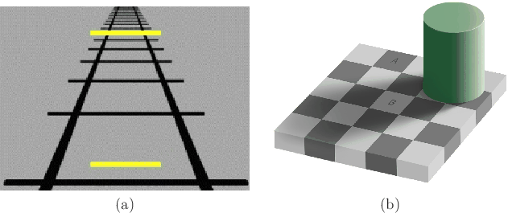
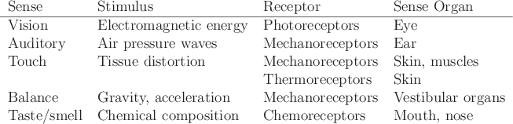
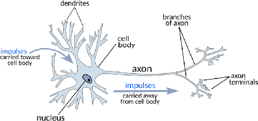
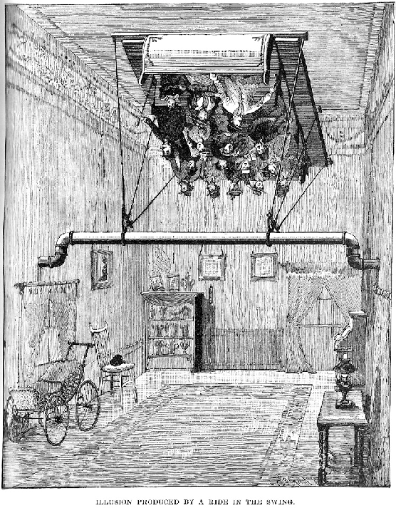

Our bodies were not designed for VR. By applying artificial stimulation to the senses, we are disrupting the operation of biological mechanisms that have taken hundreds of millions of years to evolve in a natural environment. We are also providing input to the brain that is not exactly consistent with all of our other life experiences. In some instances, our bodies may adapt to the new stimuli. This could cause us to become unaware of flaws in the VR system. In other cases, we might develop heightened awareness or the ability to interpret 3D scenes that were once difficult or ambiguous. Unfortunately, there are also many cases where our bodies react by increased fatigue or headaches, partly because the brain is working harder than usual to interpret the stimuli. Finally, the worst case is the onset of VR sickness, which typically involves symptoms of dizziness and nausea.

Perceptual psychology is the science of understanding how the brain converts sensory stimulation into perceived phenomena. Here are some typical questions that arise in VR and fall under this umbrella:

-   How far away does that object appear to be?
-   How much video resolution is needed to avoid seeing pixels?
-   How many frames per second are enough to perceive motion as continuous?
-   Is the user's head appearing at the proper height in the virtual world?
-   Where is that virtual sound coming from?
-   Why am I feeling nauseated?
-   Why is one experience more tiring than another?
-   What is presence?

To answer these questions and more, we must understand several things: 1) basic physiology of the human body, including sense organs and neural pathways, 2) the key theories and insights of experimental perceptual psychology, and 3) the interference of the engineered VR system with our common perceptual processes and the resulting implications or side effects.

The perceptual side of VR often attracts far too little attention among developers. In the real world, perceptual processes are mostly invisible to us. Think about how much effort it requires to recognize a family member. When you see someone you know well, the process starts automatically, finishes immediately, and seems to require no effort. Scientists have conducted experiments that reveal how much work actually occurs in this and other perceptual processes. Through brain lesion studies, they are able to see the effects when a small part of the brain is not functioning correctly. Some people suffer from _prosopagnosia_, which makes them unable to recognize the faces of familiar people, including themselves in a mirror, even though nearly everything else functions normally. Scientists are also able to perform _single-unit recordings_, mostly on animals, which reveal the firings of a single neuron in response to sensory stimuli. Imagine, for example, a single neuron that fires whenever you see a sphere.

## Optical illusions

**Figure 2.16:** Optical illusions present an unusual stimulus that highlights limitations of our vision system. (a) The _Ponzo illusion_ causes the upper line segment to appear larger than the lower one, even though they are the same length. (b) The _checker shadow illusion_ causes the B tile to appear lighter than the A tile, even though they are the exactly the same shade of gray (figure by Adrian Pingstone).

One of the most popular ways to appreciate the complexity of our perceptual processing is to view optical illusions. These yield surprising results and are completely unobtrusive. Each one is designed to reveal some shortcoming of our visual system by providing a stimulus that is not quite consistent with ordinary stimuli in our everyday lives. Figure 2.16 shows two. These should motivate you to appreciate the amount of work that our sense organs and neural structures are doing to fill in missing details and make interpretations based on the context of our life experiences and existing biological structures. Interfering with these without understanding them is not wise!

**Figure 2.17:** A classification of the human body senses.

## Classification of senses

Perception and illusions are not limited to our eyes. Figure [2.17](http://lavalle.pl/vr/node51.htmlnode50.html#fig:class) shows a classification of our basic senses. Recall that a sensor converts an energy source into signals in a circuit. In the case of our bodies, this means that a stimulus is converted into neural impulses. For each sense, Figure [2.17](http://lavalle.pl/vr/node51.htmlnode50.html#fig:class) indicates the type of energy for the stimulus and the _receptor_ that converts the stimulus into neural impulses. Think of each receptor as a sensor that targets a particular kind of stimulus. This is referred to as _sensory system selectivity_. In each eye, over 100 million photoreceptors target electromagnetic energy precisely in the frequency range of visible light. Different kinds even target various colors and light levels; see Section [5.1](http://lavalle.pl/vr/node51.htmlnode132.html#sec:eyestruct). The auditory, touch, and balance senses involve motion, vibration, or gravitational force; these are sensed by mechanoreceptors. The physiology and perception of hearing are covered in Sections [11.2](http://lavalle.pl/vr/node51.htmlnode352.html#sec:ears) and [11.3](http://lavalle.pl/vr/node51.htmlnode359.html#sec:audper), respectively. The sense of touch additionally involves thermoreceptors to detect change in temperature. Touch is covered in Section [13.1](http://lavalle.pl/vr/node51.htmlnode436.html#sec:haptics). Our _balance sense_ helps us to know which way our head is oriented, including sensing the direction of \`\`up''; this is covered in Section [8.2](http://lavalle.pl/vr/node51.htmlnode242.html#sec:vestibular). Finally, our sense of taste and smell is grouped into one category, called the _chemical senses_, that relies on chemoreceptors; these provide signals based on chemical composition of matter appearing on our tongue or in our nasal passages; see Section [13.2](http://lavalle.pl/vr/node51.htmlnode445.html#sec:smell).

Note that senses have engineering equivalents, most of which appear in VR systems. Imagine you a designing a humanoid telepresence robot, which you expect to interface with through a VR headset. You could then experience life through your surrogate robotic self. Digital cameras would serve as its eyes, and microphones would be the ears. Pressure sensors and thermometers could be installed to give a sense of touch. For balance, we can install an IMU. In fact, the human _vestibular organs_ and modern IMUs bear a striking resemblance in terms of the signals they produce; see Section [8.2](http://lavalle.pl/vr/node51.htmlnode242.html#sec:vestibular). We could even install chemical sensors, such as a pH meter, to measure aspects of chemical composition to provide taste and smell.

## Big brains

Perception happens after the sense organs convert the stimuli into neural impulses. According to latest estimates \[[15](http://lavalle.pl/vr/node52.htmlnode465.html#AzeCarGriFarFerLeiJacLenHer09)\], human bodies contain around 86 billion neurons. Around 20 billion are devoted to the part of the brain called the _cerebral cortex_, which handles perception and many other high-level functions such as attention, memory, language, and consciousness. It is a large sheet of neurons around three millimeters thick and is heavily folded so that it fits into our skulls. In case you are wondering where we lie among other animals, a roundworm, fruit fly, and rat have 302, 100 thousand, and 200 million neurons, respectively. An elephant has over 250 billion neurons, which is more than us!

Only mammals have a cerebral cortex. The cerebral cortex of a rat has around 20 million neurons. Cats and dogs are at 300 and 160 million, respectively. A gorilla has around 4 billion. A type of dolphin called the long-finned pilot whale has an estimated 37 billion neurons in its cerebral cortex, making it roughly twice as many as in the human cerebral cortex; however, scientists claim this does not imply superior cognitive abilities \[[224](http://lavalle.pl/vr/node52.htmlnode465.html#MorPakDamDieSonMikEri14),[277](http://lavalle.pl/vr/node52.htmlnode465.html#RotDic05)\].

**Figure 2.18:** A typical neuron receives signals through dendrites, which interface to other neurons. It outputs a signal to other neurons through axons.

Another important factor in perception and overall cognitive ability is the interconnection between neurons. Imagine an enormous directed graph, with the usual nodes and directed edges. The nucleus or cell body of each neuron is a node that does some kind of \`\`processing''. Figure [2.18](http://lavalle.pl/vr/node52.html#fig:neuron) shows a neuron. The _dendrites_ are essentially input edges to the neuron, whereas the _axons_ are output edges. Through a network of dendrites, the neuron can aggregate information from numerous other neurons, which themselves may have aggregated information from others. The result is sent to one or more neurons through the axon. For a connected axon-dendrite pair, communication occurs in a gap called the _synapse_, where electrical or chemical signals are passed along. Each neuron in the human brain has on average about 7000 synaptic connections to other neurons, which results in about  edges in our enormous brain graph!

## Hierarchical processing

  
**Figure 2.19:** The stimulus captured by receptors works its way through a hierarchical network of neurons. In the early stages, signals are combined from multiple receptors and propagated upward. At later stages, information flows bidirectionally.

Upon leaving the sense-organ receptors, signals propagate among the neurons to eventually reach the cerebral cortex. Along the way, _hierarchical processing_ is performed; see Figure [2.19](http://lavalle.pl/vr/node53.html#fig:hierarchical). Through selectivity, each receptor responds to a narrow range of stimuli, across time, space, frequency, and so on. After passing through several neurons, signals from numerous receptors are simultaneously taken into account. This allows increasingly complex patterns to be detected in the stimulus. In the case of vision, feature detectors appear in the early hierarchical stages, enabling us to detect features such as edges, corners, and motion. Once in the cerebral cortex, the signals from sensors are combined with anything else from our life experiences that may become relevant for making an interpretation of the stimuli. Various _perceptual phenomena_ occur, such as recognizing a face or identifying a song. Information or concepts that appear in the cerebral cortex tend to represent a global picture of the world around us. Surprisingly, _topographic mapping_ methods reveal that spatial relationships among receptors are maintained in some cases among the distribution of neurons. Also, recall from Section [1.1](http://lavalle.pl/vr/node53.htmlnode3.html#sec:what) that place cells and grid cells encode spatial maps of familiar environments.

## Proprioception

In addition to information from senses and memory, we also use _proprioception_, which is the ability to sense the relative positions of parts of our bodies and the amount of muscular effort being involved in moving them. Close your eyes and move your arms around in an open area. You should have an idea of where your arms are located, although you might not be able to precisely reach out and touch your fingertips together without using your eyes. This information is so important to our brains that the _motor cortex_, which controls body motion, sends signals called _efference copies_ to other parts of the brain to communicate what motions have been executed. Proprioception is effectively another kind of sense. Continuing our comparison with robots, it corresponds to having _encoders_ on joints or wheels, to indicate how far they have moved. One interesting implication of proprioception is that you cannot tickle yourself because you know where your fingers are moving; however, if someone else tickles you, then you do not have access to their efference copies. The lack of this information is crucial to the tickling sensation.

## Fusion of senses

Signals from multiple senses and proprioception are being processed and combined with our experiences by our neural structures throughout our lives. In ordinary life, without VR or drugs, our brains interpret these combinations of inputs in coherent, consistent, and familiar ways. Any attempt to interfere with these operations is likely to cause a mismatch among the data from our senses. The brain may react in a variety of ways. It could be the case that we are not consciously aware of the conflict, but we may become fatigued or develop a headache. Even worse, we could develop symptoms of dizziness or nausea. In other cases, the brain might react by making us so consciously aware of the conflict that we immediately understand that the experience is artificial. This would correspond to a case in which the VR experience is failing to convince people that they are present in a virtual world. To make an effective and comfortable VR experience, trials with human subjects are essential to understand how the brain reacts. It is practically impossible to predict what would happen in an unknown scenario, unless it is almost identical to other well-studied scenarios.

**Figure 2.20:** A virtual swinging experience was made by spinning the surrounding room instead of the swing. This is known as the _haunted swing illusion_. People who tried it were entertained, but they became nauseated from an extreme version of vection. (Compiled and edited by Albert A. Hopkins, Munn & Co., Publishers, scanned by Alistair Gentry from "Magic Stage Illusions and Scientific Diversions, Including Trick Photography", 1898.)

One of the most important examples of bad sensory conflict in the context of VR is _vection_, which is the illusion of self motion. The conflict arises when your vision sense reports to your brain that you are accelerating, but your balance sense reports that you are motionless. As people walk down the street, their balance and vision senses are in harmony. You might have experienced vection before, even without VR. If you are stuck in traffic or stopped at a train station, you might have felt as if you are moving backwards while seeing a vehicle in your periphery that is moving forward. In the 1890s, Amariah Lake constructed an amusement park ride that consisted of a swing that remains at rest while the entire room surrounding the swing rocks back-and-forth (Figure [2.20](http://lavalle.pl/vr/node55.html#fig:hauntedswing)). In VR, vection is caused by the locomotion operation described in Section [2.2](http://lavalle.pl/vr/node55.htmlnode42.html#sec:software). For example, if you accelerate yourself forward using a controller, rather than moving forward in the real world, then you perceive acceleration with your eyes, but not your vestibular organ. For strategies to alleviate this problem, see Section [10.2](http://lavalle.pl/vr/node55.htmlnode315.html#sec:locomotion).

## Adaptation

A universal feature of our sensory systems is _adaptation_, which means that the perceived effect of stimuli changes over time. This may happen with any of our senses and over a wide spectrum of time intervals. For example, the perceived loudness of motor noise in an aircraft or car decreases within minutes. In the case of vision, the optical system of our eyes and the photoreceptor sensitivities adapt to change perceived brightness. Over long periods of time, _perceptual training_ can lead to adaptation; see Section [12.1](http://lavalle.pl/vr/node56.htmlnode386.html#sec:training). In military training simulations, sickness experienced by soldiers appears to be less than expected, perhaps due to regular exposure \[[173](http://lavalle.pl/vr/node56.htmlnode465.html#Law15)\]. Anecdotally, the same seems to be true of experienced video game players. Those who have spent many hours and days in front of large screens playing first-person shooter games apparently experience less vection when locomoting themselves in VR.

Adaptation therefore becomes a crucial factor for VR. Through repeated exposure, developers may become comfortable with an experience that is nauseating to a newcomer. This gives them a terrible bias while developing an experience; recall from Section [1.1](http://lavalle.pl/vr/node56.htmlnode3.html#sec:what) the problem of confusing the scientist with the lab subject in the VR experiment. On the other hand, through repeated, targeted training developers may be able to improve their debugging skills by noticing flaws in the system that an \`\`untrained eye'' would easily miss. Common examples include:

- A large amount of tracking latency has appeared, which interferes with the _perception of stationarity_.
- The left and right eye views are swapped.
- Objects appear to one eye but not the other.
- One eye view has significantly more latency than the other.
- Straight lines are slightly curved due to uncorrected warping in the optical system.

This disconnect between the actual stimulus and one's perception of the stimulus leads to the next topic.

## Psychophysics

**Figure 2.21:** The most basic _psychometric function_. For this example, as the stimulus intensity is increased, the percentage of people detecting the phenomenon increases. The point along the curve that corresponds to 50 percent indicates a critical threshold or boundary in the stimulus intensity. The curve above corresponds to the cumulative distribution function of the error model (often assumed to be Gaussian).

_Psychophysics_ is the scientific study of perceptual phenomena that are produced by physical stimuli. For example, under what conditions would someone call an object \`\`red''? The stimulus corresponds to light entering the eye, and the perceptual phenomenon is the concept of \`\`red'' forming in the brain. Other examples of perceptual phenomena are \`\`straight'', \`\`larger'', \`\`louder'', \`\`tickles'', and \`\`sour''. Figure [2.21](http://lavalle.pl/vr/node57.html#fig:pod) shows a typical scenario in a psychophysical experiment. As one parameter is varied, such as the frequency of a light, there is usually a range of values for which subjects cannot reliably classify the phenomenon. For example, there may be a region where they are not sure whether the light is red. At one extreme, they may consistently classify it as \`\`red'' and at the other extreme, they consistently classify it as \`\`not red''. For the region in between, the _probability of detection_ is recorded, which corresponds to the frequency with which it is classified as \`\`red''. Section [12.4](http://lavalle.pl/vr/node57.htmlnode420.html#sec:experiments) will discuss how such experiments are designed and conducted.

## Stevens' power law

**Figure 2.22:** Steven's power law ([2.1](http://lavalle.pl/vr/node58.html#eqn:stevens)) captures the relationship between the magnitude of a stimulus and its perceived magnitude. The model is an exponential curve, and the exponent depends on the stimulus type.

One of the most known results from psychophysics is _Steven's power law_, which characterizes the relationship between the magnitude of a physical stimulus and its _perceived_ magnitude \[[316](http://lavalle.pl/vr/node58.htmlnode465.html#Ste57)\]. The hypothesis is that an exponential relationship occurs over a wide range of sensory systems and stimuli:

(2.1)

  

in which

-    is the magnitude or intensity of the stimulus,
-    is the perceived magnitude,
-    relates the actual magnitude to the perceived magnitude, and is the most important part of the equation, and
-    is an uninteresting constant that depends on units.

Note that for , ([2.1](http://lavalle.pl/vr/node58.html#eqn:stevens)) is a linear relationship, ; see Figure [2.22](http://lavalle.pl/vr/node58.html#fig:stevensplot). An example of this is our perception of the length of an isolated line segment directly in front of our eyes. The length we perceive is proportional to its actual length. The more interesting cases are when  . For the case of perceiving the brightness of a target in the dark, , which implies that a large increase in brightness is perceived as a smaller increase. In the other direction, our perception of electric shock as current through the fingers yields . A little more shock is a lot more uncomfortable!

## Just noticeable difference

Another key psychophysical concept is the _just noticeable difference_ (_JND_). This is the amount that the stimulus needs to be changed so that subjects would perceive it to have changed in at least 50 percent of trials. For a large change, all or nearly all subjects would report a change. If the change is too small, then none or nearly none of the subjects would notice. The experimental challenge is to vary the amount of change until the chance of someone reporting a change is 50 percent.

Consider the JND for a stimulus with varying magnitude, such as brightness. How does the JND itself vary as the magnitude varies? This relationship is captured by _Weber's law_:

(2.2)

  

in which  is the JND,  is the magnitude of the stimulus, and  is a constant.

## Design of experiments

VR disrupts the ordinary perceptual processes of its users. It should be clear from this section that proposed VR systems and experiences need to be evaluated on users to understand whether they are yielding the desired effect while also avoiding unwanted side effects. This amounts to applying the scientific method to make observations, formulate hypotheses, and design experiments that determine their validity. When human subjects are involved, this becomes extremely challenging. How many subjects are enough? What happens if they adapt to the experiment? How does their prior world experience affect the experiment? What if they are slightly sick the day that they try the experiment? What did they eat for breakfast? The answers to these questions could dramatically affect the outcome.

It gets worse. Suppose they already know your hypothesis going into the experiment. This will most likely bias their responses. Also, what will the data from the experiment look like? Will you ask them to fill out a questionnaire, or will you make inferences about their experience from measured data such as head motions, heart rate, and skin conductance? These choices are also critical. See Section [12.4](http://lavalle.pl/vr/node60.htmlnode420.html#sec:experiments) for more on this topic.

## Further Reading

The particular software and hardware technologies described in this chapter are rapidly evolving. A quick search of the Internet at any give time should reveal the latest headsets and associated tools for developers. The core concepts, however, remain largely unchanged and are covered in the coming chapters. For broader coverage of human physiology and perception, see \[[206](http://lavalle.pl/vr/node61.htmlnode465.html#Mat08)\] and numerous other books with \`\`Sensation and Perception'' in the title.
