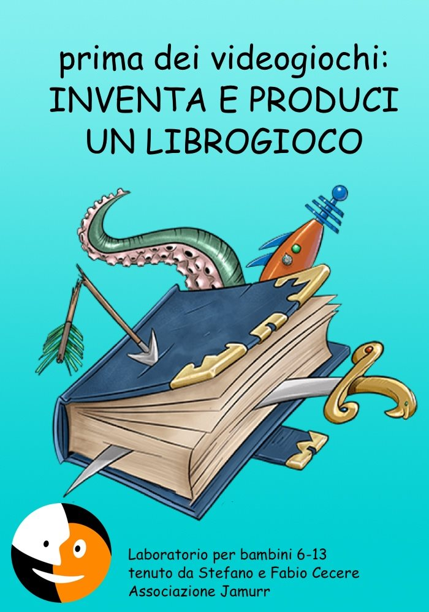

durata: 4 ore  
costo: 5 euro a testa di materiale

Per imparare a creare un videogioco, è importante capire come si costruisce una storia dove il lettore/giocatore possa interagire e fare delle scelte.
In questo laboratorio faremo vedere come dietro ai videogiochi ci sono dei "diagrammi di flusso e scelta" con enigmi e difficoltà da superare.
Aiuteremo quindi i ragazzi a inventare una semplice storia-gioco e a produrla su carta, per portarsi a casa il proprio "librogame", pronto per essere condiviso ed eventualmente trasferito su un computer (magari in un prossimo laboratorio 🙂

Ecco il resoconto del laboratorio tenuto in estate 2019:

23 bambini, un assistente, 3 ore di lavoro per creare più di 12 libri games.
dopo un'introduzione a "conferenza interattiva" sul tema dei diagrammi di flusso, sulle storie lineari e non lineari, sui media "passivi" e quelli interattivi, sul ruolo del game designer quale creatore di storie e spazi per i giocatori,
Stefano e Fabio hanno spiegato gli strumenti che i ragazzi (tra i 6 e gli 11 anni) avrebbero usato per inventare e disegnare il loro Libro Gioco.
il lavoro è stato intenso e molto divertente, con un livello di attenzione altissimo.  
Lavorando chi da solo, chi in duo, chi in trio, la maggior parte dei bambini aveva le idee creative molto chiare. altrimenti si è chiesto aiuto agli altri, all'assistente, oppure ai dadi cantastorie.

dopo un'ora di lavoro le mappe erano finite.

Una merenda con pane e olio (rigorosamente delle nostre colline fiorentine) e poi via alla produzione del librino e rilegatura.

## materiali
i materiali per il laboratorio sono questi:
- la **MAPPA** per progettare la storia [PDF](assets/LibroGameLab%20Mappa%20-%20A3.pdf)
- la **COPERTINA**, da stampare su cartoncino magari colorato [PDF](assets/LibroGameLab%20Copertina%20-%20A4%20cartoncino.pdf)
- le **PAGINE** interne dove disegnare e scrivere [PDF](assets/LibroGameLab%20Pagina%20-%20A4.pdfLibroGameLab%20Copertina%20-%20A4%20cartoncino.pdf)

## foto
ecco qualche foto della mattinata.


