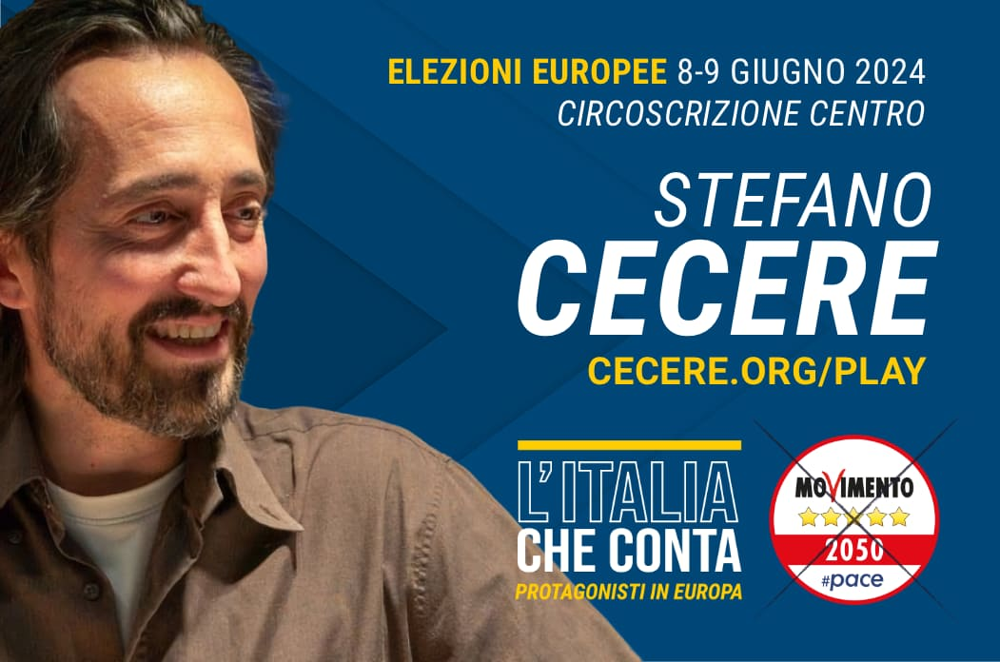

  

Questa è la pagina per la mia candidatura al Parlamento Europeo.
Sono il tuo candidato ideale? Mi vorresti vedere alle prese con altri 700 euro-parlamentari a organizzare mille attività e incontri e portare avanti le nostre idee con energia e creatività? Mettimi alla prova.

## Gioco
> Il gioco sarà disponibile a breve.

## Articoli
- [Perché mi sono candidato](../post/m5s/candidatura-m5s-2024/index.md)
- [Il programma Europeo del M5S](../post/m5s/2024-programma-europee/index.md)

## Sostienimi

- Iscriviti alla mia pagina  
  - [Facebook](https://www.facebook.com/cecere2042) 
  - [Instagram](https://www.instagram.com/cecere2042)  
  - [Youtube](https://www.youtube.com/channel/UCIJRyBArdrCb1m52coyhUZA)
  - [Canale WhatsApp](https://chat.whatsapp.com/CjWcksEAFHZKG9Edahs2yO) 
  - [Canale Telegram](https://t.me/cecere2042)  
  - [Newsletter](https://2042.substack.com/subscribe)  
- 👉🏼 [Firma l'appello per sostenermi](https://forms.gle/GiCzLHAVgCFstkkW8)

## Volantino digitale
Scarica e condidividi questo volantino su WhatsApp o Facebook o ovunque:
  

## Video

### Accademia Apuana per la Pace - 24 maggio

Il mio intervento finale di venerdì 24 all’Accademia Apuana della Pace:  

<https://youtu.be/MKTRNZGllx4>

qui tutto il video della serata:  

<https://youtu.be/dPR3eD_OmVg>

### Presentazione candidati (22 maggio)
Qui racconto la mia vita da attivista e professionale in 7 minuti:

<iframe width="560" height="315" src="https://www.youtube.com/embed/aHn6c-QSvsA?si=6Cz0hqBrIQRJK-gn&amp;start=5838" title="YouTube video player" frameborder="0" allow="accelerometer; autoplay; clipboard-write; encrypted-media; gyroscope; picture-in-picture; web-share" referrerpolicy="strict-origin-when-cross-origin" allowfullscreen></iframe>

<https://www.youtube.com/watch?v=aHn6c-QSvsA&t=5838>

### Parliamo di tutto con Linea Gialla (23 maggio)
un'ora e mezza ieri sera ho fatto questa bella chiacchierata sul perché mi sono candidato in Europa, passando dall’educazione all’umanesimo, dalla  destrutturazione del sistema ai giochi utili per conoscere il mondo…  

<iframe src="https://www.facebook.com/plugins/video.php?height=314&href=https%3A%2F%2Fwww.facebook.com%2F100084372353562%2Fvideos%2F2644812882366049%2F&show_text=false&width=560&t=0" width="560" height="314" style="border:none;overflow:hidden" scrolling="no" frameborder="0" allowfullscreen="true" allow="autoplay; clipboard-write; encrypted-media; picture-in-picture; web-share" allowFullScreen="true"></iframe>

### Telecity (20 maggio)
Confronto in diretta con deputato di FdI Osnati su attualità, Europa, economia…  

<https://youtu.be/W5nT9IMsOTk>

### Empoli per la Pace (16 maggio)
Il mio primo intervento pubblico con altri candidati su temi pace e guerra

<iframe src="https://www.facebook.com/plugins/video.php?height=476&href=https%3A%2F%2Fwww.facebook.com%2Fempoliperlapace%2Fvideos%2F2264532990568453%2F&show_text=false&width=267&t=0" width="267" height="476" style="border:none;overflow:hidden" scrolling="no" frameborder="0" allowfullscreen="true" allow="autoplay; clipboard-write; encrypted-media; picture-in-picture; web-share" allowFullScreen="true"></iframe>

### Costruire la Pace in EUropa


<https://youtu.be/bejtp-WG_pY>

### Psicopatici o Speculatori al potere?


<https://youtu.be/Y0rFY0BofUg>

### L'INTELLIGENZA ARTIFICIALE realizzerà i TUOI INCUBI PEGGIORI


<https://youtu.be/aQ73tgLdeKI>

### La DISTRUZIONE CREATIVA dell'IA: quando l'UOMO diventò di troppo


<https://youtu.be/JQOzztbM7lc>
