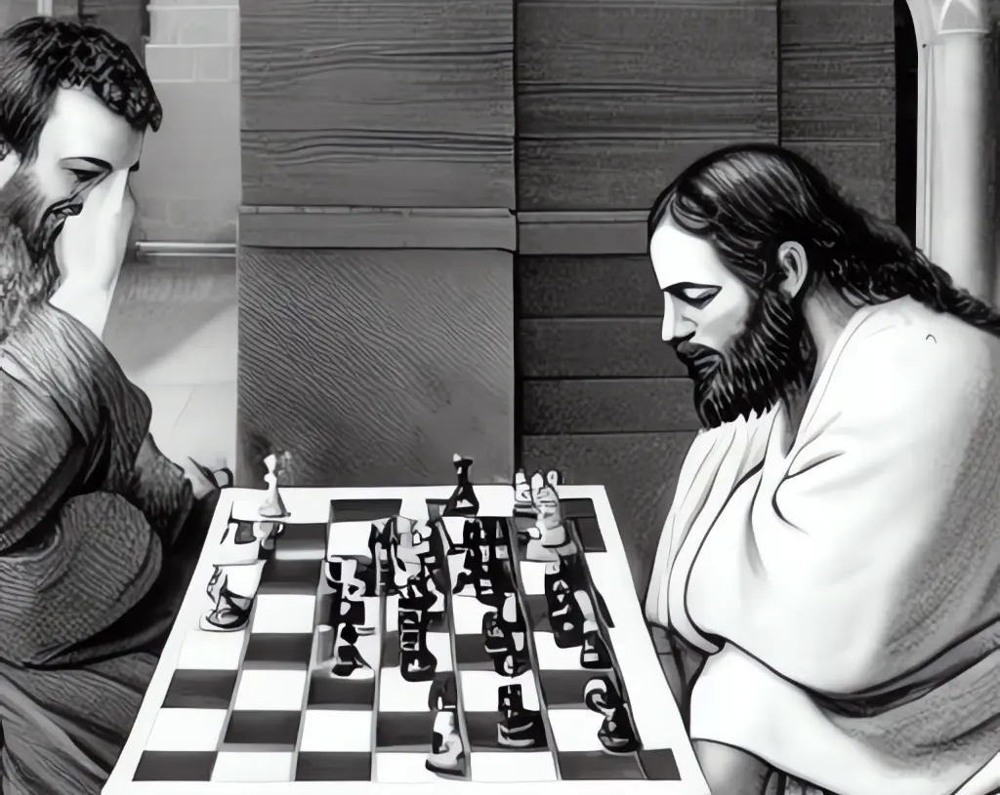

# Scacco al Messia
di H. Van Doren  
1975

> Tre storie molto lontane nel tempo si collegano grazie a un motivo conduttore interno. Socrate, Gesù e Rama vivono in epoche diverse, in contesti culturali differenti e, tuttavia, nella storia dei tre si ripetono certe costanti: la lotta del risveglio contro il sogno, il malinteso politico creato intorno a coloro che proclamano la rivoluzione interiore, il rifiuto malsano dei contemporanei nei confronti ci ciò che può restituire loro la dignità, la violenza sistematica contro le idee di pace.  
> Nei tre capitoli appaiono gli stessi scacchisti a volte con nomi simili come Anito in Socrate, Anas in Gesù e la loggia Anael in Rama. A volte con nomi diversi ma con uno stesso conflitto nelle loro coscienze, come nei casi de “il Prefetto”, Ponzio pilato e “il capo”.  
> Forse scioccherà qualche lettore il fatto che nel finale di ogni capitolo venga trattata la morte e la resurrezione del personaggio centrale in un modo umoristico e terreno. Questa reazione può essere spiegata con l’istinto tragico dell’epoca che crea un’adesione di dispiacere verso i grandi uomini quando questi vengono abbattuti e impedisce di ridere quando escono dallo scacco muovendo in modo insolito i pezzi di questo gioco.  
> Van Doren insinua che la partita archetipica sta giungendo alla fine e cerca di trasmettere la propria certezza con un breve epilogo con le parole di un uomo dell’America.  
> (testo della controcopertina dell’edizione cilena del 5 maggio 1970)

## Prologo

Questo libro non ha il beneplacito dell’aristocrazia ateniese. Tanto meno quello dei Farisei di Giudea, né della borghesia che difende la “civiltà occidentale e cristiana”.  
Contesta i Persiani, i Romani e gli Yankees.  
Pur tuttavia, la sinistra (tanto per darle un nome) che, per semplice dialettica, dovrebbe simpatizzare con esso, si sente ferita nel suo amor proprio e lo rigetta. Sembra proprio che il movimento della storia sia estraneo agli interessi delle fazioni.  
Il tempio di Apollo, il Sinedrio e la Chiesa Cattolica, potrebbero ripetere un milione di volte i loro errori, soffrendo sempre della stessa amnesia.  
Ne consegue che nessuno potrà mai accettare i fatti come li presentiamo.  
Coloro che hanno letto le prove contenute in questo volume hanno presunto che l’interprete si fosse basato su diverse fonti d’informazione: Platone, Aristofane, i 4 Vangeli, gli Apocrifi, Josefo, Strauss, Renan, Petrucelli della Gattina e le cronache degli scriba del 1970 dell’era dei Pesci....  
Nulla di più inesatto!  
Le tre storie che compongono questo libro si fondano sugli archivi audio-visivi di Hassein (una sorta di video-tape) che sono stati fatti scorrere davanti al redattore perché li interpretasse o perché descrivesse quel che vedeva.  
Questi archivi si conoscono da molto tempo con il nome pomposo di “akàsici”. In realtà, si tratta di registrazioni incise su un piccolo cristallo che  processa dati e archivia informazioni.  
Per la serenità degli ipersensibili (che potrebbero molto inopportunamente ostacolare la libera circolazione di questo volume), diciamo che il tutto è, a rigor di logica, un racconto immaginario e che, sebbene alcuni dei personaggi utilizzati siano esistiti veramente, le cose non accaddero nel  modo in cui le abbiamo qui descritte.  
Confidiamo che quanto abbiamo alla fine asserito ci consenta di rimanere amici e che la nostra digestione e i nostri sonni non ne debbano soffrire, per la maggiore gloria di Dio.  

Durante la terza dinastia, sotto l’imperatore Mu-Vang, avvenne l’esecuzione di Yu-tsen che era figlio di Dio e predicava la dottrina del risveglio.  
Sull’avvenimento, lo storico Sse-mu-tsien scrisse pieno d’orrore: “Tale fu fino a quei giorni l’oscurantismo del genere umano. Grazie al cielo la barbarie è finita.”.  
Lo storico Sse-mu-tsien visse novecento anni dopo Yu-tsen, duecento dopo Socrate, duecento prima di Cristo e duemilacento prima di Rama.

## I. Socrate

### Il Banchetto

Restando sdraiato Socrate dichiarò: “A parte gli scherzi capite quale missione mi ha affidato quella donna singolare chiamata Diotima (che certamente non era Santippe, la cuoca). Vi affido questo stesso compito perché lo portiate avanti.  
“Dovete capire che, trovandovi al centro della civiltà, il vostro lavoro, chiamandolo “Filosofia”, è reso assai più agevole. Con essa potete trasmettere la vera conoscenza che è celata nei Misteri delle scuole.  
Secondo quanto abbiamo detto finora, l’uomo andò man mano perdendo il ricordo della sua origine divina tramutandosi ora in passero, ora in quadrupede, ora in serpe per finire in pesce. Quando quest’ultima tappa sarà raggiunta, il circolo ricomincerà e l’uomo rammenterà la sua origine. Allora sarà un semidio.  
Tutti voi comprenderete che sto parlando per enigmi, giacché ho posto come punto di partenza l’uomo e da lui ho fatto derivare gli animali, quando invece gli eventi si sono svolti in maniera contraria. Bah! Che ognuno ricerchi e scopra il significato.  
Chiarito questo concetto, possiamo continuare.  
Krishna alimentò il passero, Ermete il quadrupede. Noi stiamo nutrendo la serpe e dopo verrà il pesce, portato da qualcuno che ancora non conosciamo, ma che certamente s’incarnerà perché l’Idea esiste e deve realizzarsi nel mondo sensibile.  
Perché ciò che vi dico sia reso più chiaro, voglio aggiungere che questo nostro divergere dall’origine, che a prima vista può sembrare una regressione, in realtà è un ritorno al circolo ed è il passo necessario all’evoluzione dell’uomo.  
L’altro argomento di cui vi voglio parlare si riferisce alle trasformazioni: la categoria degli uccelli ,che sono coperti di penne invece che di peli, è susseguente (dopo una piccola modificazione) a quegli uomini senza malizia ma superficiali che si preoccupano poco delle apparenze celesti e credono, nella loro semplicità, che le prove ottenute attraverso il senso della vista siano le più solide. Questo avvenne ai Brahamani quando smarrirono l’insegnamento.  
Gli animali terrestri e le bestie selvagge ebbero origine da coloro che disdegnano la filosofia e non tengono in alcuna considerazione la natura degli oggetti celesti e ciò perché essi sono carenti nell’uso dei circuiti che si trovano nella testa. Essi seguono soltanto le direttive impartite da quella parte dell’anima che si trova radicata nel petto. In conseguenza di ciò le loro teste e i loro arti anteriori si sono piegati verso la terra, attratti dall’affinità che sentono per essa. I loro crani si sono allungati e hanno mutato forma a seconda del modo in cui, causa la loro pigrizia, sono stati repressi i moti dell’anima. Anche per questa ragione, tale specie di esseri fu generata quadrupede. Dio dette ai più stolti maggiori punti di appoggio, giacché essi erano più attratti dalla terra. Così avvenne in Egitto all’inizio della sua decadenza.  
Per quanto concerne i più stolti, coloro che hanno mantenuto i propri corpi ben aderenti al suolo, dato che i piedi non erano loro di alcuna utilità, gli dei fecero in modo che ne nascessero senza e strisciassero per terra. Tale è la nostra attuale situazione, colti e bei baroni ateniesi.  
Infine la quarta e ultima specie, quella acquatica, derivò dagli esseri più bestiali e ignoranti. A questi i divini artefici non concessero neppure una respirazione pura, poiché la loro anima era piena di impurità come conseguenza di tutti i loro disordini. Perciò invece della respirazione pura e leggera dell’aria, non conobbero che una respirazione fonda e torbida nell’acqua. Essi ebbero per dimora i luoghi più bassi, cioè le profondità delle acque.....Così avverrà a tutti coloro che segneranno una nuova tappa.  
In tal modo gli esseri viventi si metamorfizzano negli uni o negli altri secondo acquistino o perdano in intelligenza o in stupidità.  
Orbene, tali specie di animali devono nutrirsi per non estinguersi e compiere così la curva del loro destino. E’ stato spiegato che ogni corpo ha uno spessore. Ogni spessore avvolge necessariamente la natura della superficie e ogni superficie è composta di triangoli. Così, un corpo animato come quello degli esseri viventi che includono i quattro solidi, trae nutrimento anche da essi, dato che ogni singola parte va cercando la propria affinità con gli elementi esterni.  
Quando da un corpo esce più di quanto vi ritorni l’insieme muore, mentre cresce quando esce meno di quanto arrivi.  
Orbene, quando la costituzione del vivente è giovane, quando conserva lo scheletro della nascita composto di triangoli totalmente nuovi, questa giovinezza gli assicura la massima coesione. Tutta la sua sostanza è di consistenza tenera. I triangoli che l’organismo incorpora e che provengono dall’esterno (quelli del cibo e delle bevande, che sono più vecchi e più deboli dei propri), sono dominati e assimilati dall’organismo stesso con i suoi triangoli completamente nuovi. In tal modo, la struttura fa crescere l’intero essere vivente al quale dà nutrimento in forma di triangoli affini in gran quantità. Ma quando la radice dei triangoli si sfalda e si rilassa in seguito alle cento battaglie sostenute contro molteplici nemici, essi stessi non sono più in grado di rompere e di assimilare i triangoli nutritivi che penetrano nel corpo e si lasciano facilmente disgregare da quelli che provengono dall’esterno. Allora, così soggiogato, l’essere vivente decade e tale stato si chiama vecchiaia.  
Infine, quando i vincoli che mantengono in coesione i triangoli cedono, si rilassano a loro volta i vincoli dell’anima e questa, liberata in conformità della natura, allegramente s’invola”.  

Socrate fece una pausa e aggiunse:  
“Noi, sin dall’inizio, abbiamo nutrito l’essere umano con l’amore che un padre sente per suo figlio, ma quando questi, giunto alla maturità, disprezza il nutrimento di suo padre, la sua eredità viene trasferita ai fratelli minori. Questo è il senso che hanno i banchetti mistici: preparare tali triangoli che servano da alimento a corpi nuovi e non come fa Santippe che condisce i cibi di elementi superflui cosicché invece di quelle figure divine ho dovuto inghiottire per venti anni cubi indigeribili. Per questa ragione mi vedete ora vecchio, pelato e pieno di difetti.”.  

Tutti i discepoli risero e uno di loro domandò:  
“Se Atene desse la libertà alla sua anima, a chi trasmigrerebbe?”.  
“Speriamo che l’anima le fugga per la bocca e non da altro orifizio - commentò Socrate - Fate attenzione alla Macedonia che se appare barbara è perché il suo corpo è tenero e può digerire meglio di questo vecchio organismo il cibo degli dei. Quando essa crescerà, diffonderà la Dottrina a tutte le terre che conquisterà. Non pensiate mai che ciò potrà farlo la Persia perché anch’essa è invecchiata e servirà solo da ponte con l’Asia.”.  

Così quando Socrate ebbe concluso, cantarono tutti un ditirambo a Dioniso e bevvero il vino sacro.  
Poi si ritirarono rapidamente.  

### Il Processo

Nell’aula del tribunale era rimasta una sola persona.  
Il Prefetto, nella sua qualità di magistrato supremo, aveva facoltà di rinviare il giudizio. Quel giorno ebbe abbastanza lavoro per evitarlo. Il ricevimento di araldi ed ambasciatori gli aveva riempito tutta la mattina e fu costretto a destinare i ritagli di tempo libero all’evasione delle pratiche politiche pendenti.  
L’esame dei verbali e dei documenti gli avrebbe permesso di dilatare ancora di più i tempi.  
Egli era incaricato delle finanze e inoltre aveva bisogno di tempo per seguire almeno i movimenti dei sediziosi per denunciarli poi al popolo di Atene. Con tutta probabilità essi stessi avevano forzato gli avvenimenti per provocare lo scandalo che aveva condotto Socrate di fronte ai giudici.  
Il Prefetto sapeva che, anche rinviando, il risultato sarebbe stato identico. Almeno ora gli restava la sensazione che grazie al suo intervento, erano state espletate tutte le formalità  che garantivano ad ogni cittadino di essere giudicato con equità.  
Aveva fatto in modo che Lisia si occupasse della difesa e se l’accusato aveva deciso di farne a meno era un problema che riguardava lui soltanto.  
Personalmente, non aveva da muovere a Socrate maggiori obiezioni di quelle che avrebbe addotto un qualsiasi amministratore dello Stato preoccupato dei cittadini morosi. Inoltre, che poteva fare se il partito democratico e gli aristocratici s’ingegnavano ad accumulare indizi per istruire il processo? Egli non era che un rappresentante del popolo e doveva fare ciò che il popolo richiedeva.  
Tuttavia in lui sussisteva ancora il dubbio: o era Socrate l’anima della sedizione, o lo era la coalizione dei partiti, o un gruppo sconosciuto a tutti.  
Secondo i politici, Socrate propugnava una Repubblica che alle spalle del popolo e appoggiata dall’esercito, rafforzasse la resistenza contro il pericolo persiano. Per i politici era evidente, tale pericolo non c’era e dunque si trattava di un pretesto.  
Il Prefetto sapeva bene che il giudizio era politico, i giudizi politici tuttavia erano vietati in seguito all’amnistia che riconciliava democratici e oligarchici, quindi gli accusatori avevano cercato di dare un’altra veste al caso.  
Per qualche ragione Socrate si era preso beffe di continuo del tribunale degli eliasti. Aveva cominciato ad appellarsi ai giudici chiamandoli: “Ateniesi” anziché “Giudici”, rinfacciando loro velatamente che il grado era frutto del caso e non dei loro meriti. Inoltre il suo discorso finale dopo la sentenza era stato sospetto. Aveva dichiarato infatti: - “Io vi assicuro, uomini che mi avete condannato alla pena capitale, che subito dopo la mia morte, subirete un castigo più duro, per Giove, di quello che mi avete inflitto con la vostra condanna. Avete agito pensando di esser liberi di render conto della vostra vita solo a voi stessi, ma accadrà il contrario: saranno numerosi coloro che in futuro vi chiederanno conto (ero io che li tenevo sotto controllo, anche se voi non ve ne siete accorti) e saranno più molesti quanto più sono giovani e il vostro risentimento sarà maggiore.”.  
Che cosa voleva dire con “ero io che li tenevo sotto controllo anche se voi non ve ne siete accorti”? Era evidente che alludeva a quel gruppo di giovani disillusi dalla politica del governo di coalizione. D’altra parte, si sapeva bene che in entrambi i partiti esisteva una velata adesione a Socrate e che proveniva soprattutto dai giovani, sia di estrazione democratica che oligarchica.  
Da molti anni i due partiti si preoccupavano di screditarlo pubblicamente e Aristofane, che era stato uno dei più sensibili alle manovre di Socrate, gli aveva scagliato i suoi dardi portandolo nel “pensatoio” mentre andava divulgando falsità sui temi più diversi insegnando la retorica tanto cara ai sofisti.  
Altre voci facevano apparire Socrate e i suoi discepoli compromessi in un partito occulto che cresceva giorno per giorno appoggiato dai Macedoni.  
Si sapeva dei rapporti che intercorrevano tra i suoi seguaci e i tiranni stranieri e questo acuiva i timori di una morsa politica che stringeva Atene e che assai bene poteva contare su Socrate come agente. Non per nulla i suoi seguaci erano spesso in viaggio per Megara e per l’Egitto, per Cirene, per Taranto e per Siracusa.  
Occorreva inoltre non trascurare le precedenti attività di Socrate. Infatti, quando egli era stato membro del Consiglio dei Cinquecento e della commissione Pritana, si era opposto all’Assemblea intera per difendere vari generali che avevano combattuto nella battaglia della Arginuse.  
In un’altra occasione si era opposto ai Trenta Tiranni, quando gli fu ordinato di catturare il Leone di Salamina.  
Tanto a Potidea, come ad Anfipoli e a Delo si era battuto riuscendo ad influire sulle decisioni del comando.  
Per tutto questo non era affatto strano che entrambe le fazioni considerassero con sospetto la tendenza di Socrate a scavalcarle. Inoltre, era sospettato di essere un sofista e Atene ricordava l’amara esperienza patita quando i discepoli dei sofisti arrivarono al potere con Alcibiade e Crizia.  
Il Prefetto ora si piegava perché Anito del partito democratico (spalleggiato da Melito e Licone) avesse condotto le accuse in questi termini: - “Socrate commette i seguenti delitti: non crede negli dei della città, tenta di introdurre degli dei stranieri e corrompe la gioventù” - facendo intendere ciò che questo, politicamente, significava.  
Gli argomenti in sé  erano deboli e risultava molto difficile produrre delle prove valide. Per questo gli accusatori avevano tentato d’influire sull’opinione popolare con campagne collaterali sull’irreligiosità dell’imputato.  
Anito era un buon ateniese e credeva di capire quale fosse il pericolo che gravava sulla patria. Pertanto avrebbe fatto l’impossibile se con questo proteggeva quei valori che reputava fondamentali, vale a dire: la famiglia, la tradizione e la religione del suo popolo (anche se questi erano in realtà i valori dell’aristocrazia).  
Quando il Prefetto convocò il tribunale, egli sapeva che il clima generale era ostile a Socrate. A parte il problema delle fazioni, anche i sacerdoti di Apollo contribuivano ad ingrandire i suoi crimini, temendo che il loro prestigio fosse spostato a favore dei gruppi socratici che li accusavano di fare commercio di cose divine. Socrate nel processo aveva impegnato la Pizia di Delfo in una dichiarazione sulla sua sapienza con l’evidente proposito di neutralizzare i sacerdoti del culto che facevano causa comune con i potenti.  
Socrate era stato magistrale nella propria difesa frantumando le accuse e dimostrando a tutti la propria innocenza.......  
Allora le fazioni erano ricorse ai mezzi più vili per sovrastare la voce di Socrate, il frastuono era notevole con accuse che partivano da tutti gli angoli dell’aula: “Critone ti mantiene per la vergogna del  popolo”, “Sei un ignorante che non è mai uscito da Atene, ma dai consiglio a tutti e ti perdi in chiacchiere tutto il giorno senza far nulla di produttivo”, “Dici di scoprire la verità negando e discutendo di continuo”, “Ti si trova ad ogni ora nella piazza pubblica, nelle palestre, sotto i portici, nei negozi degli artigiani, ma sempre con i giovani, corrompendoli”, “Caricle già ti aveva proibito di insegnare e di pervertire la gioventù”, “Hai lasciato morire di fame due dei tuoi figli”, “Tua moglie Santippe ha detto che arrivi a casa ubriaco e la bastoni perché ti dia da mangiare a qualsiasi ora”, “Sei figlio di Sofronisco e della levatrice, ti conosciamo e sappiamo anche che li hai mandati in rovina rubando loro venticinque mine che costituivano tutti i loro risparmi”, “Sei fuggito come un codardo a Potidea, ad Anfipoli e a Delo, traditore”, “Hai detto che il sole è una pietra e la luna una terra anziché dei”, “Utilizzi gli dei e li rinneghi a tuo comodo”, “Hai avuto il coraggio di affermare: opero nel modo che vedete per compiere la missione che Dio mi ha dato per voce degli oracoli e dei sogni”, “Chi credi di essere? Per noi non sei altro che un matto o un commediante”, “insegnaci qualcosa di nuovo perché quella del  - conosci te stesso - ce lo diceva la nostra nonna”, “A parte le misture che fate con Parmenide, Anassagora, Archelao e altri, non ne hai qualcuna buona per il fegato?”, “Oltre che sofista, che altro sei?”.  
Il Prefetto era riuscito a fatica a zittire il popolino e ad arrivare alla votazione. Il risultato diede la prova che esistevano molti dubbi, dato che 220 giudici avevano votato a favore di Socrate e 280 contro e ciò era un sintomo che la frattura poteva ampliarsi.  
Socrate, forse con lo scopo di accentuare la divisione, aveva continuato ad attaccare un settore del tribunale proponendo come pena niente meno che di essere mantenuto dallo Stato.  
Aveva dichiarato: “Bene, da parte mia che pena vengo a proporvi? Devo suggerire quella che merito, vero? Dunque, quale castigo devo subire e quale multa pagare per non aver mai avuto nella mia vita un momento di riposo, per non essermi occupato di ciò che  costituisce la preoccupazione della maggior parte degli uomini: i guadagni, il governo della casa, la carriera militare, i comizi, gli incarichi pubblici, le congiure e i dissensi che minacciano la città. Per essermi sforzato di convincere ognuno di voi che non ci si doveva preoccupare di tali faccende prima di cercare di essere migliori e il più prudenti possibile?
Quale ricompensa dovrei chiedere per il mio comportamento? Una ricompensa, ateniesi, proporzionale ai meriti. E ancora di più una ricompensa che sia adeguata alla mia persona.  
E quale premio potrebbe essere adeguato ad un uomo povero, a un benefattore della città, che si è visto costretto a mettere da parte i suoi interessi personali per dedicarsi soltanto alla vostra istruzione? Non c’è cosa più adeguata, ateniesi, che mantenere un uomo così nel Pritaneo con molte più ragioni che se qualcuno di voi fosse risultato vincitore in Olimpia nelle corse di cavalli. Poiché egli fa in modo che voi crediate di essere mentre io faccio in modo che voi lo siate. Lui non ha bisogno di essere mantenuto, ma io si.  
Riassumendo, quindi, se mi debbo ritenere d’accordo con la giustizia per la pena che merito, questa è la mia valutazione: il mantenimento nel Pritaneo”.  
Il Prefetto aveva considerato tutti gli aspetti del caso e solo adesso comprendeva che Socrate aveva voluto la condanna, perché facendo una tale proposta paradossale, l’unica decisione possibile era quella che era stata presa.  
Non era chiaro, tuttavia, perché l’avesse fatto.  
Per i suoi precedenti, per le calunnie, per la sua influenza sempre crescente tra i giovani, per quella ostinazione suicida a non abiurare le sue idee, il prefetto ora si domandava: chi era veramente quell’uomo?
Gli risuonavano ancora nelle orecchie quelle parole incomprensibili: “Se addormentati come siete mi deste un colpo e mi uccideste, passereste la vostra vita dormendo. Io sono qui per risvegliare l’uomo. Sono il tafano che sprona lo spirito, colui che vuole farvi abbandonare la buia caverna delle illusioni, per condurvi alla realtà della luce”.  
Era meglio non pensare. Presto avrebbe dimenticato Socrate, mentre, a sua volta, lui, il prefetto, sarebbe stato sempre ricordato per aver agito come un funzionario degno.  
Respirò profondamente e abbandonò l’aula pensando a sua moglie che lo aspettava a braccia aperte.  

### Morte e Risurrezione

Il giorno prima della condanna, il sacerdote di Apollo aveva ornato la poppa della galera che portava a Delo le offerte degli ateniesi. Siccome la legge proibiva di eseguire sentenze prima del ritorno di questa, Socrate rimase un mese in prigione. In qualunque momento i suoi amici potevano entrare nella sua cella.  
Il giorno dell’esecuzione giunsero molto presto nel carcere i discepoli, i figli e la moglie di Socrate. Santippe provocò un tale caos di urla e di gemiti che fu subito allontanata dalla cella.  
Dopo che fu liberato dalle catene, Socrate, sedendosi sul letto, dichiarò:  
“La cosa più strana sembra essere ciò che gli uomini chiamano piacere e quanto sorprendentemente esso sia collegato a ciò che chiamano dolore. Così, mentre era qui quella sgradevole donna che strillava e si percuoteva il petto, io sentivo il morso della sofferenza. Come si è allontanata, ecco qui sorgere nella mia anima una sensazione simile a quella che si sperimenta quando, esausti per le fatiche del torneo, ci vengono sfregate le membra con balsamo e olio. Questo vale anche per il piacere che è subentrato al dolore quando il carceriere mi ha liberato dalle catene che imprigionavano i miei piedi. Piacere e dolore sono concatenati e si desiderano, sostituendosi l’un con l’altro ogni momento.”.  
E così continuò a discorrere tutto il giorno.  
Alla sera, Socrate lasciò entrare la moglie che abbracciò affettuosamente e baciò sulla fronte. Subito dopo si girò e disse a Critone:  
“Dobbiamo un gallo ad Esculapio. Non dimenticarti di estinguere il nostro debito.”.  
Udito ciò, Critone si avviò in tutta fretta a rintracciare il medico del carcere. Trovatolo, gli pagò il prezzo del suo servizio consistente in 10 mine, per il quale (com’erano d’accordo) egli s’impegnava a sostituire la cicuta con una speciale pozione che aveva la proprietà di far dormire pur presentando i sintomi della morte.  
Poiché era entrato il carceriere con i discepolo di Esculapio, Socrate lo guardò di sottecchi e gli domandò:  
“Che ne dici di questa bibita per un brindisi agli dei, è buona no?”
Afferrò la coppa, la vuotò d’un fiato e fregandosi la pancia con piacere si rivolse alla moglie:  
E’ una fortuna mandata dal cielo morire innocente ma con la pancia piena, invece di vivere colpevole, ma a stomaco vuoto.  
Questa battuta aumentò la pena di Santippe la quale non resse e dovette essere condotta fuori.  
Alle due, quell’uomo che a dire di Zopiro aveva tutti i vizi ed era il ritratto della bruttezza e della burla, era morto agli occhi di tutti.  
Critone, Ctesippo e Apollodoro misero il suo corpo su un cocchio e lo portarono alla pira funebre che avevano allestito Platone e Epigena.  
Atena poteva essere soddisfatta, Socrate era morto.  
Nonostante ciò, il giorno successivo l’anziano e i suoi amici lasciavano il Pireo verso il mare aperto.  

## II. Gesù
### La Cena

Gesù si alzò dalla tavola levandosi il manto e si cinse i fianchi con un telo.  
Poi versò dell’acqua in un catino e cominciò a lavare i piedi dei discepoli e ad asciugarli con il telo che aveva addosso. Alla fine disse:  
“Ora andate e camminate per tutte le strade, anche per quelle dei gentili perché sarà lì, a Roma, che lo Spirito s’irradierà verso tutti i domini che gli appartengono. Non prendete la serpe per la coda perché essa può rivoltarsi e ferire la vostra mano. Prendete la serpe dalla testa e tutto il corpo vi seguirà dovunque la portiate.  
Questi piedi che lavo sono inoltre i pesci, la parte estrema di un corpo che avrà fine tra molti anni. Poi quando ciò avverrà, invieremo lo Spirito all’uomo e sarà la fine dei tempi.  
Ma è necessario che si faccia luce in voi e comprendiate che così come questo vino può mutarsi in sangue e questo pane in corpo, così muteranno il vino e il pane dell’umanità in sangue e corpo di un nuovo essere. Ciò sarà possibile tante volte quante sarà buona l’operazione e buono l’artigiano.  
Intanto, andate e divulgate ciò che vi ho insegnato e realizzate il cambiamento in voi stessi in mia memoria.  
Ora andrò a vegliare e voi dormirete perché se lo spirito è pronto la carne è debole. Giorno dopo giorno ho destato il vostro spirito, ma il corpo l’ha reso esausto. Così succederà questa notte.  
Vegliate, risvegliatevi e il vino e il pane si convertiranno dentro di voi in sangue e corpo di un essere nuovo.  
Se vi ho parlato così è perché non vi perdiate d’animo. Sarete cacciati dalle sinagoghe. E verrà il giorno in cui colui che vi ucciderà, penserà di aver reso servizio a Dio.  
Non vi ho detto queste cose prima perché mi trovavo tra voi, ma adesso sto per ritornare da Colui che m’inviò.”.  
Egli si raccolse un istante prima di aggiungere:  
“Padre io ti ho glorificato sulla terra. Ho portato a termine la missione che mi hai affidato.”
Quindi Gesù tacque, prese il pane e, inzuppatolo, lo diede a Giuda e gli disse:  
"Ciò che devi fare, fallo subito".  
Giuda guardò il Maestro e i compagni e rispose:  
“Sia la volontà di Dio” - e uscì rapidamente.  
Dopo aver cantato gli inni, tutti si ritirarono.  
Gesù e coloro che vollero seguirlo, si avviarono all’orto degli Ulivi.  

### L’intrigo

Pilato comprendeva bene la situazione.  
La mattina del 9 di nizan, Gesù era sceso dal monte degli Ulivi in direzione di Gerusalemme. Lo seguivano i suoi discepoli, quelli del Battista e numerosi galilei. In seguito si era aggiunta altra gente per il tumulto provocato da quelli e da coloro che non erano stati informati che la sollevazione era stata rinviata.  
Tuttavia e malgrado le grida di “Osanna al figlio di David”, la massa popolare li aveva lasciati passare fino a che arrivarono al portico di Salomone dove il gruppo si disperse.  
Il giorno dopo, Gesù aveva provocato altro fermento prendendosela con alcuni mercanti che (incuranti della legge) trafficavano nel Tempio. Accusando i sacerdoti di complicità nel traffico, Gesù si era messo in cattiva luce verso il popolino.  
Pilato sapeva che Gesù, nonostante fosse stato istigato da Anas e dai sadducei a partecipare alla congiura di Pasqua, non prendeva parte a quel gioco. Lui stesso, essendo Procuratore,  vedeva quanto tutto questo fosse complicato.  
Infatti, Seiano da Roma aveva concepito il piano: la Giudea si ribellava, i romani opponevano una debole resistenza e consentivano il successo della sommossa. Le legioni di stanza in Giudea e i giudei avrebbero poi costretto la Siria  a piegarsi, forzata non solo dalle circostanze ma soprattutto dalla complicità di Pomponio Flacco, governatore e braccio destro di Seiano.  
In diversi luoghi, i giudei avevano ammassato riserve auree al fine d’incoraggiare i legionari della Gallia e della Betica da cui Pomponio  proveniva. Persino la Britannia era in rivolta contro Tiberio che andava disgregando giorno dopo giorno l’impero e poneva dei leali patrioti nella situazione di traditori.  
La stessa guardia pretoriana, inoltre, si sarebbe incaricata del despota evitando così uno scontro armato tra le legioni. Le cose sì che sarebbero cambiate! La Giudea che in fin dei conti era uno dei paesi più poveri e richiedeva enormi spese per la sua occupazione, meritava l’indipendenza per la sua collaborazione.  
Ma Erode Antipa, governando la Galilea (anche se soggetto a Roma), si era mostrato contrario al progetto inviando dei messaggeri a Tiberio cui era rimasto fedele. Nessuno ignorava che l’ambizione del tetrarca era direttamente proporzionale alla sua debolezza di carattere e codardia.  
In tale situazione, senza l’appoggio dei fedeli di Erode e svelato il complotto, Pilato restava allo scoperto e con lui anche i giudei.  
La Pasqua era prossima e quel periodo dell’anno simbolizzava una sorte di parola d’ordine per tutti coloro che ricordavano la fuga dall’Egitto. Il complotto, in ogni modo, poteva essere differito in quanto la maggior parte di quei sessantamila abitanti, più quelli che affluivano da tutte le zone della Giudea, erano stati avvertiti dai loro capi del mutamento di piani.  
In tale situazione Gesù era entrato in città suscitando quel fermento che aveva messo nell’imbarazzo tutte le fazioni che giustamente si premuravano di spegnere qualsiasi accenno di ribellione per non dare giustificazioni ad Erode davanti a Tiberio.  
Gesù non prendeva parte alla cospirazione e in modo incomprensibile mutava ogni giorno il bersaglio dei suoi attacchi attirando su di sé l’ostilità di quei gruppi disposti a tutto.  
Il Pretore si rendeva conto che le ultime attività di Gesù coinvolgevano tutte le gerarchie della Giudea, tenendo conto che il Cesare era già informato della cospirazione. In ogni modo, lui, pure se compromesso, non aveva lo stesso timore delle conseguenze che avevano i gerarchi.  
Dopo lo scompiglio provocato dal rabbi, essi si trovarono costretti a servirsi di lui facendolo risultare come l’unico rivoltoso, al fine di difendere le proprie posizioni e dare fondamento ai rapporti di Erode, sostituendo così i veri protagonisti del complotto.  
D’altra parte il Nazareno sembrava volesse innalzarsi al di sopra delle parti per incarnare il ruolo del Liberatore ma, così facendo, aveva concentrato i suoi numerosi nemici sullo stesso fronte.  
Il sayàn, il gran sacerdote, il gran collegio, il sinedrio, la sinagoga, i sadducei, i fareisei, i betusi, gli ziloti... tutti (nessuno escluso) si sentivano toccati dalla predicazione di Gesù.  
Anche gli esseni, che erano passati in gran numero nelle fila del profeta della nuova dottrina, si erano impegnati nella lotta contro l’invasore e i suoi rappresentanti.  
Per essa il Battista aveva immolato la propria vita denunciando Erode, ed era venerato come eroe nazionale.  
E il rabbi anziché stringere alleanze, parlava ora con i samaritani, ora entrava nei templi stranieri e negava ai giudei di essere il popolo eletto, ingiuriandoli: “razza di vipere, ipocriti, sepolcri imbiancati, spiriti falsi e angusti”. Profanava il sabato. Aveva dichiarato guerra al rito e provocava disordini nella sinagoga. Aveva infranto la legge di Mosé nel capitolo delle impurezze, mangiando a casa di Simone il lebbroso, dove una prostituta l’aveva lavato in presenza di tutti.......  
Almeno questo affermavano le spie dei farisei che lo seguivano dovunque, prendendo nota di quanto faceva e diceva.  
Pilato si rendeva conto che anche tra i suoi seguaci Gesù aveva suscitato dissensi, riferendosi al Battista come a semplice canna scossa dal vento, o con l’affermazione che persino il più piccolo dei regni del Cielo era maggiore di questo.  
In tutti i casi, Pilato non prestava fede a tutte quelle calunnie, ma era evidente che gli avversari del Nazareno erano sempre più inquieti.  
Senza dubbio la fama di Gesù si andava diffondendo tra tutti i popoli più importanti e Gesù si ingegnava con arte incredibile a confondere gli spiriti senza proporre una dottrina precisa, perché sapeva molto bene che se lo avesse fatto avrebbe ripetuto cose già risapute senza riuscire così ad influire sul popolo, o avrebbe detto cose nuove, nel qual caso si sarebbe esposto a tutte le accuse di eresia.  
Neanche Pilato, come Procuratore, poteva tollerare più a lungo l’ingigantirsi della figura di Gesù senza capir bene dove quest’ultimo volesse arrivare. Per il momento era chiaro che quello voleva guadagnar tempo con lo scopo di consolidare le proprie posizioni.  
I discepoli facevano circolare su di lui le storie più incredibili e ingigantivano qualsiasi avvenimento in modo tale da suscitare la meraviglia delle moltitudini. Ovunque raccontavano aneddoti favolosi e disegnavano sui muri i loro famosi pesci e scrivevano dichiarazioni che la maggior parte delle volte arrivavano all’orecchio dalla parte avversa.  
In definitiva era la guerra e, dopo tutto, il Nazareno aveva diritto di usare tutti i mezzi a sua disposizione per divulgare le sue idee, battendosi contro un nemico con molti più mezzi a disposizione.  
Anche Pilato sentiva di essere dalla parte contraria a Gesù. Odiava Tiberio, al momento era alleato dei giudei, ma soprattutto era un romano, anche se era nato a Hispalis. Pensava, inoltre, che quanto era riuscito a Cesare, cioè avanzare su Roma dalla Gallia, poteva essere fatto altresì partendo dall’Asia, e con tali progetti per la testa non poteva perdersi in tante contemplazioni.  
Il Procuratore era al corrente delle contromisure prese dagli avversari e Gesù, rude lottatore com’era, le giustificava pienamente. Ma non sopportava le idiozie che essi mettevano nelle loro accuse. Senza buoni argomenti contro Gesù, restava sempre la strana sensazione che questi, invece di un eretico e un rivoltoso, fosse un uomo pacifico, buono, molto vicino all’insegnamento degli stoici.  
Sì, il Procuratore, anziché prove, aveva tra le mani solo fumo. Non solo si rendeva conto delle menzogne accumulate dagli accusatori ma si accorgeva che tutto ciò non aveva niente a che vedere con i suoi problemi interni. Per queste ragioni aveva inviato Gesù dinanzi ad Erode Antipa, al quale il prigioniero competeva in quanto Gerusalemme, ed egli in quanto galileo, appartenevano entrambi alla sua giurisdizione.  
Certamente Erode lo avrebbe rimesso in libertà, giacché era bene al corrente della congiura e sapeva che i veri cospiratori volevano farne ricadere la responsabilità su Gesù per continuare a restare nell’ombra.  
In quel momento entrarono Anas e Caifa, accompagnati da altri notabili. Il Procuratore li fece passare.  
“Ebbene?” - disse Pilato.  
“Procuratore” - esordì uno degli altri personaggi - Abbiamo interrogato il prigioniero sulle sue attività e su quelle dei suoi seguaci. Si è rifiutato di dare spiegazione, ci ha risposto con insolenza che le sue prediche le fa soltanto nella sinagoga e nel tempio, dove si riuniscono tutti”.  
“Davvero una cattiva risposta” - osservò Pilato.  
“Infatti” - aggiunse il personaggio - “Inoltre lo abbiamo interrogato sul conto dei suoi seguaci, dato che conosciamo la loro fama di malfattori. Organizzano sempre le loro riunioni in posti tenebrosi con una certa Maria di Magdala, il cui corpo, si dice, offrì ricettacolo a ben sette demoni, con Giovanna, moglie di Chuza, intendente di Erode, con Susanna e altre ancora che prestano le loro grazie e con le quali essi si abbandonano a piaceri impuri in onore a Belzebù”.  
“Questa è una cosa grave” - commentò ironicamente Pilato, lanciando uno sguardo a Lentulo, suo uomo di fiducia.  
“Per Mosé” - proseguì l’interlocutore cupamente - “Nega di avere una madre, come se non si sapesse che Maria lo ha concepito illegittimamente, per la qual cosa dovette fuggire in Egitto per non essere lapidata. Conosciamo i suoi fratelli Giacobbe, Giosuè, Simone e Giuda. Le sue sorelle sono tra noi ed egli ha la pretesa di affermare che non ha né madre né fratelli. Un uomo che l’ha conosciuto nella sua infanzia, ci ha raccontato e giurato sui libri della Legge che non ha mai ricevuto un’istruzione perché ha coperto d’insulti i suoi maestri fin da quando gli insegnavano l’Aleph. Ci disse pure che uccise un coetaneo gettandolo dall’alto di una terrazza. Quella famiglia reproba perseguitata andò peregrinando di popolo in popolo sempre scacciata a causa delle stregonerie della madre e delle cattiverie di quel bimbo indemoniato. Alla morte di suo padre egli fuggì con i suoi risparmi e li dissipò nei paesi che visitava senza ricordarsi di sua sorella Lia, che sta quasi morendo di fame.  
“Scusa se t’interrompo” - interloquì Caifa - “vorrei dare al Procuratore una prova decisiva sugli artifici di cui si vale Gesù per ingannare il popolo, irridendosi di esso e della nostra supposta ignoranza..... Quel tale Gesù, siccome è andato per terre d’Egitto e d’Asia, crede che noi siamo tutti analfabeti.  
“Prosegui” - disse Pilato in tono annoiato.  
“Devi sapere che in un’occasione affermò di aver risuscitato un tale che non abbiamo mai rintracciato, ma che, secondo alcuni bene informati, era intimo di Gesù e soffriva di un male che aveva l’apparenza della morte, ma non era tale. Infine, in altre occasioni (secondo quanto hanno scritto i suoi seguaci su questo papiro che fanno circolare) fece camminare un certo Pietro sull’acqua con la sola forza della fede, moltiplicò dei cibi e fece altri prodigi. Ma tutto ciò è noto da centinaia di anni con le leggende di Savatti, Jambunada e di altri..... Persino il suo sermone della montagna sembra una deformazione di quello del Dhammapada. E’ costui un vero Rabbi, Procuratore?’”
All’espressione seccata di Pilato, Caifa riprese il filo del discorso con l’aria di un leguleio.  
“Se non sapessimo che ti distogliamo dalle tue occupazioni, ti porteremmo molte più prove sul suo presuntuoso insegnamento che altro non è che quello di Sakyamuni, soltanto espresso in modo peggiore. Per noi non è anche una novità il motto: “ama il prossimo tuo”, come non lo sono le dottrine di Zend-Avesta, che Gesù mescola abilmente negli aneddoti della sua infanzia, facendo apparire tre adoratori del fuoco come magi che vengono a venerarlo dal paese di Zoroastro.”.  
Levò gli occhi al cielo e aggiunse: -“Noi rispettiamo le credenze di tutti i popoli, ma non possiamo permettere che si corrompa la nostra tradizione, la nostra famiglia e la nostra religione, mortificate come sono dal giogo straniero. E non è il caso di tirar fuori storie remote, come fossero accadute sotto i nostri nasi.”.  
“Bene” - disse Pilato visibilmente toccato - “anch’io sono di un altro paese. Vedremo cosa si può fare, ma ti avverto che questi problemi non sono di mia competenza.  
“Devi prendere oggi una decisione” - lo interruppe Anas - “Abbiamo sottoposto Gesù ad interrogatorio nel Sinedrio e tra l’altro si è dichiarato re disconoscendo il Cesare e questo è un affare di tua competenza.”.  
Pilato allora si avvicinò ad Anas e gli sussurrò all’orecchio:  
“Sei ora difensore di Cesare, o forse te la intendi con Erode Antipa?”
Il gran sacerdote fece un passo indietro e uscì dal pretorio nel momento in cui sopraggiungeva Oseas gridando:  
“Procuratore! Antipa ti restituisce l’imputato: la sua giurisdizione è subordinata alla tua.”.  
Allora Pilato aveva abbandonò il pretorio per dirigersi alla torre Marianna per incontrarsi con Giuda Iscariota (colui che aveva iniziato sua moglie alla strana dottrina del Nazareno).  
Mentre saliva rapido verso le sue stanze, il Procuratore ricordava tutto questo: la suggestiva presenza di Giuda, le sue macchinazioni di nobile sadduceo, il suo istinto politico, i suoi rapporti con tutte le fazioni che sembrava lo rispettassero e nello stesso tempo le sue relazioni con quei mistici seguaci del rabbi. In definitiva, era un uomo religioso travestito da politico o lui e tutti i suoi amici, incluso il profeta, erano politici e sovversivi travestiti da uomini di fede?
Avrebbe desiderato che Gesù fosse niente più di quello: un politico, a suo modo un patriota, disposto a servirsi di qualsiasi mezzo se con questo riusciva a scacciare lui e tutti i romani. In tal caso la lotta si sarebbe equilibrata e lui, quale difensore della Pax romana, avrebbe potuto eliminarlo. Tutto ciò aveva fatto in modo che i suoi contatti con Giuda fossero stati frequenti e che precisamente con lui fosse stato definito il complotto di Pasqua per quanto concerneva Gerusalemme. Giuda, tuttavia, manteneva sempre un certo scetticismo, lasciando intendere che tutto ciò era solo un mezzo per trasmettere la Dottrina, e che niente si poteva realizzare “dal di fuori”, senza conquistarsi il cuore degli uomini.  
Quando arrivò alla torre, trovò Giuda che lo aspettava.  
“Salve Ponzio Pilato” salutò Giuda.  
“Sai già che lo devo condannare.”
“Si” - affermò Giuda impassibile.  
“Come mai?” - domandò Pilato.  
“Lo abbiamo sempre saputo e lui  lo sapeva anche prima di tutti noi.”
Irritato da tutti quei misteri (così frequenti fra i seguaci di Gesù), Pilato ordinò:  
“Ora devi fare la tua parte. Io sceglierò Lentulo.” - detto questo lo salutò.  
Il Procuratore restò solo nella torre, fece qualche passo, poi si sedette sul davanzale di una finestra, domandandosi:  
“Insomma, chi dirige le azioni degli uomini e qual è la libertà e quale la verità?”.  
E allora ebbe la sensazione di essere come una marionetta tirata dai fili di un Destino incomprensibile.  

### Morte e Resurrezione

Dopo continui rinvii, il centurione Lentulo - che era stato scelto da Pilato con delle particolari raccomandazioni - prese in consegna Gesù e altri due sediziosi, accusati di crimini comuni.  
In 14 persone - cinque soldati, Lentulo, i tre condannati, Giuda, Giuseppe d’Arimatea, Giovanni, Simone e Maria di Magdala - il gruppo uscì dalla porta giudiziale che si apriva sul cammino di Siloh e di Gabaon, lasciando sulla sinistra la tomba di Anania, per iniziare a salire sulla destra le pendici del Golgota.  
Arrivati in cima verso l’ora quarta, distesero i condannati sulle croci e ve li affissero. Poi ne innalzarono due, infiggendo profondamente i legni nel terreno. Sulla croce di Gesù inchiodarono un grosso cuneo di legno a mo’ di piattaforma, sul quale Gesù poggiò i piedi. Gli legarono strettamente gambe e braccia. Subito dopo, Lentulo in persona gli fissò le mani al legno con colpi precisi di martello sui chiodi dalla testa ampia. Allora Gesù lanciò due grida acute.  
Agli altri due condannati furono spezzate le membra a colpi di bastone, mentre Gesù era issato con molta cautela per timore di squarciargli le mani.  
Appena il terriccio fu rassodato intorno alle basi delle croci, i soldati si posero attorno ad esse in atteggiamento di vigilanza.  
Non si sa se per l’ora tarda (era ormai la quarta ora e alla sesta cominciava il sabato) o per il clima speciale che si viveva a Gerusalemme, vero è che nessuno di coloro che prima abbiamo ricordato era presente e di essi Giovanni era stato mandato via da Giuda, poiché aveva la fama di parlare a voce altissima e per questa ragione gli avevano appioppato l’appellativo di “figlio del tuono”.  
Gesù si lamentò di aver sete. Gli avvicinarono alle labbra una spugna posta sulla cima di una canna e imbevuta di vino soporifero. Poco dopo Gesù cominciò a dire parole incomprensibili rivolto ai compagni di supplizio, finché cadde profondamente addormentato.  
Constatata la morte degli altri due condannati, Lentulo, con un colpo di lancia, trafisse con grande perizia il costato di Gesù, dal quale fuoriuscì pochissimo sangue. Dopo di che, tutti considerarono l’esecuzione come eseguita.  
I soldati deposero dalle croci i due giustiziati. Il centurione e gli amici di Gesù s’incaricarono di quest’ultimo. Il corpo fu consegnato a Giuseppe d’Arimatea, che, con l’aiuto degli altri, lo trasportò nel sepolcro che aveva eretto nel giardino della sua casa.  
Giuda si attardò un istante e versò a Lentulo trenta monete d’argento per il suo servizio, con la raccomandazione di informare Pilato di tutto quello che era successo.  
I corpi degli altri due giustiziati furono gettati lungo il crinale del Calvario.  
Giunti a casa, Gesù fu rianimato con alcune pozioni e le sue ferite, assai dolorose, furono curate. Nel frattempo, Pilato aveva fatto disporre alcune sentinelle dinanzi alla pietra che era stata collocata davanti al sepolcro di Giuseppe. Tutti ritenevano che il corpo di Gesù fosse lì dentro.  
Recuperate le forze, il Maestro si mise in viaggio per Jope con Giuda, Simone e gli altri.  
Il terzo giorno Maria annunciava ai seguaci che Gesù era risorto ma, nella depressione e nell’abbattimento in cui essi si trovavano, la colpirono fino a stordirla.  
Gesù e i suoi amici, già a Jope, salpavano verso il mare aperto in un bel tramonto.  

## III. Rama

### La Riunione

Seduti intorno a un tavolo, tutti ascoltavano le ultime spiegazioni di quel giovane che sicuramente discendeva dalle tribù d’America.  
Rama s’interruppe un istante per riconsiderare le proprie parole, poi proseguì: “Riesaminando quanto detto dal punto di vista della Tradizione, la leggenda è questa: il Creatore fece l’uomo a sua immagine, ma lo lasciò incompiuto perché potesse svilupparsi armonicamente, in accordo al processo della Natura, nella quale lo aveva posto per dirigerla.  
“D’altra parte, l’uomo non avrebbe potuto dispiegare un altro livello di coscienza fintanto che non avesse interamente popolato il pianeta e non avesse intrecciato una rete di comunicazione tra tutti gli angoli del mondo. Se la specie umana fosse stata capace di ricoprire, come delicato tessuto, tutta la Terra, allora si sarebbe potuto affermare che essa aveva maturato la propria coscienza ed era in condizione di propagare la vita verso altri punti del sistema solare.  
Come in tutti i processi, fin dall’inizio hanno agito qui tre forze: la forza differenziatrice, la forza complementatrice e quella sintetizzatrice.  
Trattandosi di una sequenza evolutiva, ogni nuova sintesi si espandeva rispetto a quella che la precedeva e, raggiunto il suo apogeo, iniziava un nuovo processo di differenziazione, fino a esaurire la triade, sostituendo i vecchi elementi con i nuovi generati nel suo interno.  
Mentre le culture e le civiltà decadevano una dopo l’altra, gli elementi più evoluti di un livello creavano le condizioni necessarie per un livello superiore.  
Le culture isolate dell’inizio divennero complementari tra loro grazie ai contatti che si stabilivano, grazie allo scambio economico, lo sviluppo delle comunicazioni, il confronto delle loro politiche, delle loro espressioni artistiche e delle loro religioni.  
Il fenomeno andò aumentando di triade in triade, simile ad una spirale ascendente, in cui ogni voluta ha maggior diametro della voluta precedente.”. - Rama fece una pausa, poi riprese:  
“Considerando tali processi, i pensatori elaborarono due concezione principali, antagoniste tra loro: quella ciclica e quella lineare.  
La prima conduce ad una interpretazione ripetitiva della storia, la seconda ad una interpretazione evolutiva.  
Accade in verità che ad ogni tappa evolutiva i processi nascono, crescono e si riproducono con il passaggio degli elementi progressivi alla tappa successiva, mentre quelli regressivi decadono e muoiono.  
Orbene, quando le culture erano isole, esse avevano la possibilità di svilupparsi senza notevoli influssi esterni. Ma le cose mutarono con il tempo, fino ad arrivare alla tappa attuale, nella quale tutte le culture esistenti sul pianeta sono in comunicazione tra loro e appartengono alla stessa struttura. Di conseguenza, tutto quello che accade in un punto si ripercuote su tutto il globo e niente di quello che accade può essere isolato dall’insieme.  
Questo sistema globale al quale si è giunti (e che tende a intrecciare tra i suoi elementi interni rapporti sempre più stretti) rende impossibile il verificarsi di fenomeni indipendenti.  
Come esempio di sistema in movimento, consideriamo un’astronave che si allontana dalla Terra. Se un astronauta esce dal modulo di comando, in tutti i casi egli continua ad essere trascinato dalla forza d’inerzia del sistema al quale appartiene e la sua libertà di movimento è sempre relativa ad esso.  
Supponiamo adesso che il navigatore possa spostarsi dalla prua ai motori di propulsione in ragione di tre km. orari. Li raggiungerebbe in meno di un minuto. Apparentemente, allora, si sarebbe avvicinato alla Terra. In effetti, si sarebbe avvicinato in rapporto alla prua in quel momento, ma in quel minuto di marcia tutto il sistema si troverebbe a cinquecento Km. di distanza dal pianeta (supponendo che la velocità dell’astronave sia di trentamila Km. l’ora).  
Ebbene, l’attuale sistema mondiale condiziona qualsiasi fenomeno in modo che esso dipende dall’insieme. Il processo storico nel quale ci troviamo inseriti, ci trascina alla velocità che esso stesso impone. I nostri movimenti sono relativi a tutto il sistema in marcia e rigorosamente dipendenti.  
Se per l’evoluzione dell’uomo furono catapultati in ogni tappa (da un certo circolo che non ignoriamo) esseri eccezionali che riuscirono ad orientare tutto il processo nella direzione che proponevano, è assolutamente inutile che fattori regressivi tentino di marciare dalla prua ai motori di propulsione.  
Il momento attuale riassume tutta la storia passata dell’uomo e proietta quest’ultimo verso il suo sviluppo in direzione della meta verso cui fu proiettato fin dal momento del lancio.  
In tale contesto ha senso parlare di un Destino dell’uomo.  
Coloro che sono avvezzi ai termini tecnici della biologia possono considerarlo, se preferiscono,  come la preparazione del codice genetico elementare dell’essere vivente che si limita a sviluppare nel confronto con l’ambiente i caratteri “registrati” nel DNA basico.  
Gli uomini credono di fare la storia, quando in realtà è il loro condizionamento genetico che li evolve lungo una retta determinata. E’ chiaro che ad ogni tappa assistiamo a correzioni di rotta che impediscono la deviazione, così come la lotta con la natura e il confronto con l’ambiente imprimono nuovi caratteri all’essere vivente che modificano la sua esperienza e gli consentono una migliore utilizzazione di possibilità....ma sempre possibilità relative al sistema nel quale è inserito.  
Se la storia sembra ripetersi ad ogni tappa, nel processo generale essa cambia sempre.  
Nei momenti opportuni quegli esseri prima menzionati hanno provocato correzioni di rotta e le loro lotte sono sempre state in favore del cambiamento e della evoluzione e contro l’inerzia e la stupidità.  
Quei momenti opportuni sono conosciuti col nome di “messianismo”. Poco importa se gli uomini che si incaricarono di tale missione erano messia nel senso obiettivo del termine, o se rispondevano al bisogno spirituale dell’epoca.  
Tutte le volte che essi apparvero, apportarono una nuova rivelazione dell’Essere , un nuovo stile di vita e un nuovo livello di coscienza, ma lo fecero nel momento stesso in cui si concludeva una grande tappa, agendo da anello di congiunzione tra un mondo in agonia e un altro giovane e luminoso, che gli spiriti più alti di ogni epoca potevano intuire all’orizzonte che toccava loro contemplare.  
Bastarono sempre pochi grandi uomini per provocare nei grandi insiemi traumi adeguati alle circostanze materiali e allo stato psicologico delle società nelle quali competeva loro di agire.  
Siamo in grado di comprendere queste relazioni partendo da un altro angolo di visuale.  
Oggi non si può negare che sia possibile la trasmutazione del piombo in oro. E coloro che perseguitarono i nostri alchimisti, mugugnano adesso di fronte ai ciclotroni dei fisici, anche se sono costretti ad ammetterli.  
Sappiamo che l’accelerazione delle particelle opera trasmutazioni, ma al momento attuale l’opinione pubblica giudica inammissibile che l’uomo possa accelerarsi interiormente da sé, possa accelerarsi psicologicamente, come per provocare in se stesso la propria trasmutazione.  
Nessuno ignora che in Chimica catalizzatori, introdotti in minima quantità, operano enormi accelerazioni in grandi insiemi. Allo stesso modo, uomini trasmutati nelle diverse epoche, modificarono con i loro insegnamenti il codice dei grandi insiemi. Tuttavia, nel trasferimento di tali insegnamenti (dottrine) da un periodo all’altro, invariabilmente si accrebbe “il rumore dell’informazione”, tanto per usare un termine di cibernetica. Cioè, si degradò ciò che era stato spiegato all’inizio.  
Ogni volta che ciò si è verificato, si è prodotto un nuovo segnale in grado di rimettere ordine nell’insieme, proprio come avviene nei circuiti di retroalimentazione. In altre parole, si scaraventò fuori bordo tutta la merce avariata.  
Se non si fosse agito in tale modo, tutto sarebbe finito nel caos totale come ci tramanda il mito della Torre di Babele a proposito della “confusione delle lingue”. Dovette accadere proprio questo perché fu tale l’aumento del rumore dalla fonte emittente al recettore, che il messaggio in ogni caso arrivò totalmente distorto.  
Malgrado l’esempio, non bisogna credere che ci stiamo riferendo soltanto a problemi di espressione e significato linguistico, ma all’agire umano in generale.  
Tornando al nostro tema iniziale e alla Tradizione: non erano certo folli coloro che parlavano di composizione geometrica del mondo, di triangoli delle cose, né erano ingenui coloro che parlavano di cambiamento del vino in sangue e del pane in corpo. D’altra parte, anche se costoro erano ispirati dalla mistica del Risveglio e il loro linguaggio era in qualche misura poetico, la verità che trasmisero non fu mai molto distante da quello che oggi conosciamo come Scienza.  
Accade, amici miei, che ciò che è valido per il mondo della natura è valido anche per il mondo dello spirito, perché tali mondi non sono separati, ma sono il medesimo Universo.  
Non abbiamo colpa se la morale attuale e alcune correnti scientifiche continuano ad essere manichee.  
Bene e male, materia e antimateria, sono aspetti di una stessa realtà e non entità separate.  
Adesso che l’uomo si trova in condizione di pensare in modo globale, può cominciare a vedere le cose nel loro complesso, comprendendo che le polarità si invertono secondo un ciclo elettrico, che esistono polarità neutre, che tutto muta di continuo, e che tale mutamento, apparentemente violento in alcuni casi,  è armonico, ordinato, strutturale.  
Per concludere, voglio fare un ulteriore riferimento al racconto.  
La leggenda fa capire che alla fine dei tempi la famiglia umana sarà in perfetta comunione e tutti gli uomini saranno in grado di sapere nello stesso istante ciò che accade in altre regioni (qualunque sia la distanza).  
Allora, quando quella delicata pelle di coscienza ricoprirà tutto il pianeta, proprio dall’inizio della storia sorgerà un pugno di esseri il cui numero e qualità permetteranno all’uomo di risvegliarsi come specie nuova, degna di portare la vita nell’Universo collaborando così al piano del Creatore.”.  
Quando Rama finì la sua dissertazione, si guardò intorno con aria di complicità.  
Pochi istanti dopo, un tale dall’accento straniero osservò:  
“Per tutto ciò che hai detto e spiegato comprendiamo che hai fatto la tua parte, ma noi che cosa dobbiamo fare?”
“Produrre il numero che manca” - rispose Rama.  
“Il numero è sufficiente” - replicò lo straniero.  
“Senza dubbio, ma è necessario ottenere un numero altamente qualificato e distribuirlo nei luoghi più adatti. E’ dagli Stati Uniti (prima che crollino) che soffierà il nostro messaggio......” - Poiché aveva notato una certa insofferenza nel gruppo, aggiunse motteggiando: -“A coloro che guardano quel popolo con disprezzo, conviene che si ricordino del detto gallego: “Dio scrive diritto con linee storte”.  
In quell’istante entrò nella stanza Fernando, un compagno dei primi tempi.  
“Cos’è successo?” - domandò qualcuno.  
“Decidono oggi alle venti. Ma lo faranno a partire da domani. Per adesso cercano soltanto di misurare la nostra capacità di reazione.”.  
“Bene” - interloquì una ragazza rivolgendosi a Rama - “Stanotte alle ventiquattro bisogna che tu ti faccia trovare all’angolo di via Ayacucho e Paso con via Vicente Lopez. Arriveranno i nostri e faranno la loro parte.”
Rama, vedendo che la notte era piuttosto avanzata, si rivolse a Fernando e gli disse con tono vivace:  
“Sbrigati, non abbiamo molto tempo.”
Il giovane guardò Rama e gli altri con calma e prima di uscire osservò:  
“Peccato che questi paesi del Sud America non abbiano la pena di morte. Un giudizio pubblico, invece delle notizie che pubblicherà la stampa, avrebbe un risultato molto più istruttivo. E poi un attentato non ha né la forza morale né coinvolge il sistema così totalmente quanto un’esecuzione che possa poi alimentare il complesso di colpa di tutta una società” - fece un gesto spiritoso e guadagnò l’uscita.  
“Li anticiperemo sempre, forzando le conseguenze.” - aggiunse la ragazza a bassa voce.  
Tutti assentirono.  
Ascoltarono ancora una volta il Cantico della Creazione.  
Poi Rama salutò tutti e uscì da una porta laterale.  

### Il Complotto

Per tutto il giorno il Capo aveva subito le continue pressioni dei diversi settori che esigevano una decisione immediata. Nessuno ignorava che dipendeva da lui chiudere la faccenda.  
Mentre i piccolo-borghesi dei servizi inferiori andavano e venivano accatastando documenti che a loro parere costituivano prove decisive, le alte gerarchie ecclesiastiche minacciavano “anatemi” per la protezione che egli offriva al “corruttore della morale, all’uomo che scavava la fossa alla cultura occidentale e cristiana”.  
La sinistra, a sua volta, non poteva sentirsi molestata se lui scaricava il peso della legge su quel fascista travestito di Rama.  
Il consigliere nordamericano aveva molto flemmaticamente insinuato che nel suo paese faccende del genere non avevano grande importanza. E aveva portato come esempio limite il caso di Che Guevara.  A conclusione del suo breve discorsetto aveva affermato: “Morto il cane, la rabbia sparisce” - e quella frase lo aveva mandato fuori dai gangheri.  
Dopo tutto la faccenda era molto poco chiara e soprattutto non appariva nemmeno l’ombra di un delitto. Non era stato arrecato alcun pregiudizio a persone né a beni e si pensava che tutti i cittadini avessero diritto di esprimere le proprie opinioni se non turbavano la morale né l’ordine pubblico.  
Era precisamente questo che giocava in favore di Rama. Quando, a causa dello stato d’assedio, le sue arringhe erano state vietate, Rama aveva taciuto senza opporre resistenza. In tutti gli altri casi, aveva sempre sollecitato l’autorizzazione per poter esprimere pubblicamente il proprio pensiero a tutti coloro, ed erano numerosissimi, che lo richiedevano. In tre occasioni consecutive le sue conferenze erano state incoraggiate ufficialmente, poiché lo stato d’assedio non lo riguardava, dal momento che gli argomenti dei suoi discorsi concernevano questioni religiose che non attentavano alla sicurezza dello Stato. Ma Rama aveva capito perfettamente che le autorità lo stimolavano per tre precise ragioni: in primo luogo, perché permetteva loro di schedare tutti i seguaci; in secondo luogo, perché dava loro la possibilità d’intimorire e fermare (per accertamenti) tutti coloro che assistevano alle sue arringhe; infine, perché dava loro l’opportunità di affibbiargli l’etichetta di agitatore pubblico disperdendo gli assembramenti a colpi di manganelli, , con lanci di bombe lacrimogene, con attacchi provocatori ad opera di attivisti prezzolati.  
Il Capo ignorava come erano stati predisposti ed eseguiti questi illeciti disgustosi. Sin dal primo istante aveva capito che coloro che oggi andavano su e giù per i piani della Centrale e mobilitavano i gruppi di pressione nei suoi dipartimenti e perfino nei ministeri, lo facevano indispettiti perché Rama li aveva sempre sconcertati con cambiamenti di fronte che non avevano saputo prevedere in passato e che paventavano in futuro.  
Essi avevano scagliato la prima pietra accusando Rama di formare gruppi chiusi che non dichiaravano pubblicamente le proprie intenzioni. Quando questi gruppi uscirono allo scoperto (e in che modo uscirono), gli accusatori fecero marcia indietro scandalizzati perché non si attendevano una simile manifestazione di disciplina e organizzazione.  
Si, il Capo sapeva tutto questo.  
Aveva dinanzi agli occhi una montagna di documenti inconsistenti, pile di lettere di ramaisti sequestrate illegalmente dalla Posta. Era in possesso di registrazioni telefoniche, fotografie, materiale sottratto dai luoghi di riunione, nei quali si era fatto irruzione fracassando porte e finestre, senza nemmeno esibire un mandato di perquisizione.  
In quella montagna di carte figuravano le prove della detenzione illegale di Rama e dei suoi dodici compagni, avvenuta mentre stavano erigendo una casa a Jujuy. Era al corrente dei dieci giorni di carcere, delle azioni illecite, delle ingiurie, dell’agosto del ’66. Era informato della corruzione del giudice che si era prestato agli illeciti con il pretesto della guerriglia.  
Tra quelle carte figurava l’aggressione a mano armata del quale erano rimasti vittime altri venti ramaisti, a Melchor Romero, nel settembre del ’67.  
Figuravano sfacciatamente in dettaglio i metodi illeciti usati a Cordova, Rosario e Buenos Aires nel ’68. L’aggressione e il rapimento di 25 seguaci e le vessazioni loro inflitte per 48 ore consecutive a Delta nel ’68.  
“Documentata” dai manifesti affissi nelle strade di Rosario era la campagna diffamatoria allestita contro una giovane seguace, il cui padre, giudice, per non veder compromesso il proprio prestigio, aveva istruito un processo per incapacità mentale, dopo aver comprato i testimoni e averla fatta torturare in carcere per 15 giorni. C’erano le prove della reclusione di altri 20 a Mendoza e c’erano i successi riportati in un processo-burla durante il quale uno dei “testimoni” fu ricusato essendo state comprovate le sue attività criminose.  
E che cosa era successo in tutti questi casi? Malgrado le pressioni, la corruzione dei testimoni, le “prove”, le campagne diffamatorie della stampa, essi erano sempre tornati in libertà rilasciando dichiarazioni come: i poliziotti sono nostri fratelli, siamo stati trattati meravigliosamente bene, è stato tutto un malinteso.  
L’intera faccenda cominciava a preoccupare il Capo, specialmente dopo aver scoperto che Claudia possedeva una stampa con l’effigie di Rama. Quel giorno le aveva chiesto per quale ragione la conservasse ed ella gli aveva risposto con quella freschezza giovanile che tanto amava: “Rama è buono”. E questo gli era caduto sulla testa come un’enormità incomprensibile. Quella notte si era ripetuto: “Se è buono, non è cattivo. Essi dicono che è buono e nessuno può provare il contrario. E se non è cattivo, perché tutta questa storia? E’ possibile allora che tutto sia capovolto? Allora a chi servo io, a chi? Rama è buono e l’argomento è così primitivo, così solido....” Si era ripetuto tante volte queste parole finché Claudia non l’aveva calmato leggendogli il Vangelo. Ed era stato peggio.  
Egli non era credente e mai lo era stato. Ma ora leggeva il Vangelo per colpa di quel settentrionale che metteva in crisi la sua coscienza.  
Ma chi era realmente quell’individuo che, d’improvviso, se ne era andato a meditare quattro mesi in montagna? Finché non era stato messo di nuovo in carcere con il pretesto che era solo, a centinaia di chilometri dalle città. Per 5 anni il clima era stato arroventato contro di lui, 5 anni di persecuzioni continue perpetrate dai pulpiti, attraverso gli articoli pubblicati da giornali e riviste, denunce di uomini dabbene, di religiosi e di politici. Allora, si era verificato un fatto che rivelava insieme il ridicolo e il sublime.  
Rama si era preparato a parlare in pubblico sulla montagna. Era la sua eliminazione definitiva. Non poteva scegliere una situazione peggiore. Inoltre, voleva farlo in patria, dove nessuno è profeta. Era pieno inverno e i passi erano bloccati dalle tormente di neve. Nulla, di conseguenza, gli era favorevole.  
Ma accadde quello che sconcertò tutti. Quattro giorni prima, le principali città del paese si riempirono di manifesti, scritte sui muri, volantini e scritti che alludevano al sermone. La centrale riceveva informazioni dall’Uruguay, dal Cile, dal Perù, dal Brasile. Anche in questi paesi succedevano cose che riguardavano l’eremita della montagna.  
La stampa USA si era impadronita anch’essa dell’affare. Non si capiva nulla e già in Europa si parlava dell’impatto psicologico del “fenomeno Rama”. La “Jeune Afrique” era mobilitata e si sapeva che in 5 città della Spagna si organizzavano conferenze sull’avvenimento. Tutto questo risultava incomprensibile. E più ancora lo era il sermone.  
Vestito come un montanaro, Rama aveva arringato una folla eterogenea in quel sito grandioso.  
Il Capo, da parte sua, aveva avviato le sue indagini attraverso il muro di poliziotti armati che assediavano la folla. Ma agenti malaccorti avevano effettuato una registrazione difettosa e difatti riportarono dei dati contraddittori e migliaia di chiacchiere.  
Egli stesso tentò varie volte di interpretare il messaggio, ma non approdò a nulla, a differenza di Claudia che ripeteva brani interi a memoria.  
Rama intanto era scomparso per riapparire poi a Rosario, a Cordova e infine a Buenos Aires, senza poter riuscire a parlare in nessuno dei tre casi. Nessuno conosceva il numero esatto dei suoi seguaci che riuscivano a disperdersi nei tumulti organizzati dalle forze dell’ordine e dai provocatori prezzolati. Inoltre molti di coloro che si sospettava aderissero alla Dottrina non apparivano mai nelle manifestazioni pubbliche.  
L’arringa della montagna aveva sconvolto i piani dell’opposizione e in seguito ai divieti, i seguaci manovrarono la stampa facendosi pubblicare esattamente ciò che volevano far sapere: notizie contraddittorie.  
“Com’era possibile” -  si domandava allora il Capo - che pur avendo tutto contro riuscissero ad accrescere giorno per giorno l’interesse nei loro confronti?
A dir la verità, in tutta la sua carriera, i discorsi pubblici di Rama non erano durati più di 40 minuti, eppure continuava a seminare lo scompiglio.  
Tuttavia il Capo credeva di aver compreso il gioco: mentre Rama confondeva i suoi avversari sollevando indignazione e adesione (una fanfaronata che era iniziata zaratustricamente, ma che di giorno in giorno andava orientandosi verso i sobborghi e i sindacati), i suoi compagni moltiplicavano i quadri sotterranei ogni volta più rapidamente, servendosi di quella dottrina assurda del Risveglio, dell’armonia interna e cose del genere.  
Il Capo aveva finalmente ricomposto il mosaico e si era detto:  
Punto primo: con tutto contro, Rama non poteva guadagnarsi il favore del popolo. Di conseguenza, doveva apparire alla luce come un’esca davanti ai suoi persecutori, al fine di alleggerire la pressione sui gruppi sotterranei. Se attaccava il governo con lo scopo di raccogliere intorno a sé gli scontenti, lo avrebbero fatto fuori rapidamente. Al contrario, se non faceva allusioni al governo, l’opposizione lo avrebbe catalogato come un agente del governo che creava diversivi. Ed ecco come agì: attaccò con una violenza sconosciuta nel paese il clero, che all’epoca sommava scandali su scandali a proposito del celibato, delle diserzioni e altre cose ancora. E seppe farlo agitando le acque con un soffio miracoloso che la stampa tentò di ritorcere contro di lui. Il clero, indignato, accusò le frecciate e, senza agire apertamente, approfittò della propria influenza per denigrarlo davanti all’opinione pubblica.  
Punto secondo: Rama colse occasione dal chiasso provocato dai suoi nemici per tenere conferenze-stampa nelle quali toccava temi diversissimi e sosteneva regimi politici in quel momento indefiniti come quelli del Perù e della Bolivia, mentre i suoi amici aggrovigliavano ancor più la trama.  
Punto terzo: cominciò col ripudiare con violenza tutti i partiti e i politici, neutralizzando così il governo che contava sui medesimi nemici. E, naturalmente, riuscì a polarizzare contro di sé il clero e la classe politica.  
Punto quarto: Lanciò appelli alle nuove generazioni, sviluppando le sue teorie sul “vuoto politico” e sulla “non partecipazione” in un mondo destinato al crollo, opponendo così i suoi nemici ai giovani che poco a poco cominciavano a sentire l’istinto di coetaneità. Ma, compreso questo, i suoi avversari tentarono di far apparire i seguaci di Rama come semplici hippies. Rama allora scomparve giurando che non sarebbe tornato più a parlare in pubblico e che non avrebbe rilasciato alla stampa nessun’altra dichiarazione. Un tale atteggiamento accrebbe lo sconcerto, ma anche l’interesse dei giovani.  
Come poteva lasciare tutto così incompiuto? Dove avrebbe condotto tutto questo? Anche un bambino sapeva che in breve tempo la gente avrebbe dimenticato persino le emozioni più grandi.  
Trascorsero i mesi e il fenomeno andò diluendosi lentamente. I nemici più tenaci cominciarono a fregarsi le mani, anche se con una certa diffidenza... Così era accaduto fino a due giorni prima.... Sì, due giorni, poi tutto si era scatenato con la rapidità di un fulmine.  
Era il quinto punto: nei sindacati cominciava a farsi strada a bassa voce un ordine lontano e non se ne potevano prevedere le conseguenze. Non si sapeva neppure quali fili stesse muovendo Rama.  
Ecco che da due giorni quel maledetto settentrionale si muoveva per Buenos Aires, negando la sua partecipazione alla nuova vicenda. All’epoca in cui si manifestavano i primi movimenti di lotta operaia, qualche idiota aveva riportato la notizia (sicuramente falsa) che Rama intratteneva strani rapporti con l’estero e che non era estraneo al fenomeno sociale argentino e forse nemmeno a quello del Cono Sud. Non era che un’inganno.  
Gli informatori parlavano di una loggia Anael, della “L” inclinata e altre sciocchezze del genere.  
Certo è che nel paese cresceva la tensione ed esisteva un vasto conflitto d’interesse e tutti sapevano che non c’era alcuna speranza d’influire su Rama nel caso che fosse proprio lui a manovrare nell’ombra.  
Allora, tutti i suoi nemici si coalizzarono per fare pressione sul Capo per obbligarlo a prendere una decisione assurda, indifendibile e ingiustificabile per la legge.  
L’ultimatum era stato lanciato e la scadenza era per oggi alle 24.  
In quel momento bussarono alla porta.  

“Avanti”  - disse il Capo.  

Fecero il loro ingresso un sacerdote e due funzionari che il Capo conosceva, e subito dopo un quarto personaggio.  

“Signor Capo” - esordì uno di loro - “padre Simone viene in rappresentanza di Monsignor Cardenas...... E questi è il dottor Robledo, uno dei nostri collaboratori.  
“Accomodatevi, signori” - invitò il Capo dopo averli cortesemente salutati.  
Al segnale di uno dei funzionari, Robledo, chiaramente turbato, aprì un dossier e senza dare spiegazioni si mise a leggere: “Il Movimento Pacifista, dato il suo programma, ha legami con altri movimenti analoghi di varie parti del mondo. I suoi postulati sono: Non-violenza fisica, non-violenza economica, non-violenza razziale e non-violenza religiosa. I seguenti punti sono le premesse della rivoluzione pacifista totale:

1. Diritto di sciopero per ogni tipo di lavoro e in qualsiasi momento.  
2. Partecipazione al potere politico
3. Eliminazione dell’apparato repressivo quale che sia la supposta legittimità della sua origine.  
4. Socializzazione della medicina.  
5. Socializzazione dell’educazione.  
6. Distribuzione delle ricchezze.  
7. Diritto alla difesa pubblica di fronte alla calunnia organizzata.  
8. Obbligo dei mezzi di diffusione di responsabilizzarsi di fronte alle loro pubblicazioni.  
9 - Fratellanza con tutti i popoli e tutte le razze.  
10 - Uguaglianza di predica con la Chiesa ufficiale.  
11 - Libera pratica religiosa privata e pubblica.  
12 - Diritto alla libera ricerca e diffusione delle scienze non ufficiali.  

Il Movimento Pacifista mette l’accento sul fatto che nessun sistema, nessun uomo, nessuno Stato della Terra, ha diritto di impedire le manifestazioni religiose dello spirito umano”.  
E considerando conclusa la sua lettura, aggiunse con aria d’importanza:  
“Il Giudice Dormemulo di Salta assicura, come me, che questo movimento, di netto taglio comunista, dipende da Rama. Lo abbiamo saputo da ottima fonte. Questo prova che si tratta di un estremista”.  
Gli astanti si scambiarono alcuni sguardi astuti e il Capo ringraziò con un tono di voce canzonatorio per la spontanea collaborazione.  
Robledo, fiero del proprio apporto, volle aggiungere:  
“Signor Capo, dobbiamo rinchiuderlo in galera per 30 anni se vogliamo evitare che le famiglie di Salta vivano in continuo soprassalto.  
“Naturalmente” - accondiscese il Capo, sorridendo per lo scioglilingua di quell’idiota. Poi si levò in piedi e tese la mano all’illustre visitatore. Questi lasciò l’ufficio con un sorriso quasi angelico, accompagnato da uno dei funzionari.  
“Signor Capo” - osservò il sacerdote in tono affabile - “quanta onestà regna ancora nel mondo; vede come la buona gente (anche se non ha le idee molto chiare) si fa in quattro per collaborare con la Giustizia. Sono venuto per una missione molto più modesta, propria del mio ministero”.  
“L’ascolto, padre.” - rispose il capo.  
“Si tratta, come dire, si tratta di .....”.  
“.....di quel delinquente di Escobar.” - completò l’accompagnatore con uno sguardo guercio.  
“Ah, si; il signor Escobar,” - riprese il prete - “ha molto preoccupato il Monsignore e vorrebbe sapere se c’è qualcosa di concreto sulla questione.”
“Vede, padre” - ribatté il Capo con voce soffocata - “siamo sul punto di concludere il caso. Credo che oggi stesso sarà portato a termine.”
“Crede, signor Capo o ne è  sicuro?” - domandò il guercio con aria maliziosa.  
“Ebbene, ci mancano alcuni dati.”
“Se lei permette, la posso aiutare.” - disse il guercio.  
Di fronte allo sguardo benevolo del sacerdote, il guercio aprì una cartella e prima di disporsi a leggere, commentò: “ecco qui ciò che hanno scritto quegli hippies, seguaci del delinquente Escobar. Sono parole testuali che riguardano tutti noi, persone produttive, mature e onorate.” - cominciò a leggere: “Un gruppo di indagine prese in esame 1000 schede. Queste contenevano i dati personali di 1000 individui delle diverse provincie argentine. L’elemento comune di essi (questa era la funzione del gruppo) consisteva nella loro attività diffamatoria del Ramaismo. Variavano in età, sesso, occupazione ed estrazione economica.”
“Questi sono i risultati:

1. Il 65% era sposato e aveva contratto matrimonio per risolvere problemi economici. Il resto erano scapoli o separati, senza prospettive matrimoniali.  
2. Il 55% aveva qualche parente prossimo che era stato in carcere per delitti comuni. Di essi il 12% aveva avuto problemi personali con la giustizia.  
3. Un deprimente 80% si definiva “cattolico praticante” anche se era evidente che soltanto il 40% assolveva regolarmente i riti (e questo in media).  
4. Il 40% era riuscito ad occupare il posto di lavoro grazie a raccomandazioni politiche. Di essi il 70% era passato attraverso partiti di opposte ideologie.  
5. Soltanto un 2.5% aveva fatto parte di alcuni nostri gruppi senza però accedere a livelli di Lavoro Superiore. Quasi la totalità di essi era stata minacciata di licenziamento se avesse persistito a frequentare quei gruppi.  
6. Il 3% era stipendiato per la sua attività diffamatoria e un 5% era ufficiosamente utilizzato per quel tipo di campagna.  
7. Si scoprì che quasi il 100% provava il sacrosanto terrore di essere diffamato.  
8. Infine, fu semplicissimo rilevare che si trattava di percentuale elevata di individui frustrati e dalla condotta sessuale irregolare.  

Si constatò dall’inchiesta che, ordinate le percentuali in senso decrescente, alcune riempivano i casellari ma, man mano che diminuivano le caselle meno piene, i numeri di ripetizione aumentavano secondo una formula precisa.  
Risultò una percentuale notevole di individui dalla costituzione fisica difettosa. Infatti tale percentuale era superiore a quella che si registra normalmente nella totalità della popolazione.”
Egli finì di leggere e spalancando gli occhi guerci più del necessario aggiunse:  
“Dicono che ci hanno schedati, signor Capo. Ci perseguitano e si immischiano della nostra vita privata, la cosa più sacra che un padre di famiglia onorato può possedere.”
“Ciò è molto grave” - disse il Capo - “abbia la compiacenza di lasciarmi questa cartella.”.  
“Certamente” - accondiscese il guercio e gliela tese nervosamente facendo cadere inavvertitamente un portacenere.  
“Dio è grande e sa perdonare” - attaccò il prete - “ma male è quando ci si approfitta del Suo nome per commettere iniquità e si mette in pericolo la tradizione, la famiglia, la patria e la religione.” - fece una pausa solenne, quindi riprese - “personalmente credo che il signor Escobar sia un uomo ben intenzionato, ma che, essendo trascinato talvolta dalla sua temerarietà e immaginazione, abbia perso il buon senso, esponendo sé e gli altri a rischi molto seri.” - altra pausa, un gesto di reminiscenza e poi aggiunse - “monsignore suggerisce che forse con un trattamento psichiatrico adeguato si possa reintegrarlo nella società e guarirlo dal suo male. Come nostro prossimo e poiché è stato battezzato nella religione dei suoi avi, ci vediamo nell’obbligo di aiutarlo e di suggerirle queste misure.”.  
“Molto ragionevole e umanitario” - osservò il Capo.  
Il sacerdote proseguì:  
“Grande è la pena che proviamo Monsignore ed io nel vedere un giovane dissipare le sue energie che forse avrebbero potuto essere utilizzate per fini migliori. Ma dopo tutto i sentieri di Dio sono imperscrutabili.... Credersi un messia, lui figlio di due indigeni; e dire che non si sa nulla della sua vita da quando è uscito dal collegio, quando è stato provato che ha precedenti penali ed è stato detenuto diverse volte. E poi, signor Capo, ha fatto un’insalata indigeribile, tra Platone, Marx. Freud e Nietsche, spacciandola per “sua” dottrina. E’ più che evidente la sua “deviazione”. Bisogna far qualcosa per lui.”.  
“E’ senz’altro il caso, padre.”. - esclamò freddamente il Capo.  
In quell’istante squillò il telefono, il Capo afferrò la cornetta.  
“Ascolti, la finisca di girare in tondo” - disse una voce dall’altro capo del filo - “non ci sono argomenti che tengano in questo affare”.  
“Si signore.” - replicò il Capo.  
“Mi ha capito? Quell’uomo non ci interessa e bisogna disfarci di lui. Questo è tutto.” - puntualizzò la voce metallica.  
“Ma come devo fare signore?”
“Lo sa bene! Poi nessuno gli creerà problemi. Mi assumo tutta la responsabilità.”.  
“Benissimo, signore, farò il mio dovere,” - ribadì il capo con il tono del funzionario disciplinato.  
“Tutta la responsabilità ricade su di me, Ah , si ricordi che non sono solo!” - aggiunse la voce troncando la comunicazione.  
Il Capo, visibilmente impressionato, riagganciò il ricevitore e si scusò davanti al prete e al guercio. Aprì una porta laterale che dava nella toilette. Immerso nei suoi pensieri si diede una rinfrescata al viso. Chiuse il rubinetto. Si asciugò e rientrò nella stanza per sedersi di nuovo di fronte ai suoi interlocutori. Il sacerdote continuò a parlare ma il Capo ormai non lo ascoltava più. Diede un’occhiata all’orologio, erano le 20.00. Guardò i due uomini e interrompendo il prete disse:  
“Signori, ho avuto il grande piacere di ascoltarvi. Siate certi che questa sera deciderò: il profeta avrà ciò che merita.”
“Colui che si è auto-designato profeta!” - replicò il guercio.  
Perdendo quasi il controllo il Capo affermò:  
“Come ho detto, il profeta avrà ciò che merita.”.  
Salutò i visitatori e piombò demoralizzato nella poltrona. Poco tempo dopo chiamò Fernando da un telefono pubblico e lo mise al corrente degli sviluppi del caso. Conclusa la conversazione tornò in ufficio.  

### Morte e Resurrezione

Era circa mezzanotte. Lontano, alcune coppie nell’ombra. Un uomo era fermo all’angolo della strada come in attesa. Una vettura che sopraggiungeva a grande andatura, si arrestò accanto a lui. Dai finestrini dell’auto partirono diversi colpi d’arma da fuoco e si vide un corpo cadere al suolo.  
Gli aggressori si diedero rapidamente alla fuga, mentre numerose persone accorrevano presso la vittima.  
Quasi contemporaneamente si fermò un’altra vettura e con l’aiuto dei presenti il ferito fu adagiato nell’interno dell’auto.  
Un tale che disse di essere il dottor Gimenez dichiarò che l’uomo era morto.  
Il giorno dopo tutti i mezzi d’informazione diffusero la seguente notizia:  “Il santone Rama è stato ucciso in uno scontro con altri malfattori”.  E la spiegazione: “Ieri notte intorno alle 24,00, all’angolo delle strade Ayacucho e Paso e Vicente Lopez, è scoppiata una rissa tra alcune persone che, con tutta probabilità uscivano da un locale notturno. Per taluni motivi che la polizia tenta di chiarire, uno di essi ha sfoderato una pistola e ha esploso cinque colpi contro la vittima, ferendola a morte. Gli altri complici si sono dati alla fuga in auto. Quasi nello stesso momento era entrata in scena una pattuglia del quartiere e anche un medico dell’ospedale Cabanillas, dove fu trasportato il delinquente ferito, il quale, pochi minuti dopo aveva cessato di vivere. La polizia cerca di far luce sui fatti” . Alcuni quotidiani aggiungevano queste altre considerazioni: “La vittima presentava vari fori di pallottola calibro 38. Il nostro cronista riuscì ad esaminare e fotografare tre perforazioni in diverse parti del corpo. Firmato il certificato di morte, il cadavere fu preso in consegna da quattro persone che, dopo aver prestato giuramento lo misero in una bara e lo portarono all’aeroporto per il suo trasferimento a Salta, città nella quale riceverà una sepoltura cristiana.  
Rama - come si faceva chiamare - era in realtà Juan Carlos Escobar, argentino, scapolo di 33 anni, nato a Salta. Senza professione e senza fissa dimora. Godeva della fama di guaritore tra la gente dei sobborghi, ma pare che quella fosse un’attività di copertura per celare le sue manovre estremiste.  
Altri ancora ricordano che l’anno scorso era stato protagonista di vari scandali a Salta, a Rosario, a Cordova e Buenos Aires, quando fu arrestato con degli hippies e alcuni elementi di estrema sinistra per aver organizzato manifestazioni nei quartieri periferici.  
Molti giovani che all’inizio avevano seguito con entusiasmo il nuovo “Messia” deposero contro di lui quando avevano scoperto le menzogne di cui erano rimasti vittime.  
La Chiesa Cattolica che fu il bersaglio delle sue invettive, lo trattò sempre con tolleranza considerandolo “pecora traviata”, come disse il parroco di Vicente Lopez. Tale atteggiamento ha permesso che i suoi resti avessero una sepoltura cristiana nel cimitero di Salta.”
Così si chiudeva il caso per l’opinione pubblica.  
I giornali di provincia avevano pubblicato due o tre necrologi che invitavano ad assistere alle esequie il giorno seguente. Quella notte la salma fu vegliata da quattro persone, mentre un agente di polizia era di sorveglianza alla porta della fattoria.  
Verso le due del mattino aprirono la cassa e fecero uscire Rama. Gli diedero da bere una bevanda tonificante.  
Lo stesso medico che lo aveva raccolto nella strada e aveva firmato il certificato di morte, si trovava ora lì per prendersi cura delle sue ferite superficiali e cambiargli i bendaggi.  
Alcune lamine di piombo furono poste in fondo alla cassa che in seguito fu saldata. Quindi il gruppo di uomini si preparò ad uscire lasciando nella fattoria uno di loro.  
Furono notati tre uomini salire a bordo di un’automobile mentre un altro si attardava a versare una somma di denaro al poliziotto di guardia.  
“Dopo diranno che l’ho venduto per denaro” - disse - “che divertente!”  
Detto questo, raggiunse gli altri sulla vettura che partì a gran velocità.  
La mattina seguente “i resti” furono seppelliti alla presenza di un piccolo gruppo di persone. Alcune donne piansero e una di esse, in preda ad una crisi di nervi affermò che Rama era vivo.  
Fu fatta rinsavire a suon di schiaffi.  
Non c’era nessun sacerdote, nessuna croce, contrariamente a quello che era stato annunciato dalla stampa.  
Quasi nello stesso momento, Rama e i suoi amici si trovavano ad Antofagasta, in procinto di imbarcarsi.  

## Epilogo

Quando furono tagliati i fili degli uomini-burattini, degli uomini di legno, il tumulto si spense e si fece gran silenzio.  

Soltanto alcuni rimasero sospesi e vivi, appesi ai grandi alberi, agli alberi-padre della selva.  

Il puma disse: no.  
Il giaguaro disse: no  
Il gatto-tambo disse: no  
La volpe disse: no  

Tutti gli animali si allontanarono, annusando e allungando le lingue, ma non toccarono gli uomini di legno perché qualcosa li proteggeva ed essi non volevano morire.  
Allora, sopra le montagne bruciate, sopra le città bruciate e sopra i corpi degli uomini-burattini e degli uomini-di legno bruciati, apparvero le navi celesti, luminose come il Sole, amabili come il Sole.  
E i signori svegli di Agarti e Shambalà riempirono il cielo e la terra e diedero nutrimento a tutto ciò che era buono.  

Autore anonimo americano.  
(dagli Archivi di Hassein)
