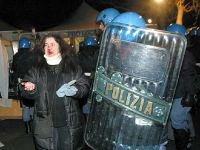

vi giro questo frammento di messaggio inviato stanotte da uno del Movimento di Torino:

"come avrete saputo dai vari tg, le forze dell'ordine ieri notte alle 4.00 hanno caricato le persone che partecipano oramai da giorni al blocco dei lavori, era presente anche qualcuno dei nostri, che fortunatamente non è rimasto tra i feriti. Come sempre tutti i mezzi d'informazione hanno cercato di dire poco e di minimizzare l'accaduto (tra i feriti c'è gente in coma!!).La strategia che stanno attuando è quella, per quanto possibile, di non far uscire l'informazione dalla valle cercando di isolare la protesta. Immediatamente ci siamo organizzati cercando di divulagare il più possibile l'informazione con tutti i nostri mezzi a disposizione,"

sembra non sia più un fatto locale. da là c’è la sensazione che possa essere la scintilla di qualcosa di più grande.
  
diverse persone cominciano a mobilitarsi per fare qualcosa. per il Movimento è più semplice perché è già strutturato:
  
ci sono reti, strumenti di informazione e di diffusione, locali, ruoli, metodologia già impostati sui valori della non violenza, della distribuzione e dell’azione diretta.

invito gli interessati a contattarmi e di non lasciarsi troppo prendere dallo spontaneismo o dalle compulsioni!

pfa (= pace, forza e allegria)

UPDATE:
  
[http://www.notav.it](http://www.notav.it/)
  
[http://italy.peacelink.org](http://italy.peacelink.org/editoriale/articles/art_13872.html)

per gli ingenui (sul tema dell'Alta Velocità e le speculazioni che ci stanno dietro): <http://www.diario.it/?page=cn04091702>