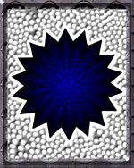

guardo il lato positivo: sempre più persone si stanno accorgendo della criticità del momento storico che stiamo vivendo. e in più risponde! siamo testimoni di risposte (intendendo risposte date con **azioni** nel mondo) che 30, 20 o solo 10, 5 ma anche 3 anni fa erano auspicate ma inesistenti (la realtà era fatta più che altro di sconnessione, di derisione o disinteresse).

oggi i tempi sono proprio cambiati.

può essere di grande interesse (e di aiuto) leggere e meditare sui seguenti commenti dell’amico Eduardo (di Spagna). (i **neretti** sono miei):

“**Dovremmo riflettere su che attività vogliamo fare e sul perché farle**, che senso ha farle, altrimenti non trasmetti alle gente il vero sentimento. Alle persone diamo idee ma non una chiara esperienza.

A volte accade che uno stia molto comodo e che il mondo gli dia fastidio, qualcuno chiama per telefono, qualcuno viene al locale e chiede “E questo cos’è?”; uno ha tanta ruggine addosso che gli fa fatica informare l’altro. Dovremmo scioglierci e renderci conto che **è grazie al mondo che io esisto**.

Abbiamo problemi di immagine al momento di parlare con le persone e dire ciò che uno sente, rimaniamo nell’io, non ci apriamo e rimaniamo rinchiusi in noi stessi.
  
**E' importante non aspettare che le cose arrivino dagli altri**, questo ci può portare perfino ad accettare i maltrattamenti, ma **fare ciò che sentiamo veramente, da me esce qualcosa al mondo.**

A volte **cose semplici quali esprimere un ringraziamento o dei buoni desideri di cuore alle persone che ci sono vicine**, crea dei buoni rapporti che permettono questa apertura.

In generale **abbiamo difficoltà personali di apertura**, di dire alla gente ciò che ci sta accadendo. **L'individualismo generalizzato di questa società è anche in noi**. E’ difficile sbarazzarcene, per tabù, per paure, per l'immagine di sé, per quello che sia non diciamo all'altro ciò che sentiamo. Uno può dire all'altro ciò che sente e l'altro poi faccia quel che vuole, il problema non è l'altro, ma sono io che non mi apro. E' grazie al fatto che ci sono gli altri che mi posso aprire, devo ringraziare che c’è altra gente. Mi apro e parlo della mia esperienza, se l'altro chiede io posso dirgli come fare e come approfondire.

Questa è la difficoltà più grande che abbiamo, nella società c'è chiusura ma questo non è una scusante. **E’ quasi per salute personale che abbiamo bisogno di aprirci**, a colui che ti ascolta, che sia giovane o vecchio non fa differenza. Se **quotidianamente** stai pensando ad aprirti, se da quando ti alzi fino al momento che ti addormenti fai richieste per aprirti, ti appariranno altri tipi di immagini, trovate, coincidenze …

**Hai accumulato una grande quantità di esperienza positiva nella tua vita, a chi lascerai questa esperienza quando te ne andrai?** E' una eredità da dare a qualcuno, altrimenti te la porterai via con te. Se la darai ad altri la tua esperienza non andrà persa, ma verranno fatte delle "copie" in altre persone.

Tu pensa ciò che vuoi fare e questo regalo che vuoi dare all'altro, daglielo, indipendentemente da ciò che l'altro dica.

**Percepisco il mondo come una stupidaggine o vedo il mondo come una necessità?**
  
Dovremmo renderci conto di quanto dobbiamo agli altri, **uno non potrebbe esistere se non fossero esistiti i nostri antenati.** E' grazie ai nostri antenati che oggi abbiamo queste condizioni e che possiamo riflettere su queste cose.

**Se non ci fosse altra gente non potrei vivere come vivo**, non viviamo isolati alcuni si incaricano del gas, altri di fornire degli alimenti, c’è molta gente che fa cose affinché io possa vivere nel modo in cui vivo.

Questa società consumistica è ancora molto radicata, è con i falliti che possiamo parlare.
  
**C’è un’intenzione, una direzione in tutto.** Uno può scegliere di seguire questa direzione o no, ma essa c’è. Posso rimanere nel mondo dell’occasionale, dell’io, dell’immagine, di quello che diranno, oppure nell’altro mondo del trascendentale. Se lasci che “questo” si esprima di più, succederanno delle cose interessanti, è un processo, una direzione.”