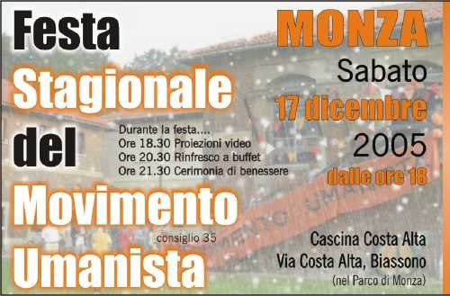

> "…Com'è possibile che esistano persone che agiscono disinteressatamente, senza curarsi di un rendimento immediato delle loro azioni?…"
  
"… Proprio perché l'ideologia del ricevere si è estesa dappertutto, non si riesce più a capire come possano esistere persone che fanno cose senza ricevere nulla in cambio…"

"… Con la loro attività portano nel mondo contenuti interiori che essi stessi hanno creato… C'è una grande differenza tra chi è obbligato a fare determinate cose per le quali in seguito verrà pagato e chi si esprime nel mondo esterno plasmandovi volontariamente contenuti interiori che forse non sono del tutto chiari nemmeno a lui stesso…"

"… Nessuno ha chiarito loro le idee, nessuno li ha forniti degli strumenti necessari per spiegare a se stessi e agli altri la ragione per la quale offrono al mondo l'enorme potenziale di cui dispongono senza aspettare alcun compenso per sé. Il che, evidentemente, è davvero straordinario."

(tratto da "Il Volontario", Discorsi, Opere Complete Vol. 1 - Ed. Multimage 2000) 

[Leggi Il Volontario](./../../docs/il-volontario.md)

se ti senti in sintonia con la nostra sensibilità, sei invitato e vogliamo conoscerti!
a Monza, dentro il Parco di Monza, dalle ore 18:00 di sabato 17 dicembre 2005, si ripete la nostra Festa Stagionale del Movimento Umanista.

scrivimi o <a href="http://www.ilfannullone.it/new/sabato-17-dicembre-festa/64/">VAI QUI</a> per i dettagli e le foto.