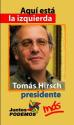

domenica si sono svolte in Cile le elezioni presidenziali. di grande interesse per noi soprattutto perché l’umanista Tomas Hirsch e il Juntos Podemos Mas rappresentano l’unica vera nuova alternativa di svolta. giro questa sintesi dei risultati:

**Elezioni presidenziali in Cile: i risultati del patto Juntos Podemos Mas**

L’ampia alleanza di sinistra Juntos Podemos Mas ha preso il 5,39% per il candidato a presidente Tomas Hirsch, il 7,38% alla Camera (con punte, in alcuni distretti, del 14 e 15%) e il 5,98% al Senato, ma grazie all’iniquo sistema elettorale cileno non ha nessun eletto.
  
Nessuno dei 4 candidati ha raggiunto il 50% dei voti; il 15 gennaio ci sarà quindi un secondo turno tra Bachelet, candidata del centro-sinistra e Pinera, candidato di destra.

Tomas Hirsch ha dichiarato:
  
“Sono molto contento del risultato ottenuto.
  
Abbiamo avuto l’appoggio dei giovani.
  
Juntos Podemos costituisce l’unica alternativa che rappresenta le aspirazioni di chi viene sempre trascurato e maltrattato.
  
In base ai recenti risultati elettorali e in relazione al secondo turno del 15 gennaio, dichiaro:
  
Come ho già detto e condiviso durante la campagna elettorale, mi definisco in aperta opposizione al neo-liberismo, causa e radice dei gravi e persistenti problemi nazionali.
  
Per questo mi considero anche in aperta opposizione e discussione della destra e della Concertacion, responsabili dell’instaurazione e del mantenimento dell’attuale modello politico, sociale ed economico.
  
Coerentemente con quanto già detto, mantengo la mia posiione di non accettare patti o alleanze di alcun tipo con questi soggetti politici. In questo modo farò un’opposizione costruttiva a chi verrà eletto e potrò mantenere la mia totale indipendenza di fronte ai poteri politici ed economici.

Per questo e davanti alla domanda che molti mi hanno posto rispetto a quello che farò al secondo turno, dico che:

**Non appoggerò nessuno dei due candidati al secondo turno, perché nessuno di loro ha inserito nel suo programma di governo le profonde modificazioni necessarie e imprescindibili per far retrocedere le condizioni di diseguaglianza sociale nel nostro paese, che generano dolore e sofferenza nel nostro popolo.

Per tutte queste ragioni io annullerò il voto, ma rispetterò le posizioni che prenderanno partiti e organizzazioni sociali, che coincidano o no con la mia scelta personale.
  
Tomas Hirsch - [www.tomashirsch.cl](http://www.tomashirsch.cl)
  
Candidato a presidente di Juntos Podemos Mas