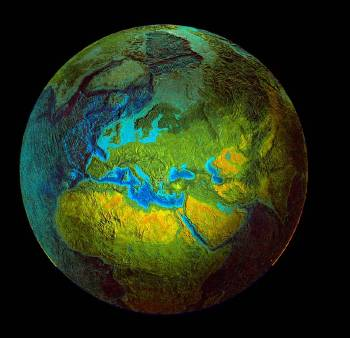

ed anche la mia applicazione preferita, davvero strepitosa:

<http://earth.google.com/> (fra poco disponibile anche per il mac!)
  
sono diversi anni che ho il sogno di realizzare un “mappamondo umanista”, dove visualizzare tutti i punti di presenza del Movimento e di attività (anche di associazioni affini, s’intende).. sarebbe davvero un belvedere!

intanto il Parlamento Europeo ha dato il via libera al Grande Fratello, autorizzando (anzi forse imponendo per almeno 2 anni) la conservazione di tutte le telecomunicazioni (telefoniche e telematiche.. quindi TUTTO quello che esce dal vostro computer).
  
ovviamente con l’interesse di “aiutarci” combattendo i terroristi e i pirati.
  
<http://punto-informatico.it/p.asp?i=56831>

ah: oggi ho voglia di ricordare che il signor Prodi è un po’ il “padrino” della Bolkestein.
  
per chi non sa cos’è, si informi: <http://www.stopbolkestein.org> perché é una cosa che ci riguarda veramente da vicino.
  
non è politica “da salotto”.
  
ovviamente l’invito alla consapevolezza mi viene dal cuore.