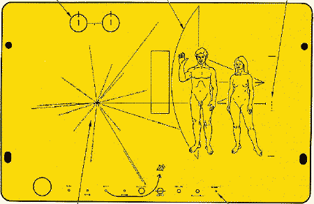

<http://musicaememoria.altervista.org/la_storia_del_voyager.htm>

_[premessa: da ragazzo ero un "bibliofilo accanito" (ciavevo pure la maglietta :), e spendevo la maggior parte delle mie paghette in libri (poi passai ai sintetizzatori e computers e lì fu la fine) libri di tutti i generi inimmaginabili.. che spesso iniziavo per sostituirli a breve con altri… finché]_

piano piano riprendo in mano i temi iniziati per completarli e integrarli per bene.

mi è casualmente caduto in mano il libro "**Contact**", di Carl Sagan, dal quale realizzarono il celebre film con la Jodie Foster..

dopo 20 pagine il libro è entrato nella mia top ten personale.
  
già il film mi era piaciuto tantissimo.. il libro va oltre nei dettagli ed amplia il discorso in modo esemplare.
  
Carl Sagan, oltre che essere stato un grande scienziato, tratta così tanti temi (dalla critica alle religioni attuali (differenziandole dalla religiosità), ai temi epistemologici, etica della scienza, sviluppo della tecnologia e pericoli per l'umanità, ampliamento della coscienza, leggi della natura e senso della vita, svilppo sostenibile e punti di vista…), con ampi e profondi sguardi, condendo questioni vitali con allegra saggezza.. da vero umanista contemporaneo.

sebbene abbia cercato di comprarne altre copie per regalarlo oggi ed è esaurito dappertutto da diversi anni, consiglio di cercarlo e di leggerlo! insieme al "**Giuoco delle perle di vetro**" di Hermann Hesse (del quale condivido il giudizio di Salvatore Puledda: "c'è dentro Tutto")

quella che vedi in alto è la prima targa che è stata allegata alle sonde Voyager e Pioneer, che stanno ancora vagando per il cosmo alla ricerca di contatti con altre forme di vita intelligenti.
  
oltre ad essere particolarmente sensibile e affascinato dal tema, penso seriamente che il giorno in cui "usciremo" dal nostro pianeta, fosse anche solo a mettere un piede su Marte.. qui le cose cambieranno drasticamente.
  
**un CONTATTO e in seguito una relazione con qualcosa di esterno al nostro Sistema (in questo caso la Terra) permetterà di far fluire energia, mobilizzando e liberando dalla chiusura che ci sta facendo degenerare in uno stato di tensione e confusione crescente.

O forse sarà proprio questo stato che stiamo vivendo, a richiedere la NECESSITA' di un'apertura verso l'esterno.. 😉

ah: buon natale!