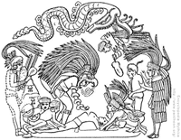

**"Qui si rinnegano i sacrifici, il senso di colpa e le minacce dell'oltretomba"…**  _(terza riga del libro [Umanizzare la terra](./../../docs/umanizzare-la-terra.md)

oggi ricorre quello che sarebbe l'anniversario della santificazione di un mio omonimo, detto anche il "protomartire".. cioè il primo martire della storia del cristianesimo. è forse da questa coincidenza che da diversi decenni mi interrogo sulla questione del sacrificio.

molte culture (la nostra ne è intrisa fino al midollo) considerano il sacrificio come un'eccellente virtù, quasi da ricercare e applicare in ogni ambito della nostra vita.. chissà forse per la credenza di una futura ricompensa.

la cosa non mi è mai quadrata nè piaciuta molto.. ma che fare?
  
**per fortuna altri la pensano e si atteggiano veramente diversamente. e li ho trovati prima che per me fosse troppo tardi 🙂**

oggi ricorre anche un anno esatto dallo **Tsunami asiatico che chiese in "sacrificio" circa 200.000 esseri umani.**
  
ne stanno parlando in tanti.. sia di quanto è stato fatto, sia di quanto poteva essere fatto preventivamente.

ricordo molto bene l'enorme "onda" emotiva che è partita quel giorno, e che ha coinvolto quasi tutta l'umanità nei mesi seguenti (fino al 21 febbraio, per l'esattezza, poi nessuno ne ha più parlato fino a ieri)

a febbraio scorso partecipai direttamente con il Coordinamento Umanista delle 9 ONLUS milanesi (del Movimento) che da molti anni sono attive in India, per organizzare un magnifico concerto, coinvolgendo direttamente molti amici musicisti (da Finardi a Saturnino, da Morgan a Andy e Garbo (coi quali suonai personalmente), ai Deasonika, L'aura e tanti altri.. <a href="http://www.clum.net/md/Articolo139.html" target="_blank">VEDI LO SPOT VIDEO</a>)
  
le attività non si sono mai fermate.. sia là, che qua! ( <a href="http://terra2.clum.net" target="_blank">Terra v2.0</a> nasce anche da lì!)

mi torna in mente ora il paradosso che **tanto ci si commuove e ci si muove per le vittime di INCIDENTI NATURALI, e poco o nulla invece contano le miliardi di vittime di INTENZIONE UMANA** (mi riferisco alle dozzine di guerre in corso, alla violenza sui bambini e le donne di tutto il mondo, gli sfruttamenti economici, le pene di morte, le discriminazioni razziali e religiose…)

un bel tema su cui riflettere, vero?