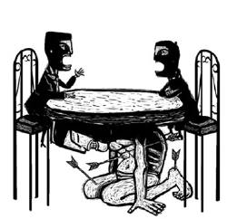

Accennavo 6 mesi fa al tema del DIALOGO.. dato che il tema è tornato, per via del [post sui Punti di Vista](i-punti-di-vista.md), credo sia interessante chiarirlo e approfondirlo.. se vuoi leggi questo documento, sulle "Condizione per il Dialogo", tenuto da **Silo** (l'argentino Mario Rodriguez Cobos) all’Accademia delle Scienze, Mosca, il 6 ottobre 1993. (<a href="http://silo.net/en/collected_works/silo_speaks" target="_blank">sito ufficiale</a>)

---

Signor Vicepresidente dell’Accademia delle Scienze di Russia, Vladimir Kudriatsev, illustri professori ed amici.

Il riconoscimento che mi è stato conferito dall’Accademia delle Scienze di Russia nella sessione del Consiglio Scientifico dell’Istituto per l’America Latina, tenutasi il 21 settembre scorso, è stato di enorme importanza per me. Pochi giorni dopo aver ricevuto la notizia, mi trovo qui per ringraziarvi di questo riconoscimento e per fare alcune riflessioni intorno al dialogo da me svolto nel corso di vari anni con gli accademici di diversi istituti del vostro Paese. Si è trattato di un rapporto di reciproco arricchimento portato avanti attraverso il contatto personale, la corrispondenza ed i libri. Esso ha dimostrato come fosse effettivamente possibile individuare alcune  idee di fondo che fossero condivise da entrambe le parti, cosa questa che si dà solo quando il dialogo è, come nel nostro caso, rigoroso e scevro da pregiudizi. Per contrasto, vorrei affrontare qui il problema degli ostacoli che intralciano la fluidità del dialogo in generale e che, molto frequentemente, lo portano in una strada senza uscita.

Intendo la parola “dialogo” quasi nell’accezione del termine greco _dialogos_ e di quello latino _dialogus_, che riprende la medesima idea, accezione che implica sempre l’alternarsi, nel discorso, di persone che manifestano le proprie idee o sentimenti.  Ma quand’anche adempia a tutti i requisiti formali, a volte il dialogo fallisce e di conseguenza non si arriva a comprendere adeguatamente ciò che era oggetto di  esame. La forma filosofica e scientifica del pensare, a differenza di quella dogmatica, è essenzialmente dialogica; essa si trova in  stretto rapporto con quella struttura dialettica che già Platone ci aveva  presentato come uno strumento di approssimazione alla verità. Studiosi contemporanei sono tornati a riflettere sulla natura del dialogo, prendendo le mosse soprattutto dalla Fenomenologia e dalla formulazione del “problema dell’Altro”, che ha in Martin Buber il suo esponente più importante. Già Collingwood aveva messo in chiaro che un problema non si risolve se non lo si capisce e che non lo si capisce se non si sa che tipo di questione ponga. Nel dialogo ermeneutico domanda e risposta si alternano; ma non c’è risposta che chiuda il cerchio, anzi, esso si apre a nuovi interrogativi che, a loro volta, esigono nuove formulazioni.

La tesi che difenderò oggi può essere esposta in questi termini: non può esistere dialogo completo se non si prendono in considerazione gli elementi predialogici sui quali si basa la necessità del dialogo stesso. Per spiegare quanto enunciato mi prenderò la libertà di fare riferimento ad alcuni esempi tratti dalla mia esperienza personale.

Quando mi si chiede di spiegare il mio pensiero in una conferenza, in un testo scritto od in una dichiarazione alla stampa, ho la sensazione che tanto le parole che uso quanto il filo del discorso che sviluppo possano essere seguiti senza difficoltà ma che, ciononostante, il discorso stesso  non riesca a “connettersi” con gran parte dell’uditorio, oppure dei lettori o dei giornalisti. Si tratta di persone  la cui capacità  di comprensione, in termini generali, non è  peggiore di quella  di molte altre con le quali invece il mio discorso “si connette”. Naturalmente non mi sto riferendo al disaccordo che l’altra parte può manifestare, con una serie di obiezioni, alle proposte da me avanzate; in questa situazione mi sembra  che vi sia anzi una “connessione” perfetta: connessione che ritrovo anche in un’accesa disputa. No, si tratta di qualcosa di più generale, di qualcosa che ha a che vedere con le condizioni del dialogo stesso (intendendo la mia esposizione come  un dialogo con l’altra parte, che accetta, rifiuta o mette in dubbio le mie asserzioni). La sensazione di non connessione si fa sentire con forza quando mi rendo conto che, pur essendo stato compreso quanto ho spiegato, ecco che si tornano a chiedere le stesse cose o si continua ad insistere su punti che non discendono da quanto è stato detto. E’ come se una certa vaghezza, un certo disinteresse andasse di pari passo con la comprensione di quanto esposto; come se l’interesse si radicasse più in là (o più in qua) di ciò che viene enunciato. Qui possiamo intendere  il dialogo come un rapporto di riflessione o discussione tra persone, tra parti. Senza concedere troppo al rigorismo, converrà individuare certe condizioni necessarie affinché questo rapporto possa esistere od affinché un’esposizione possa essere seguita ragionevolmente. In questa prospettiva possiamo dire che affinché un dialogo sia coerente è necessario che le parti: 1. stabiliscano di comune accordo il tema da discutere; 2. attribuiscano al tema affrontato un analogo livello d’importanza; e 3. possiedano un vocabolario comune relativamente ai termini decisivi che verranno usati.

Quando diciamo che le parti devono essere d’accordo sulla scelta del tema da prendere in esame, stiamo facendo allusione  ad un rapporto nel quale ciascuno ritiene il discorso dell’altro degno di nota. Fissare un tema, per altro, non significa che il tema stesso non ammetta trasformazioni o cambiamenti via via che lo si sviluppi; in ogni caso, però,  ciascuna delle parti deve sapere, anche se minimamente,  di cosa stia parlando l’altra.

Quando diciamo, prendendo in esame la condizione successiva, che i livelli di importanza attribuiti al tema dalle due parti debbano essere analoghi, non stiamo affermando la necessità di una coincidenza totale su questo punto, bensì di una vicinanza quantitativamente accettabile tra le due valutazioni; poiché, se il tema risultasse della  massima importanza per una della parti mentre per l’altra fosse irrilevante, si potrebbe anche arrivare ad un accordo sull’oggetto della discussione ma non sull’interesse o sulla funzione svolta dall’insieme del discorso.

Per ultimo, se ai termini decisivi corrispondessero definizioni diverse, le parti potrebbero arrivare ad alterare l’oggetto del dialogo e di conseguenza  il tema trattato.

Solo se le tre condizioni sopraddette vengono soddisfatte si potrà portare avanti il dialogo e giungere così ad un ragionevole accordo o disaccordo con la serie di argomenti esposti. Esistono però numerosi fattori che impediscono di soddisfare le condizioni del dialogo. Qui  mi limiterò a prendere in considerazione alcuni fattori predialogici che influiscono sulla valutazione del livello d’importanza da attribuire ad un tema dato.

Perché esista un enunciato è necessario che ci sia un’intenzione preliminare che permetta di scegliere i termini ed il rapporto tra di essi. Non basta che io enunci: “Nessun uomo è immortale” o “Tutti i conigli sono erbivori” per far capire di quale argomento stia parlando. L’intenzione preliminare al discorso delimita l’ambito, delimita l’universo nel quale si inscrivono le proposizioni. Tale universo non è geneticamente logico ma ha a che vedere con strutture prelogiche, predialogiche. Altrettanto vale per colui cui l’enunciato è rivolto. E’ necessario che l’universo del discorso sia lo stesso  per chi enuncia e per chi riceve l’enunciato: in caso contrario si parlerà di non coincidenza del discorso.

Fino a poco tempo fa si pensava che in un discorso la conclusione derivasse dal gioco delle premesse. Si riteneva, ad esempio, che  al dire: “Tutti gli uomini sono mortali; Socrate è un uomo; quindi Socrate è mortale”,  la conclusione derivasse dalle affermazioni iniziali, quando in realtà succedeva che chi aveva organizzato gli enunciati avesse già in mente la conclusione. Esisteva infatti l’intenzione  di ottenere un certo risultato e proprio questo  permetteva di scegliere enunciati e termini. Nel linguaggio quotidiano accade lo stesso ed anche nella Scienza il discorrere va nella direzione di un obiettivo precedentemente formulato sotto forma di ipotesi. Ebbene, quando si stabilisce un dialogo, ciascuna delle parti può avere intenzioni diverse e puntare ad obiettivi distinti e, soprattutto, ciascuna può dare una propria valutazione globale dell’importanza di un medesimo tema. Ma questa “importanza” non è data dal tema, bensì da un insieme di credenze, da una scala di valori e da interessi che sono precedenti al tema. In termini astratti, due persone potrebbero mettersi d’accordo  nello stabilire che il tema “il senso della vita” sia della massima importanza e tuttavia una delle due parti potrebbe essere convinta che affrontare tale materia sia di scarsa praticità, che non risolva niente e che, infine, non rivesta un carattere d’urgenza per quanto riguarda la vita quotidiana. Che l’interlocutore scettico segua semplicemente lo svilupparsi delle argomentazioni dell’altra parte o che partecipi attivamente al dialogo, ciò può essere spiegato da altri fattori ma non dal tema, la cui sostanzialità tale interlocutore ha squalificato a priori. In questo senso gli elementi predialogici non solo delimitano l’universo che conferisce al tema un determinato livello di importanza ma individuano anche le intenzioni, che vanno ben al di là (o al di qua) del tema stesso. E’ evidente  che gli elementi predialogici sono prelogici ed agiscono all’interno dell’orizzonte epocale, sociale, orizzonte che gli individui confondono spesso con il prodotto delle proprie personali esperienze ed osservazioni. E questa è una barriera che non si può superare facilmente, perlomeno fintanto che non si modifichi la sensibilità dell’epoca, del momento storico nel quale si vive. E’ precisamente per questo che numerosi risultati raggiunti nella Scienza od in altri campi dell’attività umana sono stati accettati con totale evidenza solo in momenti successivi;  ma prima di arrivare a tale accettazione, chi si batté per le nuove  idee e per le attività ad esse connesse incontrò il vuoto dialogico e molto spesso dovette scontrarsi con una barriera di ostilità eretta davanti alla sola possibilità di discutere pubblicamente i nuovi punti di vista. Passata la turbolenza iniziale ed essendosi affacciate sulla  scena della storia una o più generazioni nuove, l’importanza di quei risultati che precorrevano i tempi diventa patrimonio comune e tutti indistintamente si stupiscono del fatto che i risultati in questione siano stati precedentemente negati o minimizzati.

Allora, dato che il mio pensiero non risulta  affatto in linea con determinate credenze,  valori e interessi interni all’universo epocale, mi diventa comprensibile la   “sconnessione” che si crea con molti dei miei interlocutori, con i quali in astratto sembrerebbe esserci il più grande accordo. Nel mio compito di diffondere l’Umanesimo mi trovo frequentemente di fronte alle difficoltà che ho menzionato in precedenza: se si spiega la concezione dell’Umanesimo contemporaneo e la si spiega  chiaramente, non necessariamente si otterrà come risultato una connessione adeguata con  molti interlocutori e questo perché sussistono remore e credenze caratteristiche di precedenti momenti storici che attribuiscono ad altri temi un’importanza superiore a quella attribuita alla problematica che ha come centro l’essere umano. Naturalmente molti si diranno “umanisti”, dato che la parola “umanesimo” può abbellire il discorso ma è chiaro che non è ancora maturato un interesse genuino per intendere le ragioni o le proposte di questa corrente di pensiero e di questa prassi in campo sociale.  Se, mentre  la moda detta la fine delle ideologie, si presuppone che organizzare le idee in forma sistematica significhi costruire  un’ideologia, si tenderà - evidentemente - a non prendere in considerazione le formulazioni sistematiche dell’Umanesimo. In modo del tutto contraddittorio si preferiranno risposte congiunturali a problemi che sono globali ed ogni risposta sistematica apparirà come una generalizzazione eccessiva. In  questo modo, però, risulterà impossibile  cogliere i problemi fondamentali che si presentano e che, in un’epoca di mondializzazione, sono appunto strutturali e globali; si ricorrerà necessariamente, invece, ad un insieme di risposte destrutturate,  che per la loro stessa natura finiranno per complicare ancora di più le cose, creando  una reazione a catena incontrollabile. E’ evidente che si sta seguendo questa strada perché il mondo è governato da circoli economici ristretti che impongono i loro interessi. Ma la visione di questa minoranza privilegiata ha fatto presa perfino sugli strati più disagiati della società: è davvero patetico ritrovare nei discorsi del cittadino medio gli stessi toni che prima percepivamo nei discorsi dei rappresentanti delle minoranze dominanti riportati dai mezzi di comunicazione di massa. Le cose continueranno in questo modo - ed un dialogo profondo od un’azione concertata globalmente non risulteranno possibili  - fino a quando non saranno falliti i vari tentativi settoriali di risolvere la crisi sempre più grave che si è  scatenata nel mondo. Nel momento attuale si crede che il  sistema economico e politico vigente non debba essere posto in discussione nella sua globalità poiché lo si ritiene  perfettibile. Al contrario, secondo noi, questo sistema non è perfettibile e non può essere riformato gradualmente e non saranno soluzioni congiunturali destrutturate a permetterne a poco a poco la  ricomposizione. Queste due posizioni, messe a confronto, potrebbero in teoria  intrecciare un dialogo: ma gli elementi predialogici che agiscono nell’uno e nell’altro caso sono inconciliabili quanto a sistemi di credenze e sensibilità. Sarà solo grazie al fallimento sempre più evidente delle soluzioni settoriali che si arriverà ad un altro orizzonte dell’interrogare ed ad una condizione adeguata al dialogo. Allora le nuove idee verranno gradualmente accettate e  al contempo vasti settori della società, sempre più privi di speranza, passeranno a mobilitarsi. Già oggi, quand’anche si affermi che alcuni aspetti del sistema attuale possano e debbano essere migliorati, la sensazione che si va diffondendo in frange  sempre più vaste della  popolazione è che nel futuro le cose non potranno che peggiorare; e questa sensazione non è semplicemente il segno di una tendenza apocalittica di fine secolo ma rivela un malessere pervasivo e generalizzato che, nato nelle viscere delle maggioranze senza voce, tende a toccare tutti gli strati sociali. Intanto si continua, contraddittoriamente, ad affermare che il sistema è congiunturalmente perfettibile.

Il dialogo, fattore decisivo nella costruzione umana, non si riduce ai rigori della logica o della linguistica. Il dialogo è qualcosa di vivo: in esso lo scambio di idee, sentimenti ed esperienze è intessuto all’irrazionalità dell’esistenza. E’ la vita umana, con le credenze, i timori, le speranze, gli odi, le ambizioni e gli ideali propri di ciascuna epoca, che costituisce il terreno di ogni dialogo. Quando abbiamo detto: “Non può esistere dialogo completo se non si prendono in considerazione gli elementi predialogici sui quali si basa la necessità del dialogo stesso” stavamo puntando lo sguardo alle conseguenze pratiche della nostra affermazione. Non ci sarà dialogo completo sulle questioni di fondo della civiltà attuale sino a che la società non cesserà di aver fiducia nelle tante illusioni alimentate dal sistema  attuale. Nel frattempo il dialogo continuerà ad essere privo di sostanza e di connessione con le motivazioni profonde della società.

Quando mi è giunto il riconoscimento dell’Accademia, ho intuito che in alcune parti del mondo qualcosa di nuovo stava accadendo; quel qualcosa, che all’inizio era solo un dialogo tra specialisti, un giorno arriverà ad occupare la pubblica piazza.

Il mio ringraziamento va a questa prestigiosa istituzione ed a voi tutti, insieme al mio più vivo desiderio che un dialogo fruttifero si approfondisca e si estenda al di là delle aule accademiche.

_Silo_