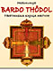

trovo molto gusto nella miscela di buoni ingredienti.

innanzitutto qualche foto della recente Regionale Umanista Africana che si è svolta a Dakar settimana scorsa.
  
sono rimasto anch’io sorpreso dall’ampiezza dell’evento!
  
[guarda qui.](http://www.partitoumanista.it/index.php?option=com_content&task=view&id=159&Itemid=0)

in tantissimi si sono poi mobilitati sabato scorso a difesa della 194 e dei PACS.
  
mi ha fatto molto piacere la email di una giovane amica che mi dice:
  
_“ciaooo sono contenta del risultato della manifestazione, per impedire ad uno stato laico (e pieno di guai) di esistere proprio quei vecchiacci in palandrana dovevano intervenire? E bada bene io sono cattolica praticante. Non sopporto quel Ruini, ma con tutta la gente che muore di fame viene a rompere le balle a chi si sta evolvendo? Papa Dorothy,invece,non vuole le/la PACS Io voglio un papa che nel 2000 non porti teste arrugginite, vecchie e del carlo codega , ma che si interessi dell'Africa, Asia, dell'evoluzione dellEuropa della Pace tra Religioni, come  Giovanni Paolo II, del Sud America e anche del nord, dell' Australia della Consacrazione del Pane fatta dalle Donne, della non discriminazione delle coppie di fatto, insomma dovremmo eleggerli noi i Papi…”_

TV: mezzi di telecomunicazione
  
Una volta si valorizzava la discussione. Ora c’è solo manipolazione.
  
Il mezzo televisivo è potentissimo, e male utilizzato.
  
Diversi anni fa (molto prima della internet tv e delle street tv) nasceva Arancio TV: [www.arancio.tv](http://www.arancio.tv)
  
spero che quest’anno sia l’anno della sua rinascita.

Oggi chiudo con **la più apparente delle chiusure: la morte.**
  
Come tutti i finesettimana, mi dedico a me stesso e ai miei studi personali.
  
Questo sabato, nello scendere a Firenze, ho ripreso in mano il Libro Tibetano dei Morti (o Bardo Todol, ovviamente tradotto dal G.Tucci).
  
Quando lo lessi la prima volta, al liceo, ero affamato di sapere, insoddisfatto di quel “senso comune” ricco di superficialità, desacralizzazione e autocelebrazione che la società ti proponeva come la migliore via di adattamento alla vita.
  
Ringrazio di non essermi mai rassegnato all’apparente destino.
  
Ringrazio tutti i grandi Uomini che hanno camminato e stanno camminando su questo pianeta.. per la loro Forza, Intelligenza e Bontà.. qualcuno anche per l’Allegria e sicuramente, visto quanto siamo distratti e volubili, anche per la Pazienza 😉

e così ieri ho cambiato sottotitolo a questo blog, con una grase di Silo che tanto vorrei che si diffondesse nel mondo:
  
**“Lo scoramento degli esseri umani valenti e solidali ritarda il cammino della storia.”**