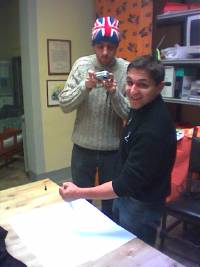
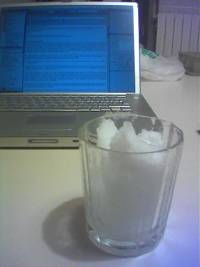

era abbastanza prevedibile la vittoria di Ferrante alle primarie di Milano, tanto che un giorno mi chiesi: ma perché Fo si è inguauato in un vicolo cieco e non si è presentato fuori dall'Unione? almeno avrebbe concorso alle elezioni vere e proprie

peccato.. la logica del duopolio proprio non la si vuole mettere in discussione (oppure…)

però forse meglio così: i 25.000 mila e passa che hanno votato Fo alle primarie di ieri forse ora si accorgeranno che c'è qualcuno, fuori dall'Unione, che porta avanti un discorsi e progetti simili da tanti tanti anni.. vedremo!

intanto ieri sera c'è stata la prima puntata del cineforum "fannullone", al nostro nuovo locale di Monza.. (con "Il Senso della vita".. no assolutamente non quello del bim bum bam)
  
prima nel pomeriggio si era praticamente chiuso il prossimo numero del Fannullone..
  

_puoi vedere qui a lato un momento del backstage.. cosa si sta facendo lo capirai quando leggerai il giornale, settimana prossima! 😀 😀_

per finire una segnalazione: chiacchierando con mia nonna, mi raccontava di quando da ragazzine loro si facevano la granita con la neve, d'inverno.. tornato a casa presto detto subito fatto (ovviamente ho scavato un po' per recuperare n'è la prima neve n'è l'ultima appena scesa sul mio terrazzo.. il risultato eccolo qui: una fantastica granita mentaorzata artigianale.. a milano!! ah ah

ww le Tradizioni
  

