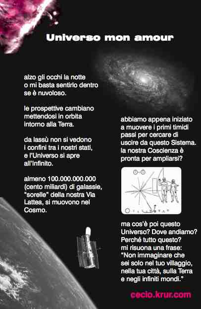

alzo gli occhi la notte
  
o mi basta sentirlo dentro
  
se è nuvoloso.

le prospettive cambiano
  
mettendosi in orbita
  
intorno alla Terra.

da lassù non si vedono
  
i confini tra i nostri stati,
  
e l’Universo si apre
  
all’Infinito.

almeno 100.000.000.000
  
(cento miliardi) di galassie,
  
“sorelle” della nostra Via
  
Lattea, si muovono nel
  
Cosmo.

abbiamo appena iniziato
  
a muovere i primi timidi
  
passi per cercare di
  
uscire da questo Sistema.

la nostra Coscienza è
  
pronta per ampliarsi?
  
ma cos’è poi questo
  
Universo? Dove andiamo?

Perché tutto questo?

mi risuona una frase:
  
“Non immaginare che
  
sei solo nel tuo villaggio,
  
nella tua città, sulla Terra
  
e negli infiniti mondi.”