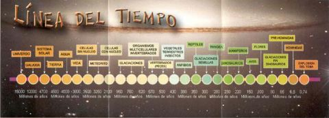

se si vuole costruire una linea temporale dell'evoluzione dalle origini dell'universo ad oggi (nell'ipotesi appunto che il tempo sia lineare) potrebbe uscirne una cosa del genere..

amici (umanisti) sono 8 anni che hanno lavorato all'approfondimento di tale tema e alla realizzazione di un video cd.

non è difficile notare quanto l'evoluzione umana, da quando abbiamo iniziato a prendere in mano il **fuoco**, sia andata crescendo in modo esponenziale. **oggi non saranno certo quattro deficienti coi paraocchi e la vista (e la memoria) corta, a farci perdere di vista il vero senso della vita.**

se c'è gente che vuole prendere la propria vita e buttarla nel cesso, lasciamoglielo fare.
  
ovviamente lottiamo e prendiamo le giuste precauzioni perché non ci trascinino con loro.

**a noi piace stare con chi ha deciso di fare qualcosa di interessate con la propria vita.**
