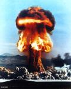
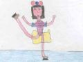

Non ne parla ancora nessuno.. la minaccia di una guerra atomica sembra ormai songiurata con il patto di non proliferazione accompagnato da Gorbaciov.. oggi l'unico nucleare che si teme è quello dell'Iran, ma gli attenti potrebbero accorgersi che la situaione si sta complicando sempre di più.. recentemente Jacques Chirac ha dichiarato che lancerà bombe nucleari se altri paesi insisteranno a pregiudicare gli interessi della Francia.
  
Nell'attuale mondo politico non si vedono germogli di ideologie (e di persone capaci di portarle avanti) che possano aprire e distendere il futuro.

Gli umanisti torneranno presto a chiedere che nessuno al mondo tenga armi nucleari.
  
Come al solito nessuno starà ad ascoltare, ma ciò non è scoraggiante.

Mentre le commozioni si susseguono a seguire le poetiche movenze di ballerine sui ghiacci, o la perfetta sincronizzazione di corpo e mente di tanti atleti di tutto il mondo… mi sorge la consapevolezza della bella "distrazione" che ci stanno proponendo, mentre sono lì a calcolare o improvvisare il futuro dell'umanità.
