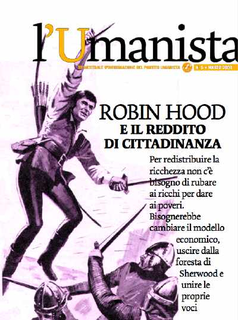

finalmente ho il piacere di pubblicare la versione digitale de _L'Umanista - il giornale del Partito Umanista_.
  
Questo n.5 è davvero bello (spero prossimamente arrivino anche i numeri precedenti) e spiega con diversi temi la abissale differenza tra i progetti umanisti e gli attuali "giocatori" in campo (centrodestra e centrosinistra, fondamentalmente)…. e poi sfido a chiamarci incoerenti.

riporto qui l'editoriale di Lorenzo Palumbo:
  
"È passato quasi un anno dalla presentazione del piano strategico del Partito Umanista in Italia. In questo anno sono stati fatti passi da gigante: il PU è presente nelle principali città italiane, abbiamo sostenuto con entusiasmo il SI al referendum sulla procreazione assistita, abbiamo dato impulso alla campagna per il ritiro delle truppe dall’Iraq Il futuro si può cambiare, abbiamo appoggiato le mobilitazioni NOTAV e già si stanno preparando le candidature per le prossime elezioni amministrative. Nonostante questa grande espansione, il 9 aprile non saremo presenti alle elezioni politiche: grande sostegno alla nostra candidatura è arrivato dalla base, dai simpatizzanti e dai nostri sostenitori, ma abbiamo bisogno di costruire ed espanderci ancora di più per arrivare ad essere una forza alternativa al neoliberismo, alternativa alla destra neofascista che cresce e alla sinistra sua succube concubina.
  
Intendiamo dire con questo, che il centrosinistra e il centrodestra non sono altro che due facce della stessa medaglia a sostegno di un modello economico, politico e sociale basato sullo sfruttamento, sulla menzogna e sulla violenza.
  
Per di più, i vertici dell’Unione, nonostante la guerra con la Serbia, l’apertura dei CPT, la precarizzazione del lavoro, non solo non si sono dimessi, ma anzi hanno la faccia tosta di ripresentarsi agli elettori come “un’alternativa”…
  
Il Partito Umanista non sosterrà nessuno schieramento alle prossime elezioni. Gli umanisti non voteranno i partiti della guerra, della speculazione, della precarietà e delle leggi speciali.
  
Una vera alternativa a questo sistema deve iniziare con la discussione del suo modello economico, della sua dottrina sociale, del suo sistema di farsa-democrazia, dei suoi valori fondanti antiumanisti.
  
Una vera alternativa partirà dalla base, dall’azione non-violenta e dal moltiplicarsi di fronti e attività che denuncino ogni discriminazione e ogni violazione dei diritti umani.
  
Non votiamo, ma continueremo costruendo, con tutte leforze contrarie all’attuale modello neoliberale, una nuova forza rivoluzionaria in difesa delle minoranze, in difesa dei diritti umani, in favore di un modello economico e di una società veramente e profondamente umane. Continueremo costruendo un modello sociale multiforme che liberi le energie per costruire il nuovo cammino che l’umanità ha bisogno di percorrere."

  
il sito associato all'Umanista è <a href="www.umanista.org" target="_blank">www.umanista.org</a>. un sito molto semplice ma ricchissimo di informazioni quotidiane su cosa sta veramente succedendo nel mondo. vi consiglio vivamente di consultarlo spesso.
