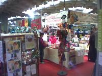
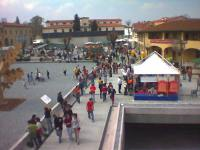

sono a Firenze e ieri sono riuscito a fare un salto a Terra Futura, la grande esposizione dello sviluppo sostenibile, con centinaia di stands nel campo del volontariato sociale, nuove tecnologie, allevamenti e agricoltura biologiche, commercio equo solidale e tanto altro..

davvero tanta roba, e tantissima gente! questo il fatto secondo me più interessante.

gironzolando ho scoperto una rivista che fa proprio al caso mio: [www.scienzaeconoscenza.it](http://www.scienzaeconoscenza.it/)… tenetela sott'occhio.

il sito di Terra Futura è [www.terrafutura.it](http://www.terrafutura.it/)
