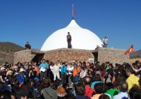

il 4 maggio è una data importante per gli Umanisti: in quella data nel 1969 è stato lanciato questo grande progetto.
  
ieri, in diverse località dei 5 continenti di questo pianeta, si sono svolte eventi celebrativi.
  
Silo (il fondatore del Movimento) ha tenuto un discorso in Cile dove inauguravano una nuova sala.

invito tutti a a dare un’occhiata a questa pagina web, eventualmente scaricarvi foto, testi e video:
  
[http://silo.net/Manantiales_May_6_2006.shtml](http://silo.net/Manantiales_May_6_2006.shtml)

Pace, Forza e Allegria a tutti!