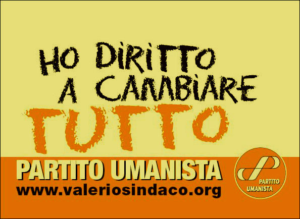

Valerio Colombo (attivista nel Movimento dal 1989) che si presenta come candidato sindaco di Milano alle prossime elezioni del 28 maggio, sarò a Telelobardia questa sera dalle 20:30 in poi, per un vario dibattito.

Credo possa essere interessante provare ad ascoltarlo!
  
dettagli: [www.valeriosindaco.org](http://www.valeriosindaco.org) e [www.pumilano.it](http://www.pumilano.it)

a, se non l'avessi già segnalato, guardate il video dell'incontro con Tomas Hirsch alla Camera del lavoro di Milano:
  
[video](http://www.humanisteurope.org/en/tomas-hirsch/tomy-mm/milan-incontro-pubblico/)

ciao