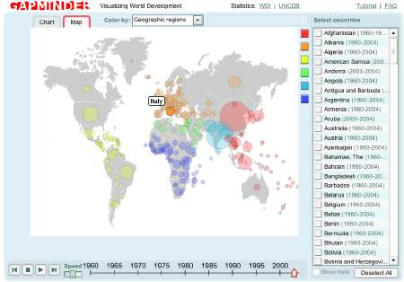

un nuovo giocattolino di Google permette di vedere la situazione mondiale (e le diversità/disparità) di vari aspetti delle nostre società (dall'aspettativa di vita alle spese militari, dal PIL al numero di utenti Internet)..

lo hanno chiamato "The Gapminder World 2006" .. i dati sembrano abbastanza aggiornati..

godetevolo anche voi: 

buona giornata! a presto
