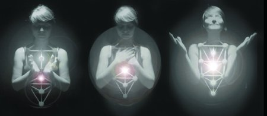
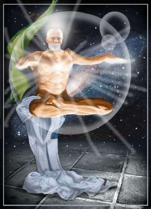

​1. Quando ero realmente sveglio andavo ascendendo di comprensione in comprensione.
​2. Quando ero realmente sveglio e mi mancava il vigore per continuare l'ascesa, potevo ricavare la Forza da me stesso. Essa era in tutto il mio corpo. Tutta l'energia stava persino nelle più piccole cellule del mio corpo. Questa energia circolava ed era più veloce ed intensa del sangue.
​3. Scoprii che l'energia si concentrava nei punti del mio corpo che erano in azione e che veniva meno quando in essi non c'era più azione.
​4. Durante le malattie l'energia veniva a mancare nei punti affetti oppure si accumulava proprio in essi. Ma se riuscivo a ristabilirne la circolazione normale, molte malattie tendevano a regredire.

Alcuni popoli conoscevano queste cose ed erano in grado di ristabilire la circolazione dell'energia con varie pratiche a noi oggi sconosciute.

Alcuni popoli sapevano queste cose ed erano in grado di comunicare quell'energia agli altri; si producevano così "illuminazioni" e perfino "miracoli" fisici.

Silo, nel suo libro Umanizzare la Terra, descrive molto bene il come siamo fatti, e le nostre potenzialità.
  
Il tema dell'energia mi ha sempre molto affascinato e interessato. Già al Liceo vieni a sapere che TUTTO E' ENERGIA.. quindi anche noi! si ma dove sta ste energia? solo nel petrolio o nel mare o nei venti?

solo nell'infinitesimo atomo?

un'immagine mi è tutt'ora scolpita nella testa: **la sola energia "elettromagnetica" degli elettroni che stanno dentro un corpo umano sarebbe in grado**, se opportunamente polarizzata (cioè mettendo gli elettroni tutti nella stessa direzione) di **far precipitare la Luna verso la Terra.**

Meno male che la mia curiosità non si è fermata alla sola lettura di libri o speculazione scintifico/filosofica.

Dato che alla radice di tutte le grandi culture e religioni della storia umana c'è sempre una dottrina o questioni legate ad un **uso più cosciente del nostro mondo interno**, non ho mai smesso di cercare la migliore via per accedere a tali esperienze.

Anche in questo il buon Silo si è rivelato un gran bel Maestro, riuscendo a semplificare al massimo temi e tecniche.

Davvero ora non mi sorprendono più certi fenomeni.. e sono certo dell'infinità dell'Essere Umano! 😉

