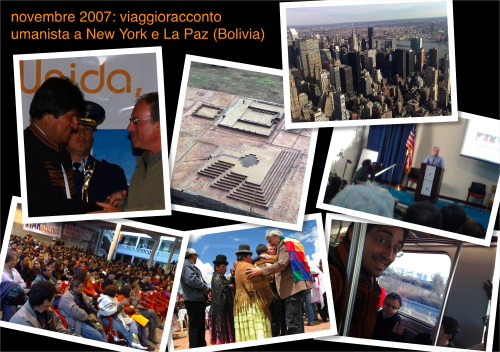

sono tornato pochi giorni fa da questo intenso viaggio che mi ha portato prima a New York e poi a La Paz (Bolivia)

due città agli antipodi, ma estremamente interessanti e … sorprendenti!

ho partecipato inoltre ai due forum umanist nord e latino-americani, conoscendo centinaia di persone, tra cui il presidente boliviano Evo Morales, tutti attenti e attivi nel grande processo di trasformazione nonviolenta del mondo.

sicuramente è stato uno dei viaggi più importanti e significativi dela mia vita, e vorrei condividere il più possibile le mie scoperte ed esperienze, oltreché tramettere informazioni vitali (soprattutto riguardo alla Bolivia) che non stanno arrivando per i canali ufficiali.

dove e quando:

- venerdì 7 dicembre: presso la <a href="https://www.casaumanista.it">Casa Umanista</a> di via Constant 22b a **Milano** - ore 21:30
- domenica 9 dicembre: presso il Centro umanista <a href="https://associazioni.comune.firenze.it/puntaest/chisiamo/chisiamo.html" >Punta Est</a> di **Firenze** - ore 18:00
- giovedì 13 dicembre: presso il centro umanista [Spazio Fannullone](https://www.ilfannullone.it/spazio/) di via Borgazzi 105 - **Monza** - ore 21:15

ti aspetto e invita tutti  
(per maggiori informazioni non esitare a chiamarmi)

stefano