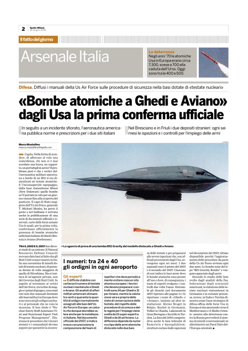

altre buone notizie:

  
ps: <http://www.nonviolenza.net/testimonials/>

ps2: oggi a pag 2 di e-polis c'è un articolo sugli usa che confermano la **presenza delle armi atomiche a Ghedi ed Aviano:**

