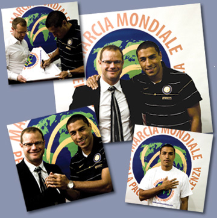

non sono un fan del calcio ma questa notizia dovrebbe interessare molti:
  
sabato scorso **Juventus** e **Inter**, dopo la supersfida per lo scudetto all'Olimpico di Torino, si sono simbolicamente unite per **celebrare la loro adesione alla Marcia Mondiale** indossando un'unica maglia, quella della pace e della nonviolenza.
  
Nella foto: **Gianluca Pessotto**, team manager della Juventus e **Iván Córdoba**, difensore centrale dell'Inter, sono testimonial ufficiali della Marcia Mondiale

leggi l'articolo completo