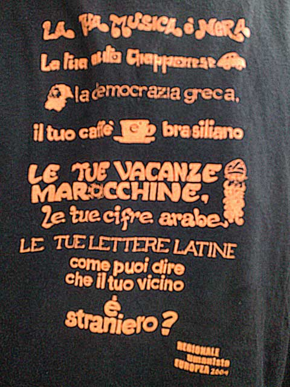

ieri mattina (nell'andare ad Assisi per partecipare alla riunione nazionale del Tavolo per la Pace) avevo scelto questa maglietta.

è una delle mie preferite e credo sia l'**unica risposta da dare a Berlusconi & C**.

**non mi vergogno di essere italiano. per ora mi dispiace .. quasi mi addolora, il sapere di moltissimi italiani che stanno scendendo nella così più bassa ignoranza da sostenere una cultura e un sistema di credenze che porta verso l'abisso**.

per me è solo uno sprono ad adoperarmi di più nel cercare di far sperimentare vie più interessanti.

un abbraccio un po' puzzolente (sono tornato a casa un po' sudato da una grande giornata ^_^ )

- La tua musica è nera
- la tua auto giappnese
- la democrazia greca
- il tuo caffè é brasiliano
- le tue vacanze marocchine
- le tue cifre arabe
- le tue lettere latine
- come puoi dire che il tuo vicino è straniero?
