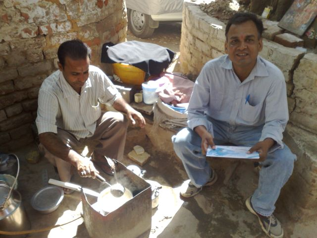
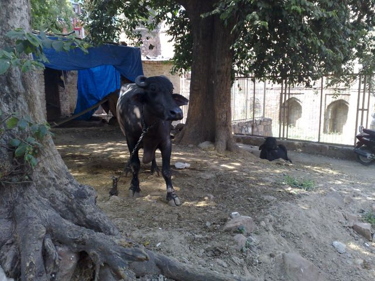

ovvero: oggi mi sono intergrato nell'equipe base arrivata da Katmandù.. sono ufficialmente il nr.19!!! ma la cosa che mi ha dato più energia nella giornata.. è stato un "tree tea" (ovvero un thè fatto sotto l'albero).. al latte.. dove il latte arriva dalla bufala a 200 mt di distanza! non potevo crederci! BUONISSIMO!!! a domani con foto, video, e un raccontino un po' anagocico di questi due primi giorni indiani… stay tuned! <http://blog.theworldmarch.org>

