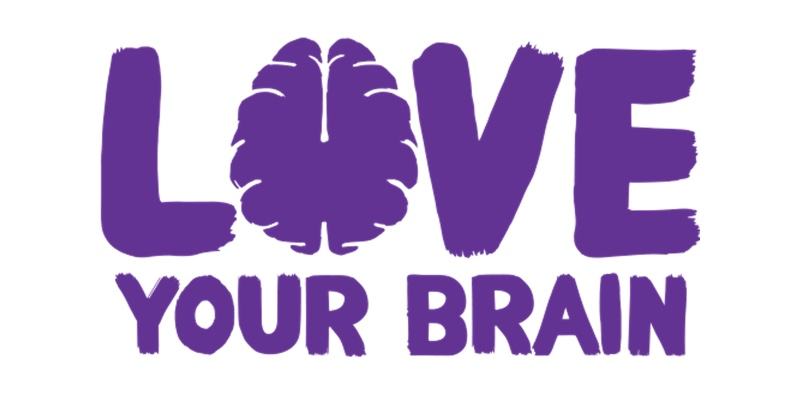

a me non piacciono gli assiomi "sono tutti deficienti" con cui molti si distaccano dagli altri con giudizi al limite del disumano.

ma se c'è una cosa che davvero dobbiamo tenere conto, è che non tutti abbiamo il cervello che funziona allo stesso modo.
E mentre è facile vedere e quindi tenere conto dei problemi fisici negli altri, non tanto lo è per quelli mentali.

il problema mondiale è che i problemi mentali sono in crescita.
non solo dovuti a questioni prettamente psicologiche e sociologiche (mancanza di senso della vita, solitudine, ansia da prestazione etc), ma anche ambientali, tecnologiche e culturali.

è comprovato ad esempio come l'inquinamento stia sensibilmente diminuendo le capacità cognitive nei bambini...

(due parole semplificative: il cervello è un'enorme "rete di connessioni" neurali... senza essere meccanicistici, è facile immaginare che se le connessioni diminuiscono o deteriorano, il cervello funziona peggio)

ora l'OMS (Organizzazione Mondiale della Sanità) sta registrando un sensibile aumento della demenza e diminuizione delle capacità cognitive... da qui al 2050 sarà un bel problema.. sopratutto considerando l'imminente quasi immortalità dei corpi... invitando a iniziare pratiche quotidiane per prevenire la degenerazione del cervello. (vedi 1)

se il problema da un lato ci tocca per questioni di solidarietà e di empatia con gli altri, dall'altro lato consideriamo come i problemi mentali di una singola persona possono mettere a disagio se non in pericolo intere comunità: mentre un disabile con un corpo ai limiti del vegetale può scoprire nuove teorie sull'Universo, una persona dal fisico perfetto con un cervello degenerato può fare una strage, o preoccupare un gran numero di persone che non sanno bene come comportarsi

la cosa migliore sarebbe quindi PREVENIRE i problemi mentali e la degenerazione cerebrale, insinuando delle buone pratiche fisico / comportamentali fin da piccoli.

una prima sintesi di buoni suggerimenti (ispirati da nota 2) è:

1) ATTIVITÀ FISICA. il buon "mens sana in corpore sano". sopratutto attività ad alta cardiovascolarità.. più sangue al cervello. si, anche il sesso.

2) STUDIARE SEMPRE: non smettere mai di studiare.. leggere romanzi non basta (ancor meno i media passivi come la tv). qualsiasi tipo di corso dove si impara qualcosa. IMPARARE == GENERARE NUOVE CONNESSIONI. fosse anche solo per avere cose interessanti da dire oltre parlare del tempo e degli altri

3) SMETTERE DI FUMARE. non è un complotto (di chi?!?!), davvero, è ormai riconosciuto che il fumo aumenta il rischio di problemi. anche il declino cognitivo.

3b) EVITARE LE DROGHE DEGENERATIVE.. sopratutto quelle sintetiche, acidi, etc

4) CURARE IL CUORE.. tutto ciò che può creare danni al cuore (obesità, alta pressione, diabete) impatta anche la sanità mentale. cura il cuore, e il cervello lo seguirà

5) PROTEGGI LA TESTA. il cranio fa il suo per proteggere il cervello. ma spesso non basta: dalla mountain bike agli sport di contatto fisico, proteggersi la testa. imparare a cadere (Judo rules!)

6) RIFORNIRSI MEGLIO: mangiare meglio. tutto qui. frutta e verdura. dieta mediterranea. riconoscere le schifezze o il cibo altamente industrializzato lo sappiamo fare. evitarlo in funzione di diventare più intelligenti magari può motivare qualcuno

7) DORMIRE bene. ed evitare le apnee notturne

8) SALUTE MENTALE: ai primi sintomi di troppa ansia, stress o depressione, consultare un medico o quanto meno non sottovalutarsi. i problemi di salute mentale possono collegarsi ad un declino cognitivo

9) SOCIALIZZARE: l'attività sociale e stare insieme ad altri a fare qualcosa.. anche solo giocare a carte! è FONDAMENTALE. se non siamo Bhudda, l'isolamento è l'anticamera della bara mentale, poi fisica.

10) GIOCA. sfida la mente, risolvi enigmi, costruisci un mobile, suona, crea, dipingi, parole crociate... qualsiasi cosa faccia attivare il cervello è buona.

ciao

NOTE
1: <https://www.who.int/mental_health/neurology/dementia/guidelines_risk_reduction/en/>
2: <https://www.alz.org/help-support/brain_health/10_ways_to_love_your_brain>
