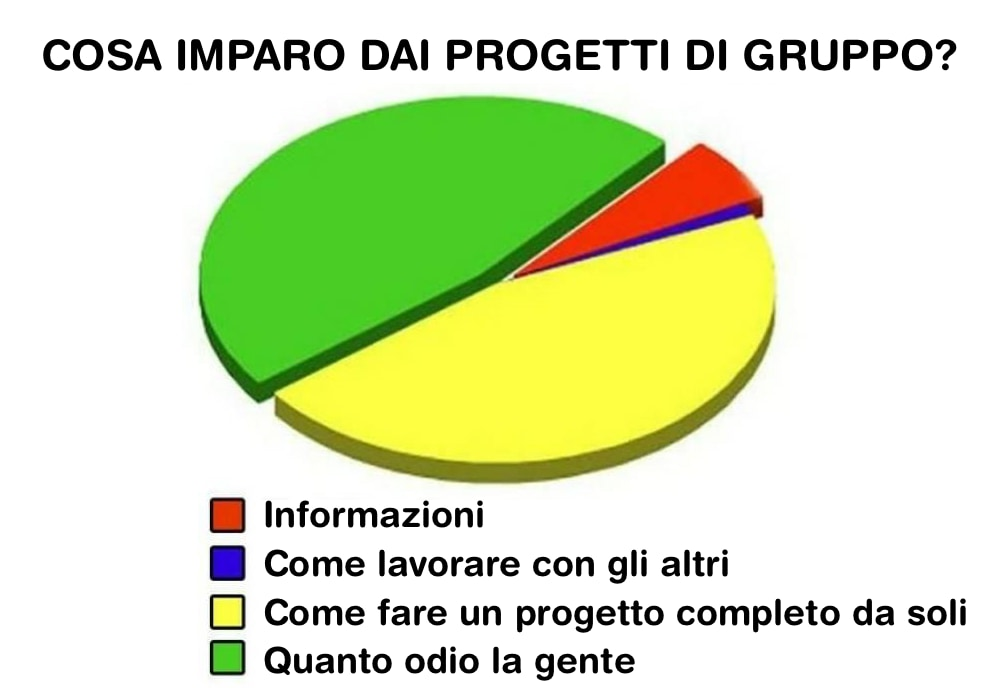

# IL COLLETTIVO PLANETARIO

può far ridere ma ha un fondo di verità: imparare a lavorare bene insieme agli altri, è la cosa più difficile. ma la più importante.

domani affronterò la cosa nella seconda parte delle mie lezioni sull'Intelligenza Collettiva e la collaborazione distribuita (per gli studenti di GameDev alla TheSign - Comics & Arts Academy - Firenze)

dopo aver lavorato 30 anni in diverse centinaia di progetti tra i più diversi: dai concertoni ai piccoli siti web, dalle multinazionali a organizzare eventi di volontariato, posso ben affermare che oltre ad una buona dose di spirito zen, ai migliori strumenti e tecnologie disponibili, alla conoscenza delle best practices, a padroneggiare minimamente la comunicazione, a sapere quello che si sta facendo!, serve un'immagine condivisa a futuro del progetto a cui si sta lavorando.

sono le mete, le idee, le storie a futuro condivise che ci fanno muovere e aiutano a superare ogni inevitabile difficoltà.

e come insieme di esseri umani, non c'è mai stato tanto bisogno di collaborazione quanto oggi. che abbiamo tutti gli strumenti e la necessità di fare il salto individui -> collettivo planetario