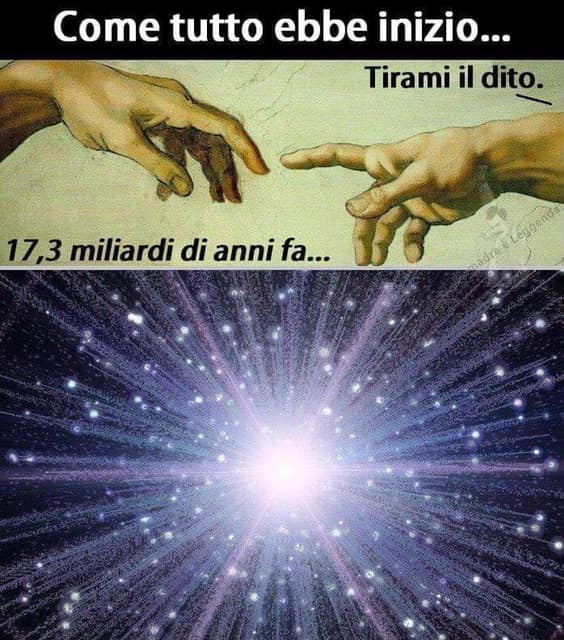

- c’è chi ha certezza nel proprio Dio creatore, e forse non se lo chiede più.
- c’è chi non se lo è mai chiesto oppure gli basta ricordarsi di un big bang letto da qualche parte a scuola
- c’è chi non ha certezze e se non tutti i giorni tutte le settimane ci pensa e si domanda con grande interesse e stupore: ma come è iniziato tutto questo?

che poi, se qualcosa ha creato tutto questo... chi ha creato o come è nato quel qualcosa?

può davvero il Tutto nascere da una casuale deformazione del nulla?

avrebbe senso Tutto quanto senza esseri intelligenti che lo possano osservare e interrogarsi sul senso di tutto ciò?

e ha senso morire prima di cercare una risposta?
o troveremo la risposta morendo?
