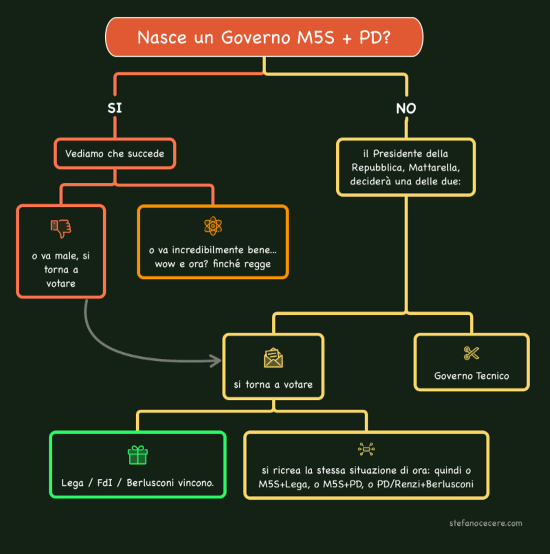

Siamo in una situazione politica delicata.
Come si fa un'analisi e sopratutto come decidere di proseguire?
La cosa peggiore sarebbe 1) non decidere 2) decidere e poi pentirsi perché si è pensato male.

Vediamo: cosa potrebbe succedere a seconda della mia scelta?
la cosa migliore è iniziare intavolare gli scenari possibili.

I diagrammi di stato e sopratutto di flusso possono venirci in aiuto.

Guardiamo ad esempio cosa succederebbe se mercoledì nascesse un Governo M5S + PD, oppure no.
Ho fatto in 10 minuti questo diagramma, perdonatemi la semplificazione ma a grandi linee sono gli scenari plausibili.

A noi interessa iniziare a pensare bene, a prendere decisioni che vanno verso la direzione che ci interessa, anche se a volte non sappiamo dove siamo né dove vogliamo andare. ma questa è un'altra storia :)

NB: qui e ora non interessano le diatribe politiche, quelle le lascio alle proprie pagine personali. So che c'è chi tifa per uno chi per l'altro e chi per l'altro ancora, oppure chi è disinteressato o chi aspira al caos (forse perché è dal caos che nascono le stelle, come diceva Nietzsche? boh)
