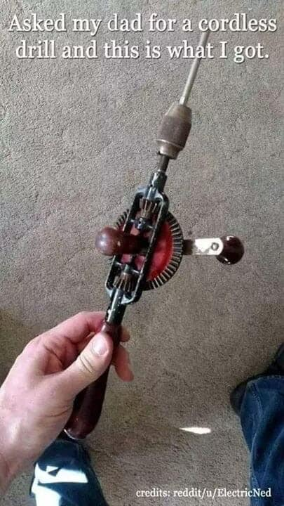

- quando la batteria siamo noi non servono batterie esterne.
- shhhh dillo piano che Alexa ascolta tutto... e potrebbe fare googol + googol
- eh?!? cmq no Alexa sta parlando con Siri
- ci fanno credere così. non hai notato come tutti gli aggeggi moderni sono ormai dotati di batterie e bluetooth o wifi?
- vero
- oggi trovalo un coso col filo... guarda per trovare il tuo nuovo mouse
- vero... il 90% sono senza filo
- e così tutto. dobbiamo iniziare a liberarci dalla schiavitù del senza filo con batteria!
- ma è un circolo vizioso: decidono loro cosa la gente può comprare. così la gente si adatta a volere quello che vedono disponibile e lo desiderano. e così via progettano mode, consumi e produzioni
- shhh parla piano! dobbiamo re-imparare a immaginare
- immaginare cosa?
- come vorremmo vivere! costruirci mentalmente le città, la società, il mondo e eso-mondi del futuro. e quelle immagini perseguire, giorno dopo giorno
- e tutto questo a partire da un trapano a manovella?
- sì
