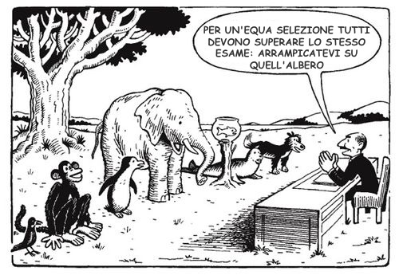

Spesso mi chiedono consigli su vari giochi e videogiochi "interessanti" dal punto di vista educativo, a volte specifici per alcune situazioni, come in questo caso l'[autismo](https://it.wikipedia.org/wiki/Autismo)

Come puoi immaginare un videogioco può essere progettato per accompagnare il giocatore in un percorso di interazioni ed emozioni particolarmente calibrate sui propri ritmi e personalità.

Il portale [Common Sense](https://www.commonsense.org/), che consiglio quale risorsa per conoscere tutti i media, dai film ai giochi, indicati per i bambini e adolescenti con critiche e indicatori, ha pubblicato un articolo con 20 app e videogiochi che possano aiutare i bambini affetti da Autismo, lavorando sul tema della comunicazione, riduzione dell'ansia, regolare le emozioni, esprimersi al meglio e mantenere delle semplici routine quotidiane.

ecco il link: https://www.commonsense.org/education/top-picks/best-apps-for-kids-with-autism
