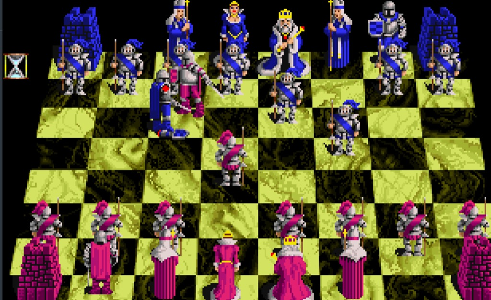

ieri sul tema di violenza nei videogiochi ho detto che è una questione subdolamente esasperata e ignorantemente messa in relazione con la realtà, e più un tema di "rappresentazione" che di contenuto.

da ragazzino giocavo a videogiochi violentissimi (**Carmageddon** anyone?) eppure sono sempre stato un promotore della nonviolenza.

citando gli scacchi dove i pezzi si mangiano/uccidono (addirittura si uccide una Regina!) come non ricordare **Battlechess** dove le mangiate avvengono con combattimenti davvero splatter?

se volete giocarlo online eccolo qui: <https://playold.games/play-game/battle-chess/play/>

