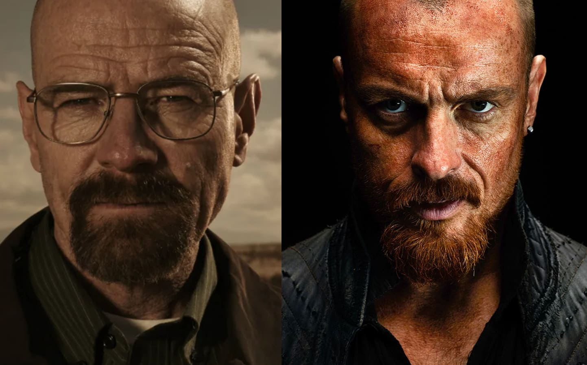

tutti riconoscerete il primo. ma il secondo?

solo a me il Capitano Flint ha ricordato più volte Walter White?

cinematografia a parte, è affascinante ricordare quanto non siamo esseri "statici", 
e il nostro corpo è la cosa che cambia di meno, con il passare degli anni (ma purtroppo il corpo e l'estetica sono le cose di cui ci si preoccupa di più)  
spesso il nostro passato è ricco di esperienze, incidenti o progetti, che ci danno una direzione e delle priorità di comportamento.

a volte non sappiamo niente del passato di chi ci sta vicino, figuriamoci di chi ci sta lontano

non solo giudichiamo frettolosamente, ma proprio non comprendiamo gli obiettivi esistenziali.

forse non siamo più abituati ad avere obiettivi esistenziali e quindi diamo per scontato che non li abbia nessun altro, lasciando ampio spazio a chi cerca di tamponare i vuoti esistenziali con merci varie.

di una cosa sola oggi sono certo: il nostro universo interno è la cosa più vasta e inesplorata che c'è. e al prossimo pelatino con pizzetto rossiccio che vedo, gli offro un caffè.

NOTE x i posteri: il Capitano Flint è il protagonista della serie tv Black Sails.
