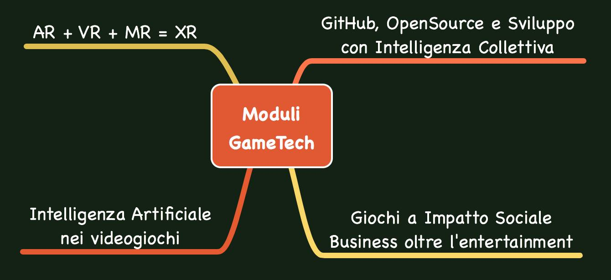

> guarda qui la pagine delle cose che insegno: [corsi](../../../2042/scuola/game-dev/index.md

anche quest'anno sarò docente presso la scuola (TheSign - Comics & Arts Academy - Firenze)[[thesign.academy](https://thesign.academy/)] nei corsi di Game Design & Development. Questi sono i miei moduli che ho finito di riorganizzare. Se ti interessano parliamone, o se possono interessare ai vostri ragazzi, contattate la scuola!

# GitHub, OpenSource e Sviluppo con Intelligenza Collettiva
- problematiche comuni nello sviluppo di progetti digitali in team
- Open Source: vantaggi e svantaggi
- Inner Source: le best practices dell'Open Source per progetti privati
- Piattaforme di sviluppo collaborativo (Git e GitHub come esempi pratici)
- Formati e Interscambio: per collaborare meglio
- Accessibilità e Presenza: come farsi amare dai collaboratori e dai boss
- Preservazione e Immortalità: preservazione e leggibilità a futuro
- Marketing ed Economia: quando uno sviluppo e presenza Open conviene
- 
# Giochi a Impatto Sociale / Business oltre l'entertainment
- panoramica su Media e impatto sociale
- caratteristiche dei giochi come strumenti di educazione, persuasione e trasformazione
- case studies di videogiochi e giochi applicati
- interesse, pubblico e tassonomia
- frameworks dedicati per il design e Game Based Learning
- problematiche e tips di sviluppo
- mercato e opportunità
- 
# AR + VR + MR = XR
- basi teoriche di computer vision e tracking
- case studies di app AR
- tecnologie AR Augmented Reality
- tecnologie VR Virtual Reality
- tecnologie MR Mixed Reality
- XR Extended Reality 
- Unity AR Foundations: conosciamolo
- 
# Intelligenza Artificiale nei videogiochi
- Machine Learning: i fondamentali
  - Neural Networks: le basi e il potenziale
  - GAN (Generative adversarial network) come funzionano?
- metodi AI nei videogiochi
  - Utility
  - FSM / Behavior Trees
  - TreeSearch / Pathfinding
  - Evolutionary Computation / Genetic
  - Supervised Learning
  - Reinforcement Learning
  - Unsupervised Learning
  - Planners
  - Random / Fuzzy / Noise
- AI per giocare
  - avversari
  - playtest
  - demo
- AI per generare contenuti
  - Livelli e Mappe
  - Visual
- Audio
  - Narrativa
- case studies spettacolari e futuro
