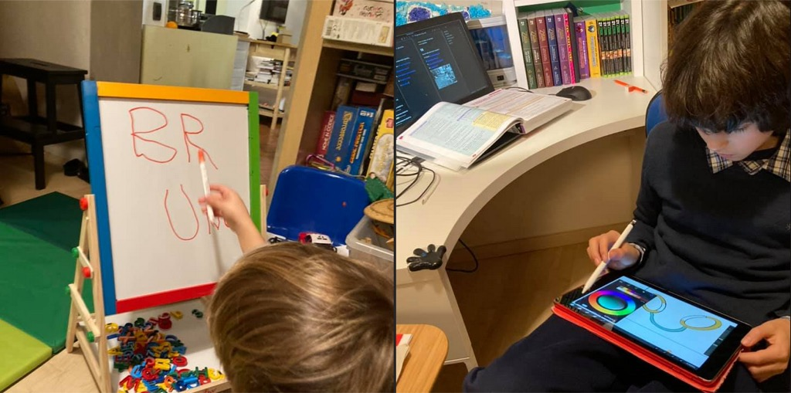

che sia digitale o analogico: non c’è differenza.  
ogni strumento ha pregi e difetti, virtù e inconvenienti.  
il primo è pazzo di tablet, ma qui preferisce scrivere sulla lavagna.  
il secondo progetta tutto a matita. ma per fare dei disegni che poi vanno in digitale preferisce usare il tablet.  
non ci sono categorie assolute. solo il godersi lo strumento giusto per il fine giusto.
