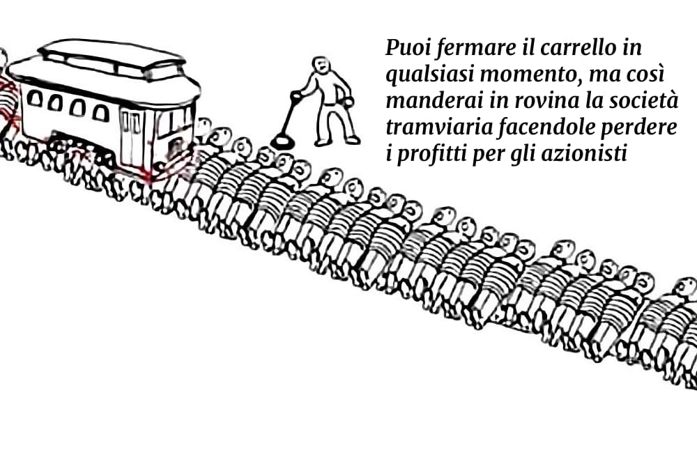
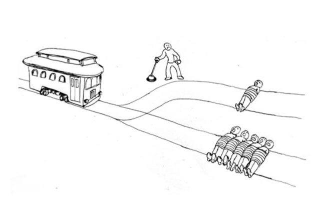

lo conoscete tutti vero questo "dilemma" etico?
è un quesito di filosofia etica inventato 50 anni fa, ed è oggi sempre più citato in ambito Intelligenza Artificiale e macchine a guida autonoma:
"un tram si rompe e se prosegue la sua strada uccide 5 persone,
c'è solo la possibilità di cambiare il suo percorso dove ne ucciderebbe una sola.
cosa scegli di fare?"

beh.. ora possiamo capire tutti la versione economica contemporanea 😉

