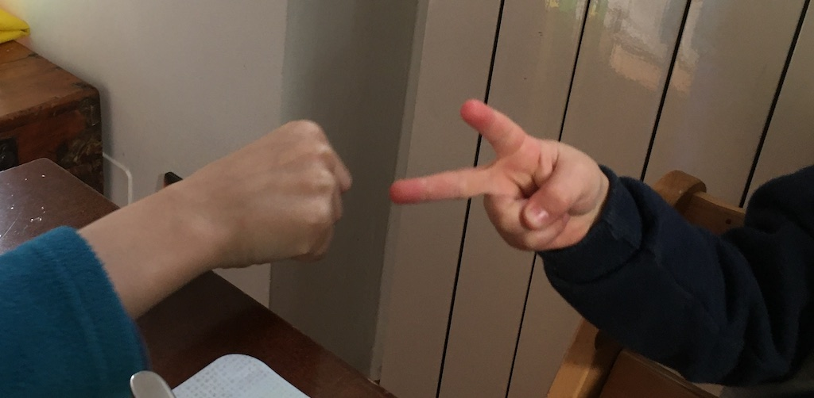

- sasso! carta
- carta! forbice
- forbice! sasso
- sasso! sasso. carta! carta. forbice! forbice
- ma non si vince mai per davvero!
- esatto.. all’infinito c’è un equilibro.. sopratutto se usate tutti la stessa migliore strategia..
- e quale è?
- scegliere veramente a caso. cosa difficilissima.
- perché è difficile?
- ora vi spiego…

il gioco carta-sasso-forbice (ovvero la Morra Cinese, che salutiamo) prevede che per ogni mossa ci sia un’equilibrata possibilità di perdere, pareggiare o vincere. e a meno che conosciate molto bene il vostro avversario, e quindi le sue abitudini di gioco, la tattica migliore per vincere.. o meglio per perdere di meno, è quella di scegliere ogni volta una mossa a caso, in modo da essere imprevedibili.
se entrambi i giocatori usassero questa tecnica, il gioco a tendere sarebbe un pareggio assoluto.
e ciò non è meraviglioso? il Sistema.. ovvero l’Universo, sta in equilibrio nonostante le nostre libere e casuali scelte individuali.. nessuno perde né vince sempre.. a tendere c’è la giusta distribuzione…
ma noi non siamo esseri casuali, ci sarà sempre qualcosa che ci influisce. e anche se non fosse, l’ottenere un numero veramente casuale è forse la cosa più difficile dell’universo!
perché se io conoscessi esattamente tutte le condizioni iniziali, la scelta sarebbe prevedibile.. calcolabile. pensate ad esempio di tirare un dado: se io lo tirassi sempre con la stessa forza e direzione e ogni atomo dell’aria e del tavolo fossero nello stesso stato, otterrei sempre lo stesso risultato!
avrete tempo per studiare cosa vuol dire, e se è davvero possibile, essere davvero liberi di scegliere. Ma la cosa bella è che se le regole del sistema sono equilibranti, qualsiasi cosa facciamo alla fine saremo in equilibrio.
