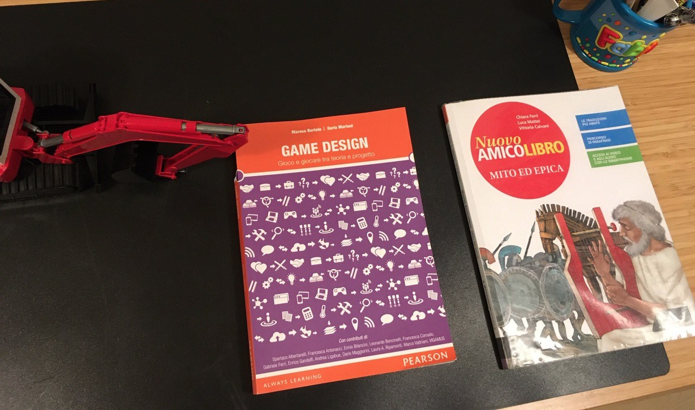

"A rigore la filosofia è nostalgia, il desiderio di trovarsi dappertutto come a casa propria."

ricordo come ieri il giorno in cui leggendo i Frammenti di Novalis rimasi folgorato da questa frase. credo sia stata una delle frasi che più mi hanno segnato e guidato.
