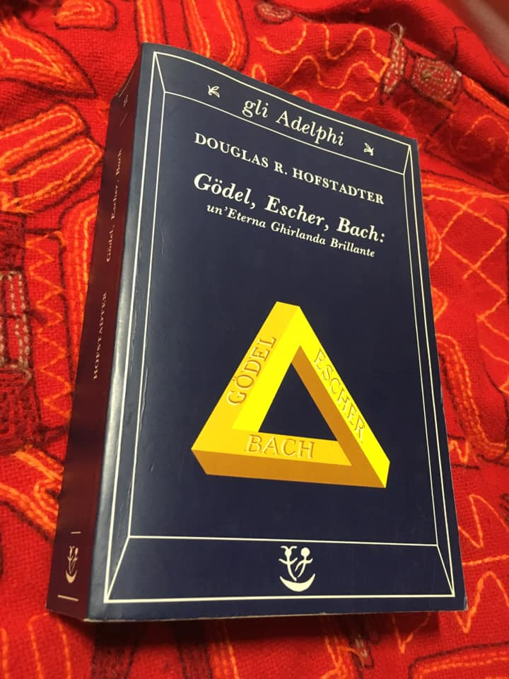

torno ora dalla visione del bellissimo film documentario su M.C.Escher
e voglio/devo rileggermi quello che è stato un fondamentale della mia mente e dei suoi sviluppi, dato che Escher stesso parla molto di Bach.

questo libro è un viaggio divertente e intelligentissimo, tra i più ricchi di spunti e rimandi, che partendo dalla ricostruzione delle musiche originali di Bach e le leggi della ricorsività e della “formalizzazione” del linguaggio e di ogni i cosa, si addentra nei meandri della mente e della coscienza, fino a dare i mattoni base per l’Intelligenza Artificiale e per le visioni sistemiche del mondo

purtroppo non è un libro per tutti tutti. sono 800 pagine che seppur leggere sono molto dense di voglia di matematica.

chissà quanto è conosciuto tra i giovani d’oggi. cercherò di raccontarlo mentre lo rileggo.

Quaerendo invenietis