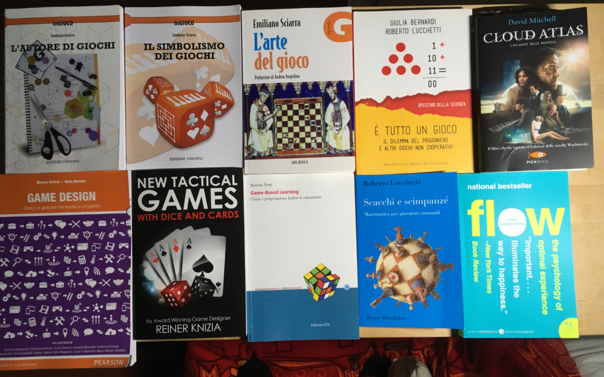

i 10 libri sul comodino che mi stanno nutrendo questo trimestre.

li condivido perché potrebbero interessare, nel caso parliamone!

- l’autore si giochi
un panoramica sul lavoro del creare giochi da tavolo.

- il simbolismo dei giochi
si parte da molto lontano: il gioco nei riti sacri dell’antichità, il fato e l’alea... e tutta un’analisi dei giochi nella storia. non mi aspettavo che un autore di giochi avesse la stessa passione per le religioni comparate e la spiritualità.

- l’arte del gioco: un libro completo si ludologia. come pochi.

- Game Design: una piccola “bibbia” forse la più completa tra i libri italiani. copre un po’ tutti gli aspetti dell’arte di progettare giochi e videogiochi

- Scacchi e Scimpanzé: matematica, sistemi e attualità. per me utilissimo perché vivo un po’ così.

- Game Based Learning: una sintesi sull’uso dei giochi quali strumenti didattici.

- New Tactical Games del mitico Reiner Kniza, l’autore di più di 600 giochi salle meccaniche semplici quanti geniali.

- Flow: un saggione di psicologia della felicità. ovvero dove stanno le esperienze ottimali che ci permettono di svilupparci al meglio divertendovi.

- Cloud Atlas è l’unico romanzo... ma che romanzo! il film è eccellente e questo tanto quanto.

ecco ora sapete come sto rielaborando i miei neuroni. e voi?
