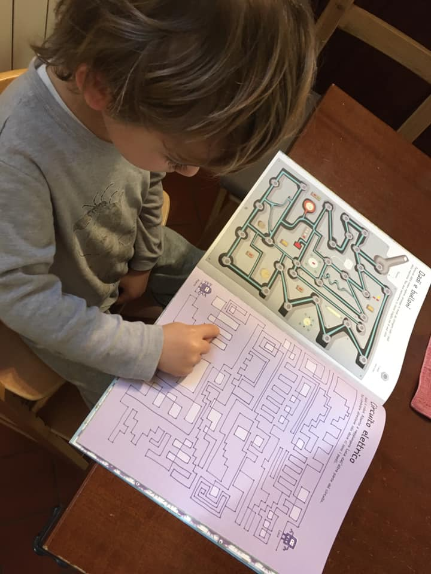

pensando ai commenti di un amico, proprio mentre Bruno faceva colazione con questo libro datogli dal fratellone... perché è stato un libro importante per lui (labirinti)

di fatto il libro è una tecnologia importante.
dirompente per l’evoluzione umana (è stato il primo vero collante dell’Intelligenza Collettiva umana, ovvero l’accumulo e la crescita e miglioramento della Conoscenza di tutti)

il contenuto è diverso dallo strumento che lo veicola. e il fine di usufrutto un’altra cosa ancora...

sono sicuro che se anziché un libro di carta avesse avuto sotto gli occhi un tablet, moltissimi sarebbero saltati su a dire: “niente tablet a colazione! sempre attaccato a quei così!”

io dico: che differenza c’è? è il contenuto che ci interessa.
e se questo contenuto fosse “intelligente” e cambiasse relativamente alla capacità del lettore? dalla semplice dimensione del testo alla difficoltà degli esercizi o dei giochi?
se si collegasse ad altri 5 amici e si potesse leggere e commentare il testo insieme?

i libri ci hanno isolato. ma non hanno leso, tutt'altro, la nostra capacità di relazionarsi e di costruire una società umana più bella per tutti
