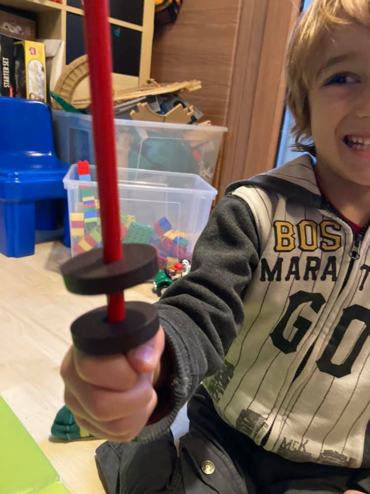

“sono due magneti su una matita. e rimbalzano perché c’è la forza magnetica.
se invece lo giro si attaccano fortissimo.
come i trenini.”

questi magneti sono il nuovo gioco preferito di Bruno. e sono uno spunto continuo per fare esperimenti e parlare si fisica (ovvero per lui: come funziona la materia)

il giocattolo sperimentale è sicuramente il modo migliore per stimolare la curiosità. moh me lo segno
