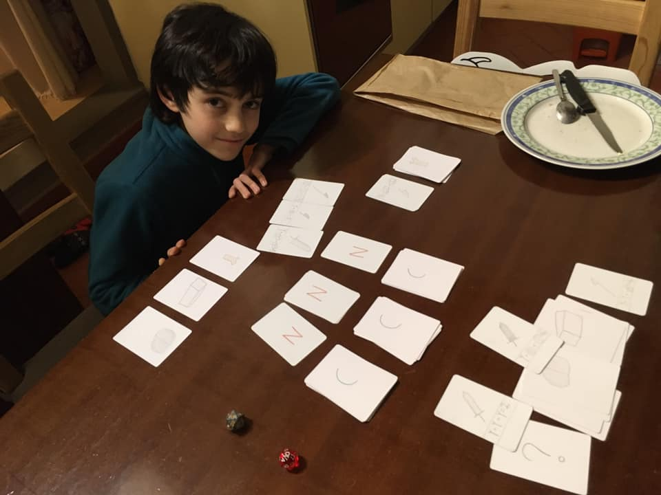

perché giocare ai soliti giochi se ne puoi creare uno nuovo tu?
Fabio nelle ultime settimane (da dopo la Global Game Jam) era particolarmente impegnato in un progetto segreto. e ora l’ha svelato collaudandolo insieme: Ninja Craft.

devi combinare adeguatamente le materie prime per creare le armi con cui attaccare l’avversario.
con sottili regole matematiche per le quali si arriva inevitabilmente ad una vittoria al filo di spada finale.

l’occasione è ottima per parlare di probabilità, inferenza della scelta tattica, regole e divertimento

ad esempio lo sapevate che il “gioco dell’oca” non è un gioco?
o meglio: è così solo casuale e il giocatore non interviene in niente, che tu sia Einstein o un gatto a giocare, è irrilevante. è tutto solo caso!
mentre gli Scacchi non hanno nulla di casuale (al massimo chi inizia per primo)

per questo quando giochiamo ad un gioco, oltre a godercelo, lo analizziamo un poco per capire come è stato pensato e realizzato.

ecco. ora ci siamo guadagnati la cena